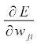
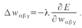

CUDA Character Recognition
======================

**University of Pennsylvania, CIS 565: GPU Programming and Architecture, Project 2**

* Grace Gilbert
  * gracelgilbert.com
* Tested on: Windows 10, i9-9900K @ 3.60GHz 64GB, GeForce RTX 2080 40860MB

## Overview
In this project I implemented a multilayer perceptron (mlp), a simple neural network that is used for machine learning.  There are two states of the project, the training state and the predicting state.  In the training state, we are given a set of data inputs and their desired output values.  In this case, the main data set is 52 English characters (upper and lower case), each with a .txt file containing gray scale values of an image of the character.  We train the mlp using the .txt file data and the expected values, adjusting weights based on error calculations until they converge on good weights that match the output value with high consistency. Once we have these good weights, we can then use the mlp in the predicting state with these weights to predict the output value of a .txt file data without knowing it's desired output in advance.  

### Project Run Options
At the top of main.cpp, there are multiple setting that the user can adjust. 
- The first, training, indicates if we are in the training (1) or predicting state (0).
- Next is the accepted error, which determines what error value is low enough that we can consider the weights that achieved that error good enough weights. The lower this value is, the longer it will take for the weights to converge, but the more accurate the predictions will be.  
- Next is the number of random weight attempts.  To find good weights, we start with randomly assigned weights.  We then see if these weights converge.  If they do not converge after a certain number of iterations of training on the input data, then we reset and try new random weights.  The number of random weight attempts determines how many times we will reset and try new weights before giving up on convergence.
- Related is the number of convergence iterations.  When testing certain weights, we repeatedly run the data through the mlp network and refine the weights until the error is low enough.  This number determines how many times we will refine the weights before giving up on this set of weights and resetting.
- The final option is the use xor value. I had some trouble training the character recognition data, but was successfully able to get weights for the simpler xor example to work, where the input is a pair of 0's and 1's, and the output is the xor of the pair.  If this value is set to 1, the training and prediction will run on the xor example rather than the character data.  If set to 0, it will read the character data from the text files and run training and prediction on that.

## Training
The overall training pipeline is to generate a set of random weights, run each input data through the mlp network, and iteratively adjust the weights based on the output and error returned from the mlp network until the error is sufficiently low.  It is not guaranteed that all sets of initial weight guesses will converge to good final weight values, so after some number of iterations of testing the input data and adjusting weights, we reset and make new random weight guesses.  If after many resets of the guesses, we still haven't gotten convergence, we stop to avoid an infinitely running program.  Once the converged weights are found, we output these weights. 
### Random Weight Generation
The random weights are generated on the GPU, as the weights do not depend on each other, so can be generated in parallel.  For the random seed, I take the elapsed time between the start of training and the time at which the weights are generated, so that each set of random weights has a different seed.
### MLP Network
The mlp network takes in out piece of input data at a time.  This input data is make up of a certain number of values.  In the case of the xor data, the data is made up of two numbers, whereas in the case of the character data, the input is made of up 10201 numbers, 101 by 101 numbers.  There is then a second layer of values called the hidden layer.  The number of hidden layers is somewhere between 1 and the number of input numbers.  For each pair of input numbers and hidden layer numbers, there is a corresponding. predetermined weight.  The value of the hidden layer values is found by taking a dot product between the input values and their weights corresponding to that hidden layer index. That dot product value is then put into an equation to find the hidden layer value:

```
hidden layer value = 1/(1 + exp(-dot product value))
```

This completes the first layer of the mlp.  Each hidden layer value also has a weight. The final layer is just one value, as this will be our output.  To find that final value, we fist sum the products of each hidden layer value and its weight.  Then we perform the same operation described above on this product we just found.  This is our output.  If we were in the prediction state, this would be the conclusion of the mlp, as we would return this output as the prediction based on the given weights. 

Below is a diagram illustrating the layers and weights in the mlp network:


### Error propagation
In training mode, we want to use the mlp output to calculate error and adjust the weights to lower error, a process called error propagation.  To calculate the error of an indivual data input, we find:
```
error = (output - expected value)^2
```
The expected value is a numerical value representing what the input data's correct value is.  For the xor example, it is 1 for true, 0 for false, and for the characters, the characters are number 1 through 52. 

Next, we calculate the partial derivative of the individual data value's error over the weight for each weight:



We then take the accumulation of all of the error values from each input's mlp run.  Using this value, combined with the partial derivative mentioned above, we come out with a delta that gets added to each weight:



In my implementation, I run the mlp on each piece of input data, where I calculate the output, the error, and the partial derivatives for each weight.  During this iteratation of all the data, I accumulate the total error, which I then use to calculate the delta values that I then add these to the weights, modifying the weights for the next iteration over the data. If the total accumulated error is low enough, no more error propagation is needed, as the weights are sufficiently converged.

## Predicting
In the predicting phase, there are no iterative loops of running the mlp.  Instead, we assign predetermined weights, ideally weights that have been found as good predictors in training.  We then run the mlp on the input data with these weights, and just find the output, no error propagation.  This output becomes our prediction.  In both the xor and character data, the expected values are all discrete integers, so when outputting the prediction, I round the mlp result to the nearest integer.  In my network, I was unable to find converged weights for the character data, so the predictor will almost always output all 0's, not close to the expected values ranging from 1 to 52.  However for the xor data, given the weights I found that converged, the predictor is accurate on all inputs.

## Challenges
I ran into multiple challenges working on this project. Initially, when calculating the error propagation, instead of using the total accumulated error over all inputs to find the delta value for the weights, I was finding an error value per input. This threw off my weight adjustments, so my weights were never converging.  Once I caught this, I reorganized my code to output the partial derivatives and output value for each input, and then after accumulating all of the error, finally calculate the delta.  

Another challenge I faced and was unable to fix was that once I changed the data to the character data, I found that it never converged and all of the data points kept outputting the same value even though they contained different data and different expected values.  There may have been an error in how I was reading in and passing along the larger data sets.  Another possibility is that I did not let the weights converge long enough.  Once I increased the data to be 10201 values per input, and 52 inputs, the mlp loops ran significantly slower and I ran out of time to let them run long enough to potentially converge.  I am somewhat skeptical that they would have converged, however, as it seemed incorrect that they would all output the same value on every iteration.  Due to this challenge, I was unable to find good weights for the character data, so my prediction for that data set is almost meaningless, just using random weights on a potentially buggy input data set.  


