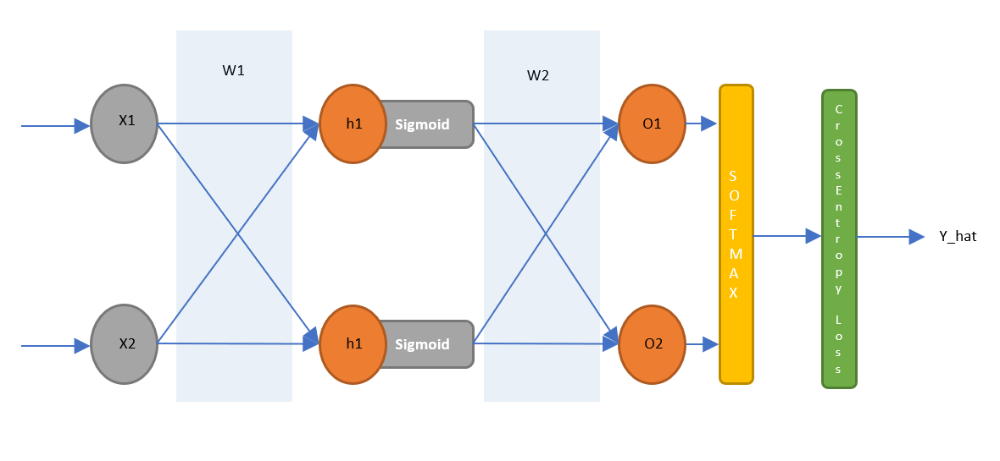
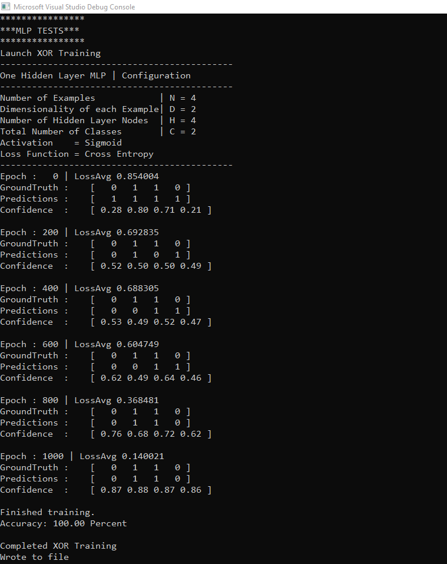
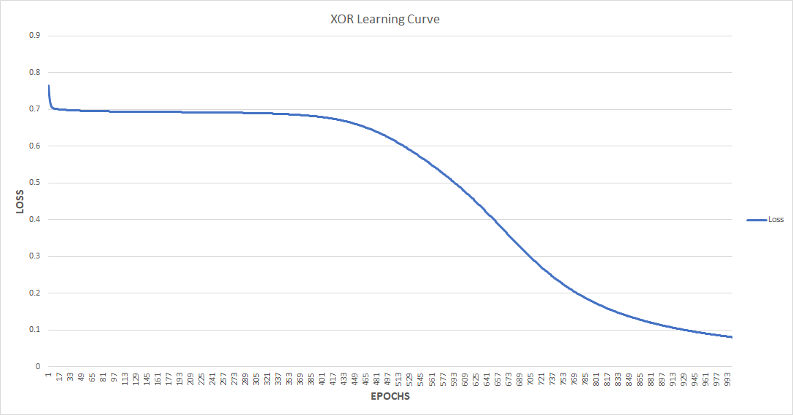
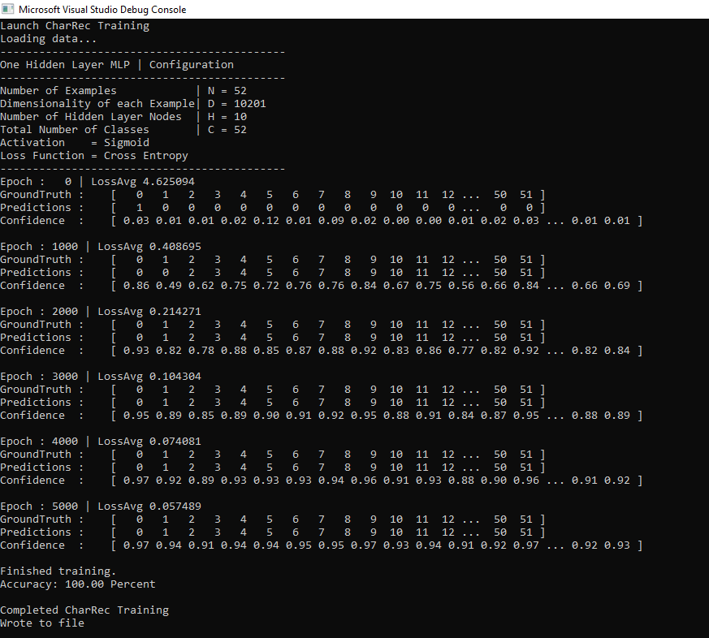
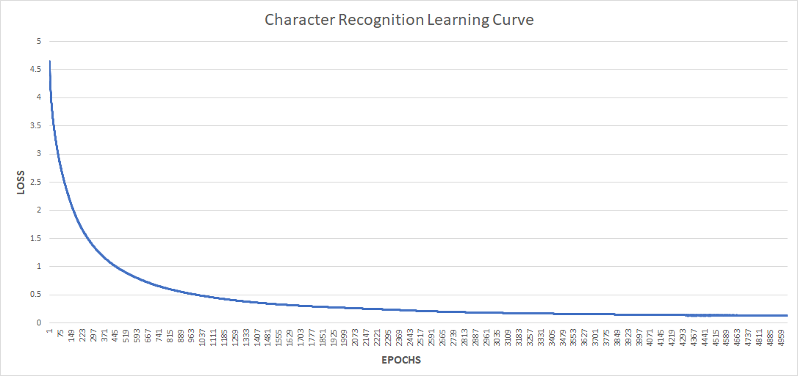

## Project 2 Part 1 - CUDA Character Recognition
**University of Pennsylvania
CIS 565: GPU Programming and Architecture**

* Author: Chhavi Sharma ([LinkedIn](https://www.linkedin.com/in/chhavi275/))
* Tested on: Windows 10, Intel Core(R) Core(TM) i7-6700 CPU @ 3.40GHz 16GB, 
             NVIDIA Quadro P1000 4GB (MOORE100B-06)

[](img/title.png)

### Index

- [Introduction](/README.md#introduciton )
- [Implementation Details](/README.md#implementation-details)
- [Training MLP to Predict a 2x2 XOR](/README.md#training-mlp-to-predict-a-2x2-xor)
- [Training MLP for Character Recognition](/README.md#2-training-mlp-for-character-recognition)
- [Observations and Comments](/README.md#training-mlp-to-predict-a-2x2-xor)
- [Performance]()
- [Extra Credit](/README.md#extra-credits)


### Introduciton

In this project, we implementa Multi Layer Perceptron using CUDA. 
Training a neural network involves computing a sequence of operations that are highly parallelizable. 
We implment computations at each stage of the forward and backward pass using CUDA kernels and compare performance. 

A multilayer perceptron (MLP) is a class of feedforward artificial neural network. An MLP consists of at least three layers of nodes: an input layer, a hidden layer and an output layer. Except for the input nodes, each node is a neuron that uses a nonlinear activation function. MLP utilizes a supervised learning technique called backpropagation for training. Its multiple layers and non-linear activation distinguish MLP from a linear perceptron. It can distinguish data that is not linearly separable such as an XOR function.

After each a forward pass is run, an error in the difference between the actual output and the theoretical output due to each specific weight is calculated. This value is then multiplied by a negative lambda value to give the delta to be added to that specific weight to lessen the error in the overall system. Running this over multiple epochs allows us to find the right weights that describe the dataset classifiction.

 

### Implementation Details

  
 
 We design our MLP network to train on batches of data. Therefore, the input dimension is NxD where N is the number of examples in a batch and D is the dimentionality of each example. After the hidden layer (NxH) is computed, the values are activated useing a Sigmoid activation function. Finally, the ouput layer, of dimension NxC where C is the numbe of classes, is fed into a softmax layer to compute probabilties over classes. We compute loss over these class probablity vectors using Multi Class Cross Entropy. 

Forward Pass:
```
h = W1*X1
X2 = sigmod(h)
O = W2*X2
Probab = Softmax(O)
Loss = CrossEntropy(Probab)

```
Once the Loss is computed, the gradients with respect to W1 and W2 are computed using the chain rule and are reduced to simple matrix forms. See the code comments for more details about loss simplification.

Backward Pass:
```
//Compute Derivatives Using Chain Rule
dL/dw1 = dL/Pr * dPr/dSc * dSc/x2 * dx2/dh * dh/w1;
dL/dw2 = dL/Pr * dPr/dSc * dSc/x2;

//Update Weights 
w1 = w1 - LearningRate*dw1;
w2 = w2 - LearningRate*dw2;
```

### Training MLP to Predict a 2x2 XOR
 
 <p align="center">
  
</p>
 
We train an MLP to predict output of a two bit XOR gate. Given 4 2-bit inputs and ground truth labels, we train the network as follows:

 Epochs: 1000
 
 Learning Rate: 0.1
 
 N = 4               //Number of examples per batch
 
 D = 2 + 1(bias)     //Feature Dimension
 
 H = 2               //Hidden Layer Nodes
 
 C = 2               //Number of classes
 
 
 The network learns to classify XOR inputs over a 100 epochs correctly.
 The loss per epoch reduces consistanctly
 
 
 
 
 
 The learned weights have been added to the repo [here](/build).
 
### Training MLP for Character Recognition
 
We train an MLP to predict characters from images in this task. Given 52 images of characters ground truth labels, we train the network as follows:
 
 Epochs: 5000
 
 Learning Rate: 0.1
 
 N = 52               //Number of examples per batch
 
 D = 10201            //Feature Dimension (101 x 101)
 
 H = 10               //Hidden Layer Nodes
 
 C = 52               //Number of classes
 
 
 
 
 
  The training is stable as the loss reduces consistanly at every uweight update.
  The learned weights have been added to the repo [here](/build).

### Performance

Inference Time v/s Hidden Nodes

Inference Time v/s Data Size


### Observations and Comments
- The MLP describled above is able to learn XOR, a non-linearly seperable function, only when a bias term is added to the input.
- In case of character recognition, we only have one image sample per class of characters, therefore the networks learns to memorise the data mapping to the classes and would not generalise well. In order to build a robust character recongition network, an ideal dataset of charcters per class would need to have enough variation in font intentsity. 

### Extra Credit
We implemented batch processing of data instead of running one exampe at a time. This required simplyfying gradinets at the matrix level. These have been laid out in detail in the code. 
