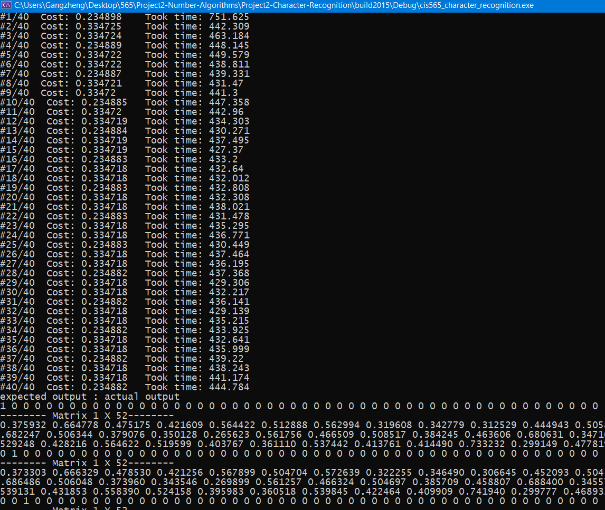

CUDA Character Recognition
======================

**University of Pennsylvania, CIS 565: GPU Programming and Architecture, Project 2**

* Joshua Nadel
  * https://www.linkedin.com/in/joshua-nadel-379382136/, http://www.joshnadel.com/
* Tested on: Windows 10, i7-6700HQ @ 2.60GHz 16GB, GTX 970M (Personal laptop)

### Character Recognition

The program outputs the total error before training and total error after training. As you can see, total error decreases after optimizing the network's weights on training data.

My implementation is hard-coded at 3 layers. I cannot test framerates at other network complexities.

I am limited to a data set of 101 by 101 images. I have no other training or testing data to compare performance on image size with.

