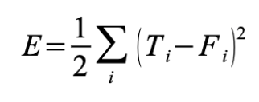
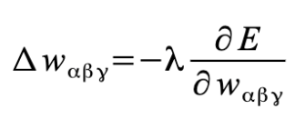

# Project 2b: CUDA Character Recognition
**University of Pennsylvania, CIS 565: GPU Programming and Architecture,
Project 2 - Character Recognition**

Caroline Lachanski: [LinkedIn](https://www.linkedin.com/in/caroline-lachanski/), [personal website](http://carolinelachanski.com/)

Tested on: Windows 10, i5-6500 @ 3.20GHz 16GB, GTX 1660 (personal computer)

## Project Description

The goal of this project was to implement a small neural network that would recognize characters from black-and-white image inputs. I specifically implemented a multi-layer perceptron, with one hidden layer. In this project, I let the size of the hidden layer be the average of the size of the input layer and the size of the output layer (which is always 1).


The training starts when a set of data in input into the peceptron, becoming the first layer. This data is multiplied by a series of weights (initially created randomly) that each correspond to one input node and one hidden layer node. These weights are used to determine the importance or the "weight" each specific input will have in determining the output. All of the products with the same hidden layer node position are summed, then put into the activation function, which, in this project, is a sigmoid function, f(x) = 1/(1+e^-x). The results of this function then become the "input" to the next layer, which has its own set of weights and follows a similar weighting and summing process. Since our final layer is one node, we are left with one output, which is also input into the activation function.

Each input into the network results in a singular output value. This expected value for this input is subtracted from the actual output, squared, and then summed with the corresponding result from every other input. This sum is divided by 2 to give us the total error for this round of training.



We then calculate the error in the difference between the actual and theoretical output due to each specific weight (the error's partial derivative with respect to each weight). Each of these values is multiplied by a negative lambda (here defined as (total error / 5)) to get the delta to be added to that specific weight. This is what is known as back-propogation and should ultimately result in a reduction of error in the overall system.



We can continue this reduction of error until it reaches a certain threshold or we reach our maximum number of iterations. Once training is complete, we record the final weights to a text file, which can then be used as the weights for when we actually want to run our system on a single input.

I initially trained and tested my data on a small XOR example, then moved onto to training and testing for the much larger character recognition example (52 characters, each with an input array of 101x101 = 10,201 floats).

## Output

The weights produced by training for both the XOR and character recognition examples can be found in text files in this repository. After training, I tested the network on each possible input. Here is the result for XOR:

```
*********************************
*********** XOR TESTS ***********
*********************************
Expected output: 0.000000
Actual output:   0.001515

Expected output: 1.000000
Actual output:   0.977023

Expected output: 1.000000
Actual output:   0.976850

Expected output: 0.000000
Actual output:   0.019346

Total error:   0.000720
```

There seems to be an issue with my character recognition test, as the actual output for each tested character is 0.

## Challenges

This project was my first foray into machine learning, and only my second project using CUDA/GPU programming, so this project was a bit of a challenge. I struggled a bit with choosing how to represent and pass around data, particularly when it came to error calculation and back-propogation. For example, when it came to calculating the partial error derivatives for each weight and summing them to get a delta w for each weight, I intially made one large float * buffer that held all the partial derivatives for all weights and for all inputs, and worked with this using various indexing schemes. This worked fine for the very small XOR example, but when it came to the actual character recognition example, which had over 50 million weights, I had trouble fitting everything one buffer. I had to think of a way of dividing the data into pieces while also allowing me to run various calculations on it in parallel, and I still don't think what I did was the best choice.

In the end, I don't believe my back-propogation/weight update functionality works fully, as my network stops reducing error after only one iteration for the character recognition example. Nonetheless, I learned a lot about neural networks through this project.
