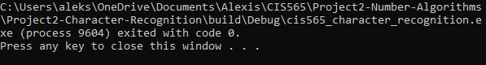

CUDA Character Recognition
======================

**University of Pennsylvania, CIS 565: GPU Programming and Architecture, Project 2**

* Alexis Ward
  * [LinkedIn](https://www.linkedin.com/in/alexis-ward47/), [personal website](https://www.alexis-ward.tech/)
* Tested on: Windows 10, i7-8750H CPU @ 2.20GHz 16GB, GTX 1050 Ti 

# README

Sadly this is all that runs so far; I will update if I decide to take a late day!

For my readme, I think I would not be able to make graphs analysing framerate to image size, as it doesn't seem we were provided varying sizes, but I would recode the hard-coded perceptron to get data for the other two graphs.

I would start with the perceptron classifier to match training input data to output data by adaptively learning.

Then running it on all the data, hopefully converging onto Hannah's excel data