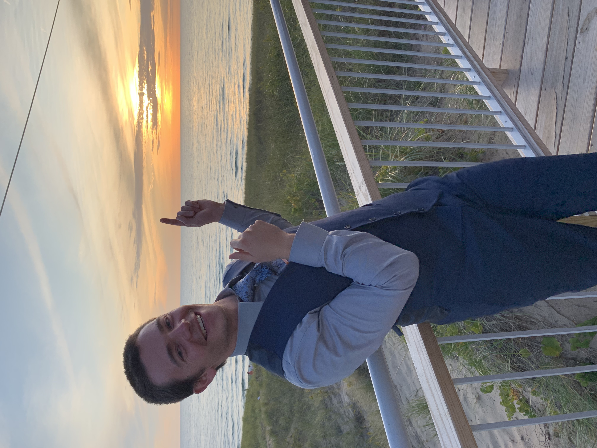

CUDA Character Recognition
======================

**University of Pennsylvania, CIS 565: GPU Programming and Architecture, Project 2**

* Eric Micallef
  * https://www.linkedin.com/in/eric-micallef-99291714b/
  
* Tested on: Windows 10, i5, Nvidia GTX 1660 (Personal)

### Analysis

Unfortunately, I will be taking a zero for this part of the project. I implemented some stuff on the GPU and CPU but not hardly enough to warrant any respect.

Thursday morning I flew to Michigan to be in a wedding and came back Monday morning. Needless to say time was not on my side.

Instead of grading my project please enjoy these nice photos of me from the wedding.

* Me trying to hack my neural network ... (yes that is me ... don't lock your keys in your trunk when you are in the middle of no where Michigan )

* Them feels when you think you know what back propagation is but then you don't ....

* Me pointing at my working neural network like ... 

