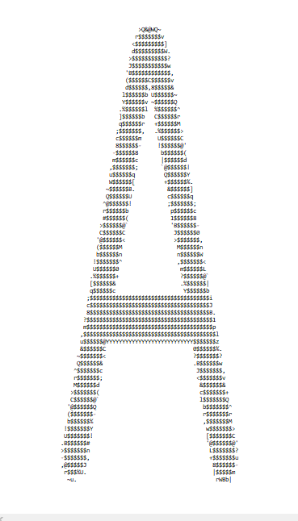
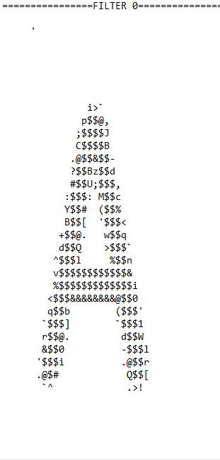
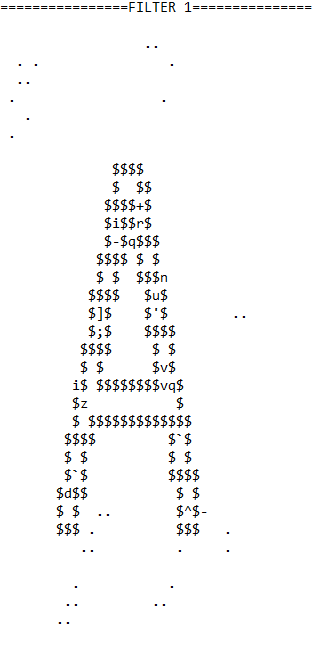
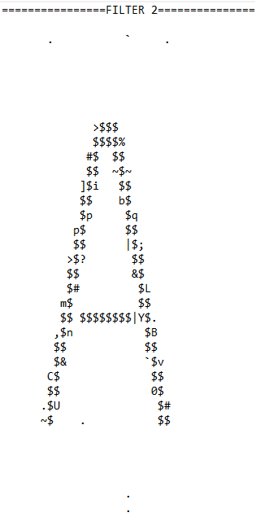
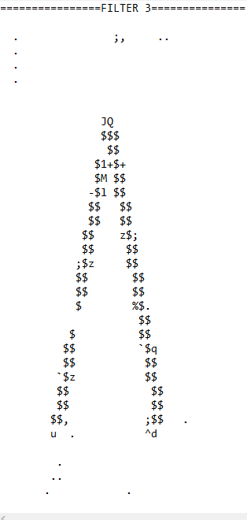
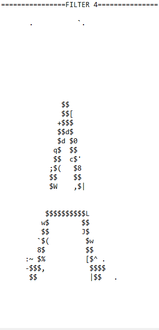

CUDA Character Recognition
======================

**University of Pennsylvania, CIS 565: GPU Programming and Architecture, Project 2**

* Taylor Nelms
  * [LinkedIn](https://www.linkedin.com/in/taylor-k-7b2110191/), [twitter](https://twitter.com/nelms_taylor), etc.
* Tested on: Windows 10, Intel i3 Coffee Lake 4-core 3.6GHz processor, 16GB RAM, NVidia GeForce GTX1650 4GB

*Input image, acii-art style*

## CMake Notes

Notably, I needed to add the following line to `CMakeLists.txt`:
`link_directories(${CUDA_TOOLKIT_ROOT_DIR}/lib/x64)`
Additionally, under the `target_link_libraries` function, I added links to the `cublas` and `curand` libraries

## Use Directions

There are a couple of `#define` clauses at the top of `main.cpp` that can be used to modify operation of the program. The relevant ones are `READING` and `TRAINING`. 

* The `READING` value will, if enabled, read in pre-trained weights. This is essential if just testing the file input. 
* The `INFILE` value defines the file name of the weights file to read from. Note that there is so very, very little error checking regarding reading a file in; it's more or less a binary data dump of the weight arrays straight from memory. Security experts should be cringing right now.
* The `TRAINING` flag modifies whether you are training the dataset or not.
* The `OUTFILE` value helps create the filenames for the relevant output files. They are in the format `numresults`-`hiddenlayersize`-`outwt|trainrecord`-`OUTFILE``.bin|.csv`. These files are the resulting weight values, or a record of the total error against the training iteration number, respectively.

Set your flags accordingly, compile the program, and go at it!

## ML Design Notes
As a relative novice to machine learning, I have elected to primarily put in only two fully-connected hidden layers.

However, I HAVE elected to process the images on the front end through some common image convolutions, followed by a run through a max pooling layer. These results become the first "feature layer." This has the advantage of reducing the number of "pixels" from 10201 to 6534, as I'm running the images through convolution with 3x3 kernels, followed by a 3x3 max pooling operation. Both the convolution and max-pooling are hand-implemented.

There is the slight hiccup that I am not sure how to property back-propogate through a convolutional layer and update convolution kernel weights. That said, I stand by the decision, as the resultant data sets have more activated information than the original data.

I added a bias term to the result of these convolutions and poolings, and again inside the hidden layer.

## Training Time Analysis
To analyze how my network performed for training, I decided to train it only on the first 8 letters, so that I could get some good data about how various parameters affected training time. This would then help determine the best way to structure the network for the larger, 52-letter dataset.

For each trial, I ran up to `10,000` iterations, with each iteration being a batch of all 8 input data sets, after which I updated the weights with the total error from all of that batch of runs. If it ran for more than `10,000` iterations, I considered it "done," effectively unconverged (even if the total error was, still, slowly approaching 0).

I ran each until the sum of the squared errors for the whole set was less than some constant, in this case invoked via `#define GOODENOUGH 0.00001`.

### Hidden Layer Size

The "hidden layer" that came out of my convolutional layers was a fixed size based on the structure of convolutional kernels and max pooling (a little over `6500` elements). However, this left one hidden layer that could be tuned to a specific number of elements. I first ran a number of trials to determine how many elements would lead to the fastest training, with regards to the output vector size.

One frustrating thing about this approach is that the random seed I'm using to generate initial arrays has a significant effect on the overall training time as I change around the size of the arrays, by way of messing with the hidden layer. A one-bit difference in the starting seed could make a tenfold difference in how long the network took to train.

...Or at least, that's what I thought, but changing around the seed, while occasionally very important, did not have as much impact as what were occasionally just one-element differences in hidden layer size.

I've attached an unsatisfying chart here, and decided to go with a hidden layer of size equal to 3 times the size of the result layer, because I am no data scientist, and it is the approach that came closest to working.

### LAMBDA value

Rather than tying the training scaling to total error, I decided to keep it to a single value, because it made coding easier if I could just `#define` it.

I then endeavored to find a LAMBDA value that would operate well across the training set.

Given the relative simplicity of only eight data points, I chose to increase my sample size to `16` for this next round, to better see the results of the training.

Well, it turns out, that was a bad idea; training took way longer in this case, as the model attempted to fit more and more complex input and output pairings.

In the end, I abandoned this analysis, because of the level of runtime complexity I was encountering. (Apologies!)

### The Big Training
I ended up arbitratily deciding on a hidden layer of size `256`, as "roughly 5 times the result vector size" sounded like a metric.

Then, I had a bear of a time training across all manner of situations, because I could not get it to converge.

After a boatload of time, I ended up going with final parameters of hidden layer size (`F2SIZE`) of `156`, a `LAMBDA` training weight of `0.05`, and it took some number of hundreds of thousands of batch iterations through the training data set. In the end, I acheived some, but not perfect, success.

