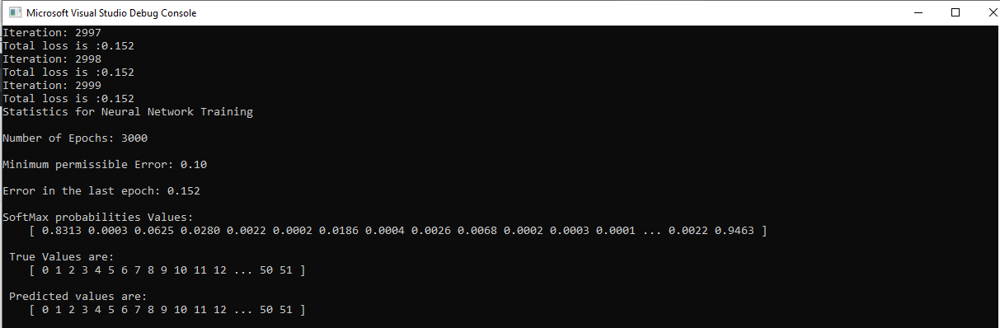

CUDA Character Recognition
======================

### Overview

The overview of the subproject is to create and train a Neural Network for Character Recognition. In more detail, given the image of the alphabet, the Neural Network can identify what character it is and perform the classification. For first testing our Neural network, we will create the network and train on the 2X2 XOR data and then extend it to the character recognition.

## Neural Network

Neural Network in the Multi-Layer Perceptron where the classifier is designing by combining many perceptrons at the same time. As peach perceptron is a linear classfier, it can't classify some of the complex datasets and model the high complexity, The Neural network have the non-linearity aspect as it is made up of several such single multi perceptrons. 

As shown in the figure above, we will be creating a neural network which has a single hidden layer. 

Here are the three main components of the Neural Network:

* **Input Layer**: The layer has the nodes equivalent to the number of features in the data point. We feed the input into the layer.

* **Hidden Layer**: These are the layers which increase the non-linearity model in the classifier and can able to design the models which are very complex to classify for other classifiers. We can vary the number of layers and the number of hidden units in each layer according to our implementation. 

* **Output Layer**: The output layer contains the number of units to which we have compressed our input to and we can use the output layer to classify the output using various other methods like Softmax, reduction in dimensions, etc.

But we will vary the number of hidden units in the hidden layer. Note that the above figure is for the single datapoint. We see the for each hidden unit is calculated as the weighted sum of each of features present in the data. Later on, to bring non-linearity, activation function such as Signmoid, ReLu are used. After hidden units are computed, we can calculate the value of the units as the same as that of the hidden layer and then add on the classifier which increases the confidence of the classification by increasing and decreasing the probabilites to the extremes. 

For updating the weights so that we find the global minima, we use gradient descent optimization. We calculate the gradients using the chain rule for both the weight vectors and then update the weights using the learning rate and these gradients. We continue doing the procedue for some epochs. 

### My Neural Network Implementation

In my implemetation of Neural network, I'm training all the data points at the same time, hence, we have the input data as the array of `DATA_POINTS * NUMBER_OF_FEATURES` as we finally have to train our network for all the data points. Training all the data points once will result in Matrix Multplication for Feed forward and Backpropagation stages of training, which could be easy to model given that we have fixed our parameters shuch as the number of hidden layers and number of hidden units in each layer. 

I will be explaining my network taking reference of 1 data point, although I have trained for all the data points together. As we have 2 features in each data point, we have the number of units in our input layer. For the hidden layer, I have varies it and the number of units at 4 gives the good output. Finally, we have the number of units at the output layer as 2 as there are two classes we need to identify for, i.e., 0(low) and 1(high). This form of network can easily be then migrated to character recognition as it can be easily scaled and the number of classes at the output can be increased to the requirement. I'm not using biases to model my network. Here, I will have two weight arrays, namely, weightsA and weightsB. The weightsA is the matrix which tranforms the input layer to the hidden layer and has the dimensions of `2x4` in our case.  The weightsB is the matrix which tranforms the hiidden layer to the output layer and has the dimensions of `4x2` in our case. 

## XOR Training Analysis

Here is the loss vs Iterations Plot for the XOR training:

Here, we see that the loss of the network saturates and I'm putting the threshold at the total Error at 0.1. Hence, we have trained the network with the 4 datapoints of XOR. The accuracy of the network comes out to be 1 as it has predicted the outcomes correcty.

The weights arrays weightsA and weightsB after the training are stored in the [weightsA_XOR.txt](https://github.com/somanshu25/Project2-Number-Algorithms/blob/master/Project2-Character-Recognition/weightsA_XOR.txt) and [weightsB_XOR.txt](https://github.com/somanshu25/Project2-Number-Algorithms/blob/master/Project2-Character-Recognition/weightsB_XOR.txt) files. The siftmax probabilites at the output layer is in [softmax_prob_XOR.txt](https://github.com/somanshu25/Project2-Number-Algorithms/blob/master/Project2-Character-Recognition/softmax_prob_XOR.txt).

## Character Recognition

After learning on the small dataset, we have extended the Neural network to learn the small and capital alphabets seperately. Hence, for this training, we have total 52 classes to train. Each image has 10201 pixels, hence, the number of features are 10201. There are 52 data points. For our network here, we train it with 10 hidden units in our hidden layer. At the output, we have units equal to the number of classes, which are 52.

We are given the bitmap converted txt files for each image in the scale of 0-255. For simplicity after reading the images, we are scaling these grayscale values to 0-1 range as it can be processed more easily in the neural networks to converge. Since here also we are feeding all the data points at once, we have the input matrix of dimension `52 x 10201`. The weightsA and weightB have the dimesions `10201 x 10` and `10 x 52`. The output layer finally we are getting will be `52 x 52` and the dimesion fo the hidden layer matrix will be `52 x 10`. Here, we have put the learning rate as 0.1 for the training here.

### Analysis

The loss vs Iterations for Character Recognition is given below:

As we observe the screenshot of the training output at the top of README, we can see that the accuracy of the classifier is 1 as all the inputs are correctly classified into their classes and the average training error on the last epoch was 0.15, which is acceptable for our purposes. We don't want to have the loss very close to zero as there would be high possibility for the model to overfit the training data and high chance of performing poorly on the test data.  

The wieghtsA array after the training are stores in [weightsA_characterRecognition.txt](https://github.com/somanshu25/Project2-Number-Algorithms/blob/master/Project2-Character-Recognition/weightsA_characterRecognition.txt), the weightsB are stores in [weightsB_characterRecognition.txt](https://github.com/somanshu25/Project2-Number-Algorithms/blob/master/Project2-Character-Recognition/weightsB_characterRecognition.txt), the softmax probabilties at the output are stored in [softMax_prob_characterRecognition.txt](https://github.com/somanshu25/Project2-Number-Algorithms/blob/master/Project2-Character-Recognition/softMax_prob_characterRecognition.txt) and the hidden layer units values are stored in [hidden_layer_characterRecognition.txt](https://github.com/somanshu25/Project2-Number-Algorithms/blob/master/Project2-Character-Recognition/hidden_layer_characterRecognition.txt).

### Inferences on Chnaging the hidden units in hidden layer

Here are some of the inferences we can make out of the subproject:

1. For training XOR, the number of hidden units in hidden layer as 2 does not completely classify all the 4 points, but it classifies only 2 points as the XOR model is tough to learn with very small non-linearity. To increase the non-linearlity, we need to either add some bias parameters int the network or incrase the numbe rof hidden units in the hidden layer. By both means, we are increasing the pararmenters which could hold more informations about the model to be learnt.

2. On the other hand increasing too many parameters by increasing too many hidden units would result in unnecessary computations which owuld not be required to fit the training data. Hence, we need to have the good balance between the number of hidden units.

3. The same effect goes with the number of hidden layers. Increasing too many parameters would give the result but it's not worth doing it. 
