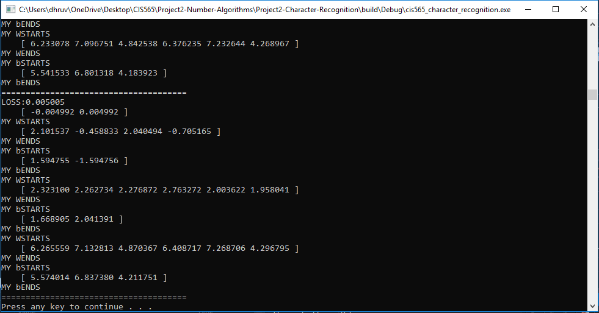

CUDA Character Recognition
======================
**University of Pennsylvania, CIS 565: GPU Programming and Architecture, Project 2**

Dhruv Karthik: [LinkedIn](https://www.linkedin.com/in/dhruv_karthik/)

Tested on: Windows 10 Home, Intel(R) Core(TM) i7-8700 CPU @ 3.20GHz, 16GM, GTX 2070 - Compute Capability 7.5
____________________________________________________________________________________
   
____________________________________________________________________________________
## Outcome
### XOR Convergence



## Additional Implementation Features
### Variable MLP Builder & Batched Updates

Define any MLP very easily as follows:
```C++
//Network Structure
int numSamples = 1;
int inputDim = 2;
int numLayers = 1;
int hiddenDim[1] = {5};
int outputDim = 2;
```
Notice ```numSamples```. This allows you to set the batchSize of the Neural Network to perform Batched Gradient Descent, as opposed to stochastic gradient descent which is the base implementation. This required that I implement an ```AffineLayer``` class and construct matrices out of these, and handle backpropagation for variables batches. 
### Variable Image Sizes

This is a consequence of the previous feature, as I can accept arbitrarily sized inputs and outputs via the ```inputDim``` and ```outputDim``` variables.  

## Tragic Historical Significance of the XOR Problem
Neural Networks are not new. In 1958, [Frank Rosenblatt](https://en.wikipedia.org/wiki/Frank_Rosenblatt) proposed a hypothetical model of a brain's nervous system and coined it the *perceptron*. Essentially, this model fit a line to a dataset. However, as seen below, you can't fit a line to an XOR function. 


The perceptron got a ton of hype in the 60's, but two authors published a [book](https://mitpress.mit.edu/books/perceptrons) on emphasizing why perceptron's are terrible, because they can't fit the XOR function. This book single handedly resulted in the first of three AI Winters. If it weren't that book, the students of CIS 565 in 2010 would also be implementing MLP's in CUDA!
