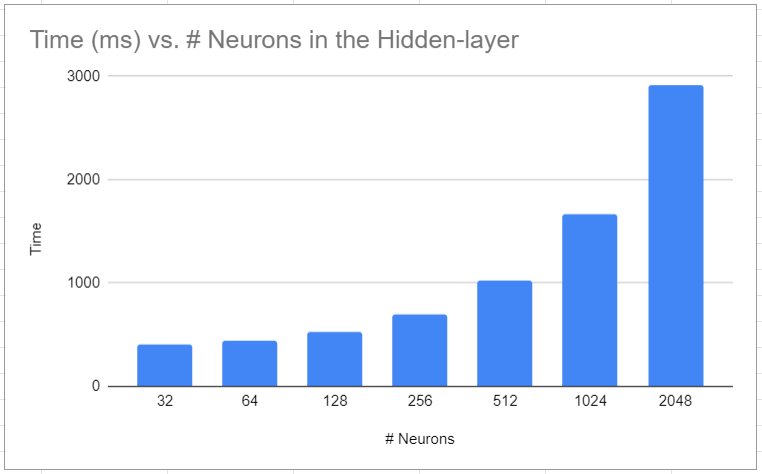

CUDA Character Recognition
======================

**University of Pennsylvania, CIS 565: GPU Programming and Architecture, Project 2**

* Gangzheng Tong
  * www.gtong.me
* Tested on: Windows 10, i7-8th Gen @ 2.2GHz 16GB, RTX 2070 8GB (Personal Laptop)

### Features Implemented
In this project I implemented the following features:
1. Loading data from files
2. Forward and backward propagation implemented on GPU
3. Wrap cuBLAS, thrust and my custom kernel into a Matrix struct and make it easy to use; could also be useful for future projects
4. Use C++ smart pointers to manage memory and avoid memory leak all at once
5. Test the time on different number of neurons

However, I'm not able to predict the character given training samples. The cost fluctuates between 0.2 and 0.3 and seems not dropping within 40 iterations. I did unit tests on every kernel and didn't find anything wrong. Maybe it's due to the limited number of training samples or inappropriate initial weights and bias.

### A Few Observations
1. GPU is capable of handling large throughput. With the increasing # of hidden neurons, the data becomes huge (10212 * 2048 floats for a weight matrix) but my RTX 2070 was able to complete on iteration under 2 seconds. That's 52 samples and a dozen of big matrix operations. 
2. C-Style matrix is typically row-major, but CUDA matrix is colmn-major. I spent a lot of time debugging the matrix dot production being unware of this.
