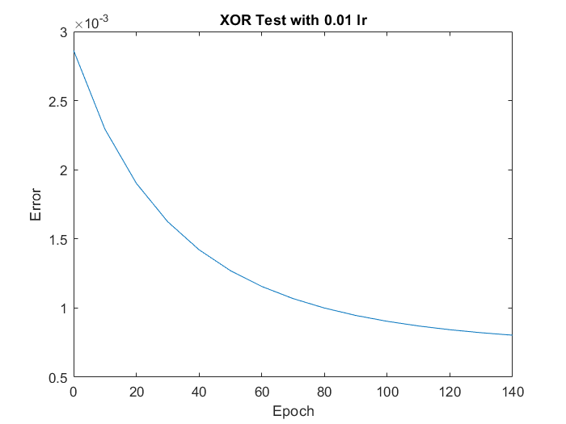
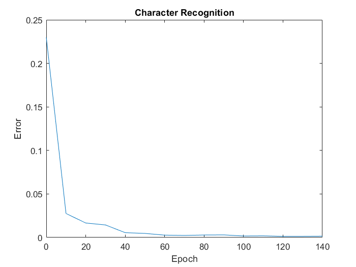

# Project 2-2 CUDA Character Recognition
======================

**University of Pennsylvania, CIS 565: GPU Programming and Architecture, Project 2**

* Weiqi Chen
  * [LinkedIn](https://www.linkedin.com/in/weiqi-ricky-chen-2b04b2ab/)
* Tested on: Windows 10, i7-8750H @ 2.20GHz 2.21GHz, 16GB, GTX 1050 2GB

## Project goal
This project aims to build a Multiple Layer Perceptron (MLP) using CUDA. In my case, a 3-layer MLP is implemented and tested on two different datasets.

The MLP consists of one input layer, one hidden layer and one output layer. The number of hidden neurons in the hidden layer can be specified by user when constructing.

### XOR Example Test
To make sure the implementation is correct, a simple test to train the MLP for XOR operation is performed first. Parameters include:

* Input neurons: 2
* Hidden neurons: 2
* Output neurons: 1
* Learning Rate (lambda): 0.01
* Initial weights from input layer to hidden layer : w11 = 10.1, w12 = 0.9, w21 = 20, w22 = 0.87
* Initial weights from hidden layer to output layer: w1 = 41, w2 = -54

The plot below shows the total squared error vs number of epochs.



Console Output

```
--- XOR Example ---
epoch: 0 | error: 0.00286369
epoch: 10 | error: 0.00229358
epoch: 20 | error: 0.00190236
epoch: 30 | error: 0.00162444
epoch: 40 | error: 0.00142166
epoch: 50 | error: 0.00127057
epoch: 60 | error: 0.0011561
epoch: 70 | error: 0.00106817
epoch: 80 | error: 0.000999872
epoch: 90 | error: 0.000946314
epoch: 100 | error: 0.000903958
epoch: 110 | error: 0.000870197
epoch: 120 | error: 0.000843124
epoch: 130 | error: 0.000821268
epoch: 140 | error: 0.000803517
```


### Character Recognition
Parameters:
* Input neurons: 10201
* Hidden neurons: 256
* Output neurons: 52
* Learning Rate (lambda): 0.01
* Initial weights: sampled from a uniform distribution from -1 to 1 randomly

The dataset has 52 images of size 101x101. Each image is a letter from the alphabet, either capitalized or not. Therefore our input is a 1x10201 array expanding the image matrix. The corresponding label is a 1x52 one-hot array.

The plot below shows the total squared error vs number of epochs.



The plot below shows the accuracy vs number of epochs.


Console Output

```
--- Character Recognition ---
epoch: 0 | error: 0.179246 | accuracy: 90.3846%
epoch: 10 | error: 0.0394659 | accuracy: 100%
epoch: 20 | error: 0.018194 | accuracy: 100%
epoch: 30 | error: 0.00813415 | accuracy: 100%
epoch: 40 | error: 0.00660377 | accuracy: 100%
epoch: 50 | error: 0.00379195 | accuracy: 100%
epoch: 60 | error: 0.00267373 | accuracy: 100%
epoch: 70 | error: 0.00241532 | accuracy: 100%
epoch: 80 | error: 0.00199531 | accuracy: 100%
epoch: 90 | error: 0.00165342 | accuracy: 100%
epoch: 100 | error: 0.00178789 | accuracy: 100%
epoch: 110 | error: 0.000856958 | accuracy: 100%
epoch: 120 | error: 0.00144631 | accuracy: 100%
epoch: 130 | error: 0.000920435 | accuracy: 100%
epoch: 140 | error: 0.000663891 | accuracy: 100%
---
Target:1, Predicted:1
Target:2, Predicted:2
Target:3, Predicted:3
Target:4, Predicted:4
Target:5, Predicted:5
Target:6, Predicted:6
Target:7, Predicted:7
Target:8, Predicted:8
Target:9, Predicted:9
Target:10, Predicted:10
Target:11, Predicted:11
Target:12, Predicted:12
Target:13, Predicted:13
Target:14, Predicted:14
Target:15, Predicted:15
Target:16, Predicted:16
Target:17, Predicted:17
Target:18, Predicted:18
Target:19, Predicted:19
Target:20, Predicted:20
Target:21, Predicted:21
Target:22, Predicted:22
Target:23, Predicted:23
Target:24, Predicted:24
Target:25, Predicted:25
Target:26, Predicted:26
Target:27, Predicted:27
Target:28, Predicted:28
Target:29, Predicted:29
Target:30, Predicted:30
Target:31, Predicted:31
Target:32, Predicted:32
Target:33, Predicted:33
Target:34, Predicted:34
Target:35, Predicted:35
Target:36, Predicted:36
Target:37, Predicted:37
Target:38, Predicted:38
Target:39, Predicted:39
Target:40, Predicted:40
Target:41, Predicted:41
Target:42, Predicted:42
Target:43, Predicted:43
Target:44, Predicted:44
Target:45, Predicted:45
Target:46, Predicted:46
Target:47, Predicted:47
Target:48, Predicted:48
Target:49, Predicted:49
Target:50, Predicted:50
Target:51, Predicted:51
Target:52, Predicted:52
```

### Extra credit:
Matrix multiplication is implemented in place of doing 1d vector for input to output.
