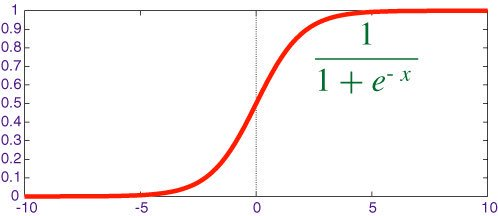
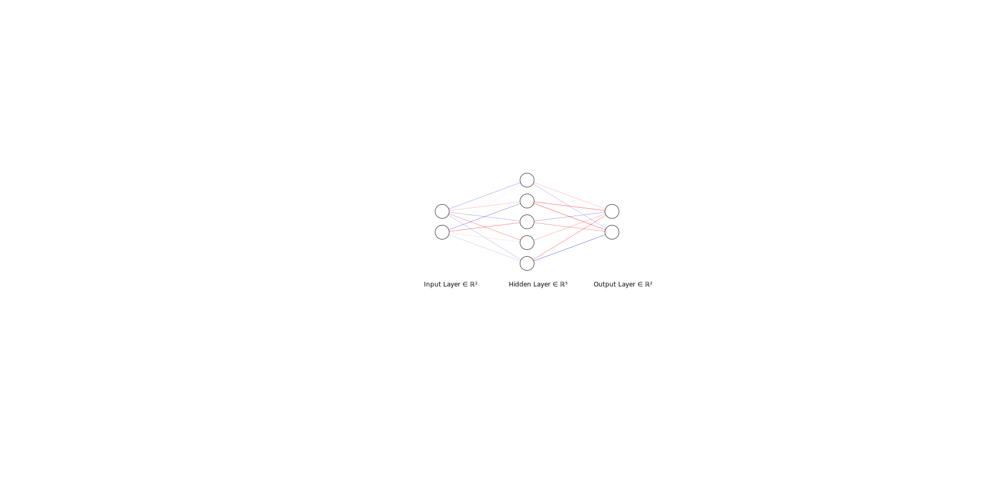
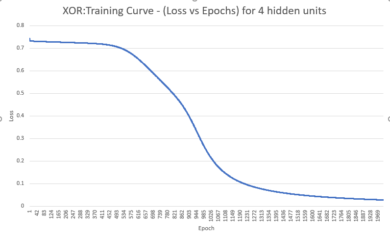
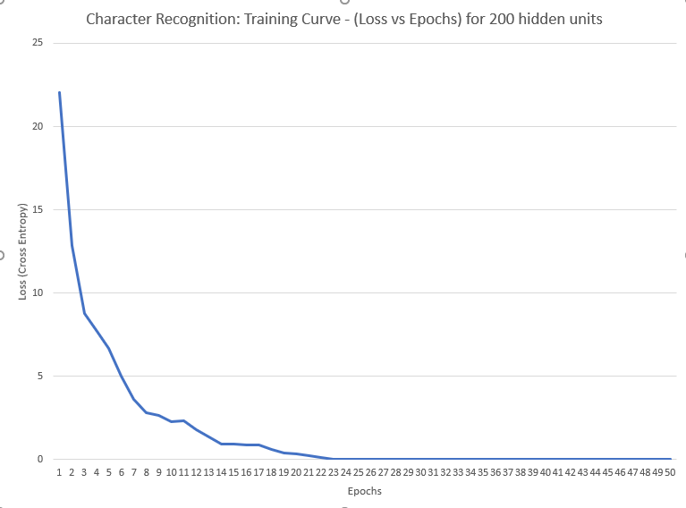
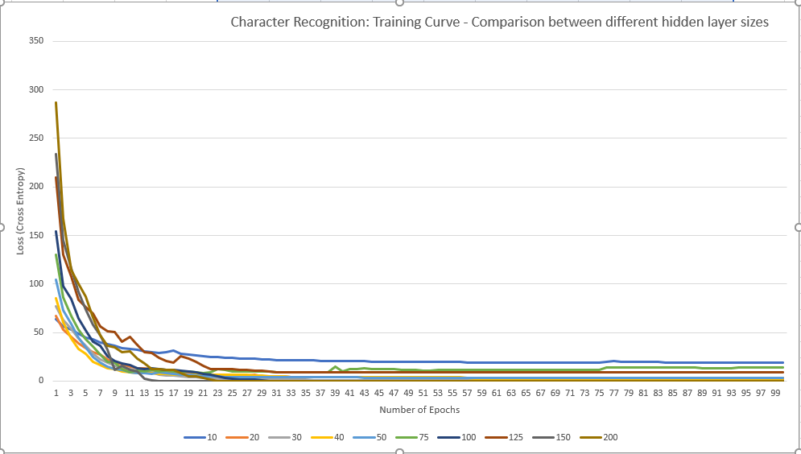
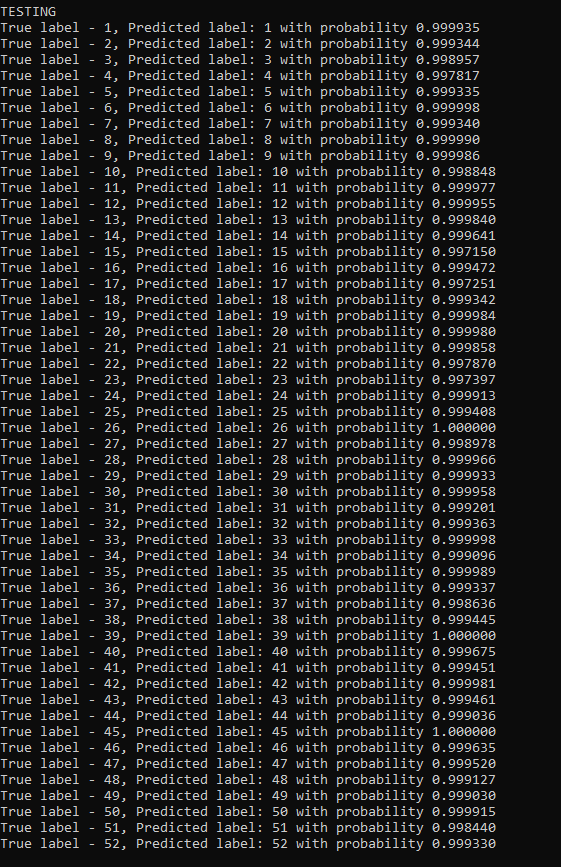

CUDA Character Recognition
======================

University of Pennsylvania, CIS 565: GPU Programming and Architecture, Project 2**

* Saket Karve
  * [LinkedIn](https://www.linkedin.com/in/saket-karve-43930511b/), [twitter](), etc.
* Tested on:  Windows 10 Education, Intel(R) Core(TM) i7-6700 CPU @ 3.40GHz 16GB, NVIDIA Quadro P1000 @ 4GB (Moore 100B Lab)

### Description

This repository contains the CUDA implementation of a Multi Layer Perceptron (MLP). The network has a architecture having one hidden layer and can be used to train and learn mappings between any inputs and labels. The inputs to the network should be one dimensional. The network can then be trained on a data set for some classification task. Once trained, the network can be forward propogated to make predictions for any input (even those not in the dataset used for training).

The input size, hidden layer size (number of perceptron units in a layer) and the output size (the number of classes to classify into) can be easily configured for the network. The network uses non-linear activation functions in the hidden units and the output layer to convert the final outputs into probabilities (or say confidence) of classifying in a given class.

### The Neural Network Architecture

The complete neural network architecture implemented can be picturized as follows,


[Image reference](https://www.google.com/url?sa=i&source=images&cd=&ved=2ahUKEwjFj--K3djkAhWsq1kKHWfaCkAQjRx6BAgBEAQ&url=https%3A%2F%2Fwww.cc.gatech.edu%2F~san37%2Fpost%2Fdlhc-fnn%2F&psig=AOvVaw3n6z_jJ1Gt-TEhuC_wXEFM&ust=1568839521037348)

The network implemented has a single hidden layer. The size of the hidden layer can be easily configured during initializing the network. The input layer will have size equal to the dimension of the each input. The output layer will similarly have a size equal to the number of classes to be used for classification. 

We need to use a non-linear function after passing through each layer of the network till the last layer. This is to make sure the neural network does not learn a linear function eventually. So, I have used the sigmoid activation function after the hidden layer. The Sigmoid function takes the form as shown in the below figure.


[Image reference](https://www.google.com/url?sa=i&source=images&cd=&ved=2ahUKEwjgrNPqztjkAhVow1kKHeCzBIIQjRx6BAgBEAQ&url=https%3A%2F%2Ftwitter.com%2Fhashtag%2Fsigmoid&psig=AOvVaw3DJLoIr81ZD90Mq1ZBwYQj&ust=1568835764647240)

At the end of the last layer, to transform the outputs to look like probabilities, we use the softmax function. This makes sure the outputs for all classes sum to 1.

The symbols used subsequently will mean the following,
- N : Number of instances in the data set
- H : Size of the hidden layer
- C : Number of classes
- F : Dimension of each input instance
- W1 : Weight matrix between input and hidden layer
- W2 : Weight matrix between hidden and output layer

The dimensions of each layers and weight matrices used are as follows,
- Input Layer : N x F
- Hidden Layer : N x H
- Output Layer : N x C
- W1 : F x H
- W2 : H x C

### Training Process

Before training the network, the network parameters explained in the above section need to be initialized. This is done using the ```initialize_network()``` method.

Once the network is initialized, the ```train()``` function can be called which will perform training for as many epochs (iterations) as specified by the user.

**BACKPROPOGATION

The training performs these operations in the following order and is looped over every iteration.
- Forward pass through the network - this will generate the values of the output layer (probabilities for each class)
- Compute the loss for the pass
- Compute the gradients of the loss with respect to each weight
- Update all the weights

### Making predictions

Forward passing through the network for any input image will output the predicted class. It will also give the confidence the neural network classifies the input image in the predicted class.

### Analysis of the training process

I tested the implementation first on the XOR function. The network converged in arounnd 1500 epochs. After training for these many iterations, the netowrk could give accurate predictions for the XOR function almost 100% of the time.

The architecture of the neural network used to train can be found in the following figure,



Number of epcohs for convergence = 1500
Final Loss = 
Test accuracy = 100%

The training plot of the network tested on the XOR function can be seen in the following figure.



After testing for the XOR function, I loaded the character recognition dataset and trainied the network on it. 

Based on the architecture created, the network converged in around 30 epochs. I trained it for 50 epochs with 200 hidden units.

Number of epcohs for convergence = 30
Final Loss = 
Test accuracy = 100%

The training plot of the network tested on the Character Recognition can be seen in the following figure.



I also tested the networks performance for different network architectures (number of perceptron in the hidden layer). The following figure shows the comparison.



The trained weights can be found [here](img/trained_weights_200_layers.xlsx)

### Testing the network

I tested the network on all the images in the data-set in a reverse order to make sure the network has not learned the order and has actually learned the mapping.

The predictions for all tests are as shown in the following figure. The figure shows the true labels, the predicted class and the probabilities associated with the class.




