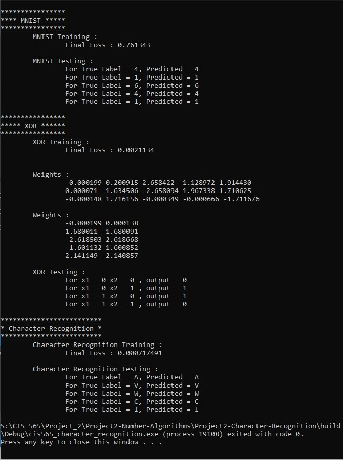
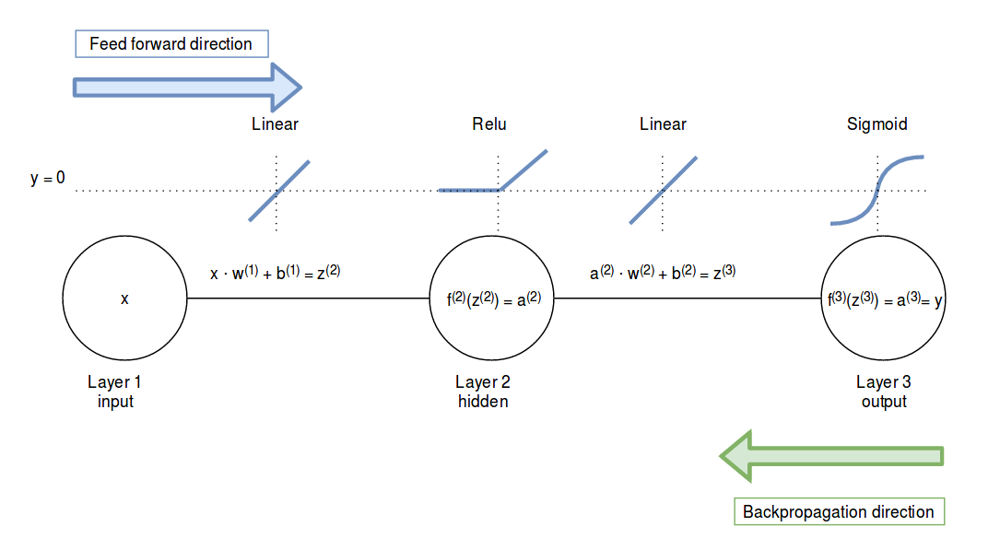
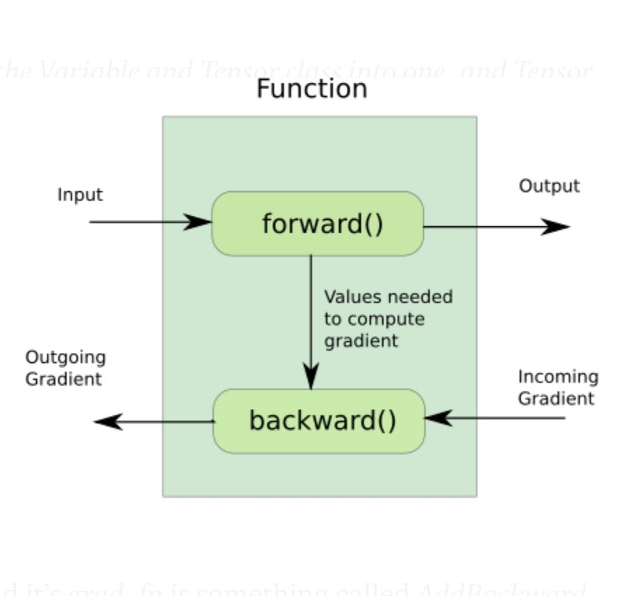
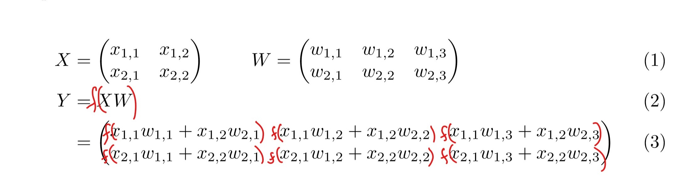
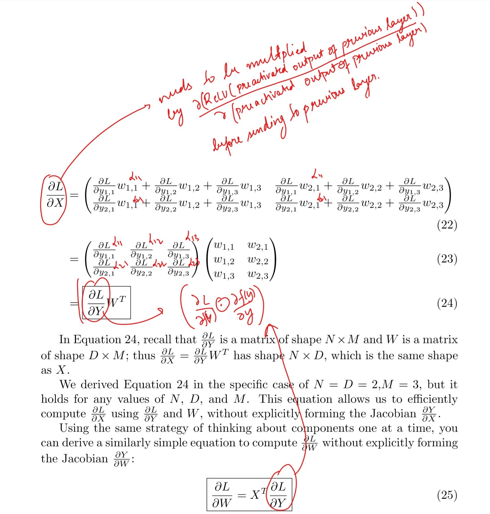
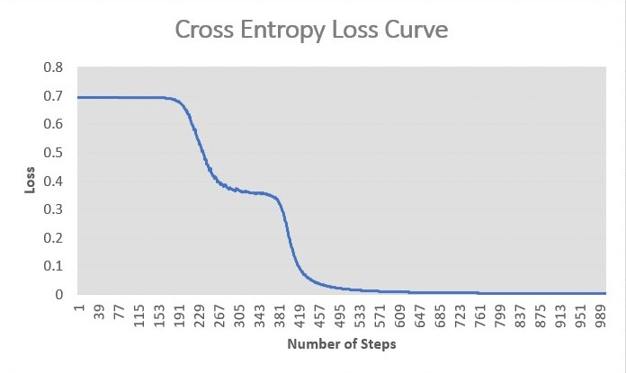
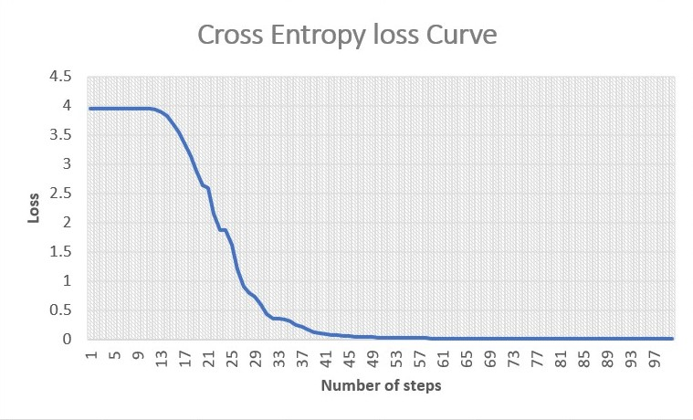
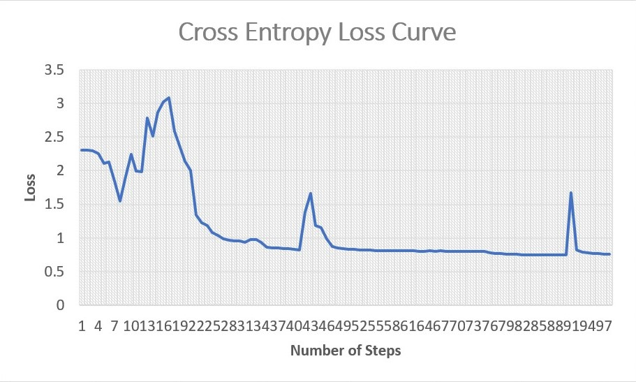

CUDA Character Recognition
======================

**University of Pennsylvania, CIS 565: GPU Programming and Architecture, Project 2**

* Author : Kushagra
  - [LinkedIn](https://www.linkedin.com/in/kushagragoel/)
* Tested on:  Windows 10 Education, Intel(R) Core(TM) i7-6700 CPU @ 3.40GHz 16GB, NVIDIA Quadro P1000 @ 4GB (Moore 100B Lab)

____________________________________________________________________________________

## Breaking the Ice


## Table of Contents
1. [Introduction](#intro)
2. [What is a Multi Layer Perceptron](#mlp)
2.1. [Forward](#forward)
2.2. [Backward](#backward)
3. [Implementation](#impl)
4. [Performance Analysis](#perform)
5. [Humble Brag](#brag)
6. [References](#ref)


<a name = "intro"/>

## Introduction
In this project we have created a generic multi layer perceptron from scratch in CUDA. We then train the multi layer perceptrons on 3 different datasets :  
* MNIST
* Custom Dataset having upper and lower case alphabets
* XOR

<a name = "mlp"/>

## What is a Multi Layer Perceptron
To understand what a multi layer perceptron is, we start by looking at what a perceptron is. The following image gives an idea of how a perceptron functions and the motivation behind it

Neuron             |  Perceptron
:-------------------------:|:-------------------------:
 | 

And with several such perceptrons, we make a multi-layer perceptron as depicted here :
~[](img/MNISTmlp.png)

<a name = "forward"/>

### Forward Pass
A forward pass means going from inputs to outputs in a mlp by calculating the value at each intermediate layer and then multiplying with the layer's weights to get the inputs for the next intermediate layer.


<a name = "backward"/>

### Backward Pass
In this step, we calculate how our trainable parameters effect the loss and adjust them accordingly. This is more popularly known as BackPropagation and is essentially an application chain rule from calculus.

A depiction of the forward pass and the backward pass looks like :


<a name = "impl"/>

## Implementation
On to the fun stuff now. I implemented this project trying my best to keep the mlp architecture as generic as possible. Due to this design, we have the capability of having :
* Variable number of hidden layers
* Variable sizes of hidden layers
* Variable batchSizes for faster training
While also trying to encapsulate as much of the implementation detail from the user as possible. The following class definition explains how its being done. 
### MultiLayerPerceptron
```
class MultiLayerPerceptron {

  std::vector<FullyConnectedLayer*> layers;
  int batchDim;
public :
  MultiLayerPerceptron(int inputDim, int numHiddenLayers, int *hiddenDim, int outputDim, int batchDim);
  void forward(float *input, float *output, bool test = false);
  void backward(float *output, float *predicted, float learningRate);
  float loss(float *label, float *predicted);
};
```
We see here that the MultiLayerPerceptron has a vector of FullyConnectedLayers which can be instantiated using the hiddenDim array. The forward and backward method perform the operations we described above. 
The MultilayerPerceptron takes input from the user, iterates through the layers and calls their respective forward and backward methods and finally returns the prediction. 
As long as a class extends FullyConnectedLayer and implements the forward and the backward method, we can add it to our MultiLayerPerceptron.

### FullyConnectedLayer
```
class FullyConnectedLayer {
  float *weight = NULL;
  float *inputs = NULL;
  int inputDim;
  int batchDim;
  int outputDim;
  bool lastLayer;

public:
  FullyConnectedLayer(int inputDim, int outputDim, int batchDim, bool lastLayer);
  void forward(float *input, float *output, bool test = false);
  void backward(float learningRate, float *incomingGradient, float *outgoingGradient);
  int getInputDim();
  int getOutputDim();
};
```
This class symbolizes each hidden layer in the multi layer perceptron. The forward and the backward methods over here have the core logic to calculate the hidden values and finally the output.
By setting the lastLayer to true, we can signify the last layer to use softmax to give outputs as probabilites, otherwise each layer uses ReLU as its activation.
One thing that is absent here are the biases (although the first layer can handle biases if we append 1 to each sample). But in our experimentation, it was found that biases in the input layer were sufficient to give use good results.

### Isn't this too complicated?
Yes, but actually no. We are calculating the gradients of each layer in a very clever and efficient fashion. 
The magic is present in the FullyConnectedLayer implementation. Each layer recieves a partial gradient from the next layer, which it uses to calculate gradients for its own weights and also what information it should pass along to the previous layer. The following image will provide a better idea of how this is working :

 

And if someone is curious enough for the maths behind it, don't worry, I got you covered. With a little bit of maths, its not hard to see that  current layer will recieve the derivative of the loss w.r.t to its output and the derivative of the loss w.r.t to the input of the current layer needs to be passed to the previous layer.

 
 

<a name = "perform"/>

## Performance Analysis
Let's look at how our implementation performs on the datasets :  

### XOR  

   

### Custom Dataset  

   

### MNIST  

   


So the loss is going down quite smoothly. This means that our implementation works really well.

### Observations
* It was observed that for XOR would not train if the size of the hidden layer was less than 5. At anything more than or equal to 5, the loss keeps decreasing as long as we train. Which was expected as it will keep pushing the probabilites towards 1 without actually every reaching it due to the softmax.
* The character recognition with little training would give 100% accuracy with just 1 hidden layer. This means its overfitting badly which was expected since we have only one data point per class. We can revisit this later to add some kind of regularization/penalty to ensure that the mlp doesn't just memorize the input.
* To see if our MLP actually learns anything, we tried an alternate dataset, The MNIST. In fact we use a 2 hidden layer with less hidden units as having more hidden units would exhaust the memory of the GPU. This is because we are doing batch gradient descent and we are storing the inputs for all layers, leading us to signficant memory consumption.
* Another interesting fact about MNIST is with just the addition of biases to the input layer, we observed huge improvement to the point that the network actually started to predict correct values and not give the same answer for all the inputs.


<a name = "brag"/>

## Humble Brag
* As Archimedes once said, give me enough CUDA cores and I will meet you at the global minimum, you can have as many layers as you want and with as many hidden units. (almost) Nothing is hard coded.
* The interface to use the Multi-Layer Perceptrons follows PyTorch's style and therefore is highly intutive to anyone who has experience in PyTorch.
* Batch Gradient descent : You don't have to run the mlp again and again for different inputs, just batch them up and run the mlp once with correct parameters and let the implementation handle the un-fun stuff for you. On a serious note, batch gradient descent with generic classes introduced a lot of several complications about how to calculate and propagate the gradients which are now being handled very gracefully by the Autograd style of backpropagation.
* MNIST : I was successfully able to learn the correct labels for hand-drawn numbers, how cool is that!!
* Not giving up even when windows did :)  
  


<a name = "ref"/>

## References  
* http://cs231n.github.io/neural-networks-1/  
* https://corochann.com/mnist-training-with-multi-layer-perceptron-1149.html  
* https://www.ritchievink.com/blog/2017/07/10/programming-a-neural-network-from-scratch/
* https://towardsdatascience.com/getting-started-with-pytorch-part-1-understanding-how-automatic-differentiation-works-5008282073ec
* http://cs231n.stanford.edu/handouts/linear-backprop.pdf
