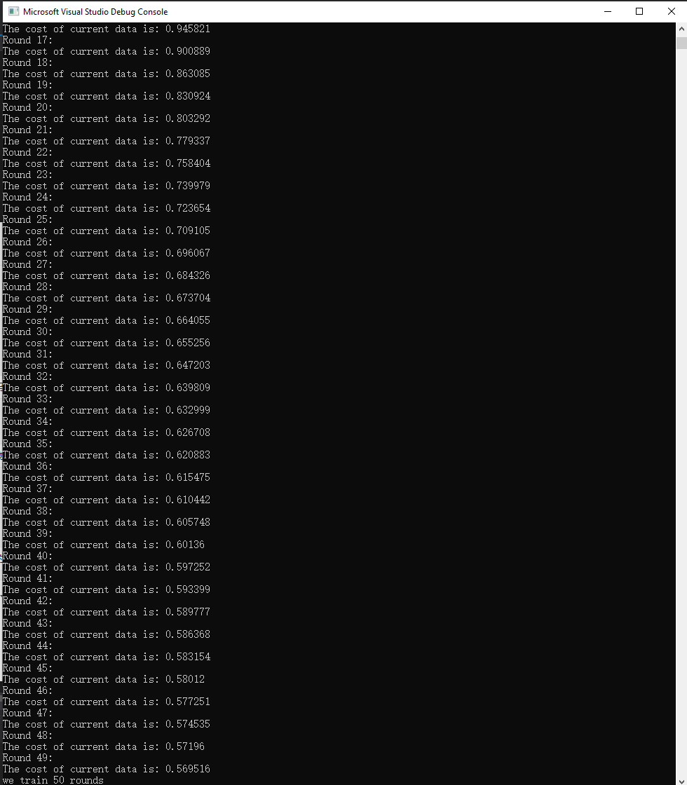

CUDA Character Recognition
======================

**University of Pennsylvania, CIS 565: GPU Programming and Architecture, Project 2**

* #### Author information
  
  - Tianming Xu (Mark)
    - www.linkedin.com/in/tianming-xu-8bb81816a (LinkedIn)
  - Tested on: Windows 10, i7-8700 @ 3.20GHz 16GB, GTX 2080 8192MB (my personal desktop)

### Output Screenshots(50 Epochs and 30 neuron)

The cost drops from 6 to around

#### Features

I implemented a file loader to load in all the training data from the data-set folder and input that to the neural network class. In the class, according to how many epochs we will train, I will loop through all the training data I have in the back propagation algorithm, applying back the delta of weights and bias. The cost of out data set drops significantly after 5 epochs.

#### Performance Analysis

Due to time constraint, I don't have time to do a full performance analysis. However, the GPU can help me handle many matrix operations so, it should be more efficient than the CPU version.

#### Acknowledgement

This homework I especially want to thank Jiangping Xu for helping me figure out the concept of neural network. Also, http://neuralnetworksanddeeplearning.com/ is a fantastic website which describes the concept of neural network concisely. There are python codes for a hand written number recognition program, which helps me a lot for implementing my character recognition program.