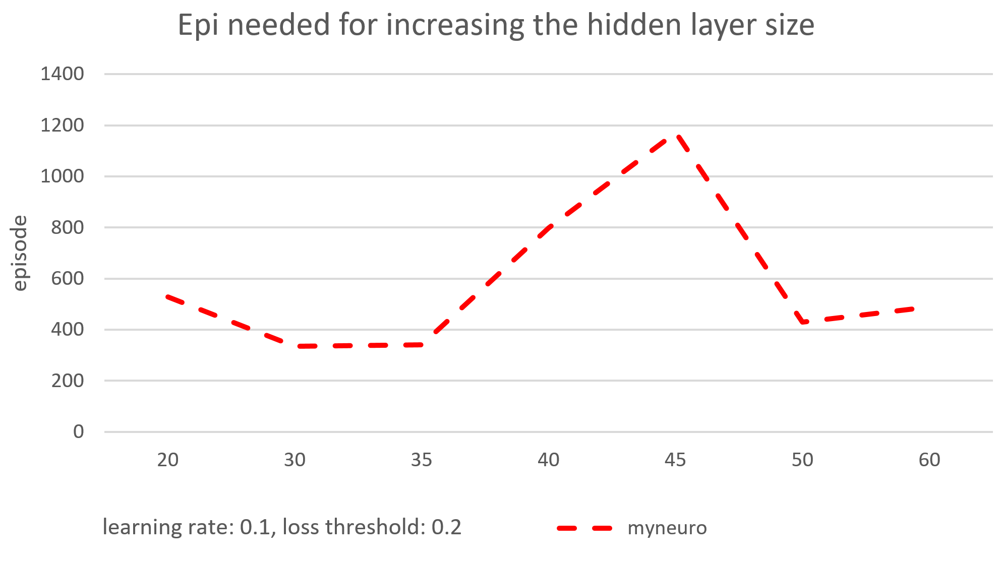

CUDA Character Recognition
======================

**University of Pennsylvania, CIS 565: GPU Programming and Architecture, Project 2**

* Yan Dong
  - [LinkedIn](https://www.linkedin.com/in/yan-dong-572b1113b/)
  - [personal website](coffeier.com)
  - [github](https://github.com/coffeiersama)
* Tested on: Windows 10, i7-8750 @ 2.22GHz  (12CPUs)  16GB, GTX 1060 14202MB (OMEN 15-dc0xxx)


[Result](#result) - [Rules](#rules) - [Runtime Analysis](#analysis) - [Extra](#extra)


## Rules

##### I build a simple neuro network, it has:

- Input layer-the image data come in here, now is 10201 neuro based on the provide data.
- one hidden layer-the number of the neuro can be changed. We calculate the intermediate quantity with weights and then do a sigmoid function, then be the input of the next layer.
- Output layer, the neuro count is 52 based on there are 52 classes at present.

##### Loss function:

​	There are 2 loss calculation, the first one is MSE, which means just calculate the difference between the prediction and the real label and then square it and multiplied by 0.5.


​	The second one is entropy_cross method, here is the equation: yi and yi' is the prediction and the ground truth.


#####  Forward Pass

- input data into input layer

- Multiply neuro data in this layer with weights(full connected)

- get hidden layer data

- sigmoid

- Multiply neuro data in this layer with weights(full connected)

- sigmoid

- softmax 

- get output

  

##### Back Propagation

- calculate the error between ground truth and output
- softmax derivative, pass backward
- sigmoid derivative
- multiply with weights, pass backward and get the hidden-output gradient
- sigmoid derivative
- multiply with weights, get the input-hidden gradient
- update the weights


## Analysis



As shown in the graph, when we increase the hidden layer size, sometimes the episode goes down, sometimes increase, there is no obvious stable tendency for my network.


after training more times, the accuracy increase.

## Result

###### There are separate training and testing part

you can set the loss threshold you want, 

for instance, 0.5, and you input the training time you want.

Then we get training, if the final loss is less than the threshold, 

we can go into the test part.

###### There are two test way,

the first is randomly pick a picture to recognize, do it several times,

another is just follow the order(maybe forward or backward, here I use forward)

to make 52 tests. 

I print each recognize test result.

###### I print the weights in the folder, see hid_out_w.txt and input_hid_w,txt

```
****************
** Recognize TESTS **
****************
successfully build the network!
epoch 0 loss : 5.83244
epoch 1 loss : 4.90023
epoch 2 loss : 4.26333
epoch 3 loss : 3.7257
epoch 4 loss : 3.25222
epoch 5 loss : 2.82764
epoch 6 loss : 2.44545
epoch 7 loss : 2.10429
epoch 8 loss : 1.80387
epoch 9 loss : 1.54303
epoch 10 loss : 1.31975
epoch 11 loss : 1.13122
epoch 12 loss : 0.973897
epoch 13 loss : 0.843676
epoch 14 loss : 0.73633
epoch 15 loss : 0.647869
epoch 16 loss : 0.574772
epoch 17 loss : 0.514071
epoch 18 loss : 0.463332
epoch 19 loss : 0.420601
epoch 20 loss : 0.384323
epoch 21 loss : 0.353275
epoch 22 loss : 0.326494
epoch 23 loss : 0.30322
epoch 24 loss : 0.282853
epoch 25 loss : 0.264912
epoch 26 loss : 0.249011
epoch 27 loss : 0.23484
epoch 28 loss : 0.222143
epoch 29 loss : 0.210712
epoch 30 loss : 0.200374
epoch 31 loss : 0.190984
epoch 32 loss : 0.182422
epoch 33 loss : 0.174586
epoch 34 loss : 0.167391
epoch 35 loss : 0.160762
epoch 36 loss : 0.154637
epoch 37 loss : 0.148961
epoch 38 loss : 0.143687
epoch 39 loss : 0.138776
pic: 1  pred:   1
pic: 2  pred:   2
pic: 3  pred:   3
pic: 4  pred:   4
pic: 5  pred:   5
pic: 6  pred:   6
pic: 7  pred:   7
pic: 8  pred:   8
pic: 9  pred:   9
pic: 10  pred:   10
pic: 11  pred:   11
pic: 12  pred:   12
pic: 13  pred:   13
pic: 14  pred:   14
pic: 15  pred:   15
pic: 16  pred:   16
pic: 17  pred:   17
pic: 18  pred:   18
pic: 19  pred:   19
pic: 20  pred:   20
pic: 21  pred:   21
pic: 22  pred:   22
pic: 23  pred:   23
pic: 24  pred:   24
pic: 25  pred:   25
pic: 26  pred:   26
pic: 27  pred:   27
pic: 28  pred:   28
pic: 29  pred:   29
pic: 30  pred:   30
pic: 31  pred:   31
pic: 32  pred:   32
pic: 33  pred:   33
pic: 34  pred:   34
pic: 35  pred:   35
pic: 36  pred:   36
pic: 37  pred:   37
pic: 38  pred:   38
pic: 39  pred:   39
pic: 40  pred:   40
pic: 41  pred:   41
pic: 42  pred:   42
pic: 43  pred:   43
pic: 44  pred:   44
pic: 45  pred:   45
pic: 46  pred:   46
pic: 47  pred:   47
pic: 48  pred:   48
pic: 49  pred:   49
pic: 50  pred:   50
pic: 51  pred:   51
pic: 52  pred:   52
test time: 52 ,correct probability: 100%
```


## Extra

I use the cublas to do the forward pass and the back propagation calculation as a matrix multiply.

The input of the txt data can be a matrix of  *1 x 10201*

and the input_hid_weight is *10201 x hid_layer_size*

the hid layer data is  *1 x hid_layer_size*

the hid_output_weight is  *hid_layer_size x output_layer_size*

the output is  *1 x output_layer_size*