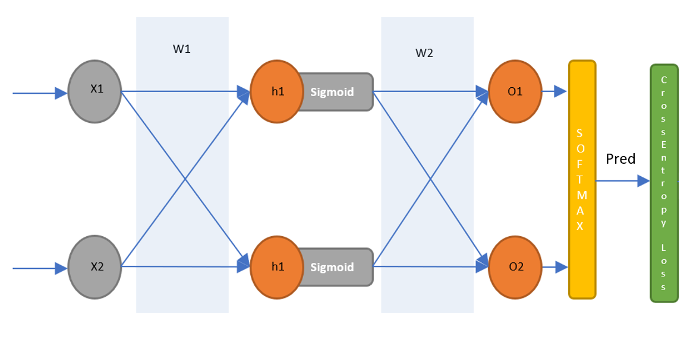

## Project 2 Part 1 - CUDA Character Recognition
**University of Pennsylvania
CIS 565: GPU Programming and Architecture**

* Author: Chhavi Sharma ([LinkedIn](https://www.linkedin.com/in/chhavi275/))
* Tested on: Windows 10, Intel Core(R) Core(TM) i7-6700 CPU @ 3.40GHz 16GB, 
             NVIDIA Quadro P1000 4GB (MOORE100B-06)

### Index

- [Introduction]( )
- [Algorithm]()

### Introduciton

In this project, we implementa Multi Layer Perceptron using CUDA. 
Training a neural network involves computing a sequence of operations that are highly parallelizable. 
We implent computations at each stage of the forward and backward pass using CUDA kernels and compare performance. 

Stream compaction, also known as stream filtering or selection, usually produces a smaller output array which contains only the wanted elements from the input array based on some criteria for further processing, while preserving order. For our implementation, We will attemp to remove '0's from an array of ints.

### Network Architecture

 The chosen MLP architecture is described the diagram below.
 
  
 

###  1: Training MLP to Predict a 2x2 XOR
 
 DEscription
 
 
 
 
 
###  2: Training MLP for Character Recognition
 DEscription
 
 
 
 
 
### Observations and Comments
