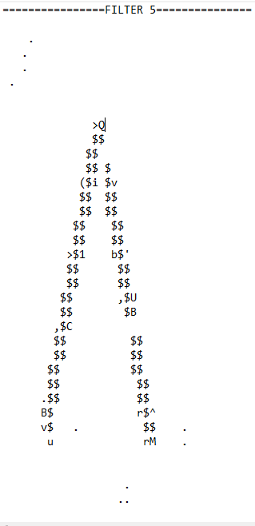
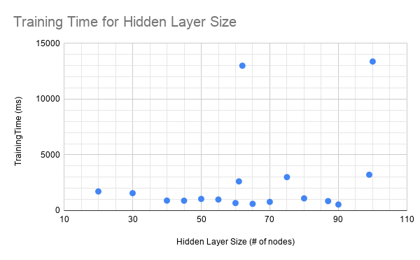

CUDA Character Recognition
======================

**University of Pennsylvania, CIS 565: GPU Programming and Architecture, Project 2**

* Taylor Nelms
  * [LinkedIn](https://www.linkedin.com/in/taylor-k-7b2110191/), [twitter](https://twitter.com/nelms_taylor), etc.
* Tested on: Windows 10, Intel i3 Coffee Lake 4-core 3.6GHz processor, 16GB RAM, NVidia GeForce GTX1650 4GB


*Input image, acii-art style*

## CMake Notes

Notably, I needed to add the following line to `CMakeLists.txt`:
`link_directories(${CUDA_TOOLKIT_ROOT_DIR}/lib/x64)`
Additionally, under the `target_link_libraries` function, I added links to the `cublas` and `curand` libraries

## Use Directions

There are a couple of `#define` clauses at the top of `main.cpp` that can be used to modify operation of the program. The relevant ones are `READING` and `TRAINING`. 

* The `READING` value will, if enabled, read in pre-trained weights. This is essential if just testing the file input. 
* The `INFILE` value defines the file name of the weights file to read from. Note that there is so very, very little error checking regarding reading a file in; it's more or less a binary data dump of the weight arrays straight from memory. Security experts should be cringing right now.
* The `TRAINING` flag modifies whether you are training the dataset or not.
* The `OUTFILE` value helps create the filenames for the relevant output files. They are in the format `numresults`-`hiddenlayersize`-`outwt|trainrecord`-`OUTFILE``.bin|.csv`. These files are the resulting weight values, or a record of the total error against the training iteration number, respectively.

Set your flags accordingly, compile the program, and go at it!

## ML Design Notes
As a relative novice to machine learning, I have elected to primarily put in only two fully-connected hidden layers.

I added a bias term to the result of these convolutions and poolings, and again inside the hidden layer. The hidden layer I ended up going with was of size `156`, as that was larger than the number of outputs to that layer, smaller than the number of inputs, and got reasonably close to training successfully.

### Convolution

I elected to process the images on the front end through some common image convolutions, followed by a run through a max pooling layer. These results become the first "feature layer." This has the advantage of reducing the number of "pixels" from 10201 to 6534, as I'm running the images through convolution with 3x3 kernels, followed by a 3x3 max pooling operation. Both the convolution and max-pooling are hand-implemented.

Some results are here, in the form of more sweet, sweet ascii art. These have all been through the subsequent max pooling layer, as well.


*Gaussian filter*


*Outline filter*


*Sobel filter (top)*


*Sobel filter (right)*


*Sobel filter (bottom)*


*Sobel filter (left)*


There is the slight hiccup that I am not sure how to property back-propogate through a convolutional layer and update convolution kernel weights. That said, I stand by the decision, as the resultant data sets have more activated information than the original data. Hopefully, the data loss on letters with similar shapes did not end up sinking the entire operation.

## Training Time Analysis
To analyze how my network performed for training, I decided to train it only on the first 8 letters, so that I could get some good data about how various parameters affected training time. This would then help determine the best way to structure the network for the larger, 52-letter dataset.

For each trial, I ran up to `10,000` iterations, with each iteration being a batch of all 8 input data sets, after which I updated the weights with the total error from all of that batch of runs. If it ran for more than `10,000` iterations, I considered it "done," effectively unconverged (even if the total error was, still, slowly approaching 0).

I ran each until the sum of the squared errors for the whole set was less than some constant, in this case invoked via `#define GOODENOUGH 0.00001`.

### Hidden Layer Size

The "hidden layer" that came out of my convolutional layers was a fixed size based on the structure of convolutional kernels and max pooling (a little over `6500` elements). However, this left one hidden layer that could be tuned to a specific number of elements. I first ran a number of trials to determine how many elements would lead to the fastest training, with regards to the output vector size.

One frustrating thing about this approach is that the random seed I'm using to generate initial arrays has a significant effect on the overall training time as I change around the size of the arrays, by way of messing with the hidden layer. A one-bit difference in the starting seed could make a tenfold difference in how long the network took to train.

...Or at least, that's what I thought, but changing around the seed, while occasionally very important, did not have as much impact as what were occasionally just one-element differences in hidden layer size.

I've attached an unsatisfying chart here, and decided to go with a hidden layer of size equal to 3 times the size of the result layer, because I am no data scientist, and it is the approach that came closest to working.



### LAMBDA value

Rather than tying the training scaling to total error, I decided to keep it to a single value, because it made coding easier if I could just `#define` it.

I then endeavored to find a LAMBDA value that would operate well across the training set.

Given the relative simplicity of only eight data points, I chose to increase my sample size to `16` for this next round, to better see the results of the training.

Well, it turns out, that was a bad idea; training took way longer in this case, as the model attempted to fit more and more complex input and output pairings.

In the end, I abandoned this analysis, because of the level of runtime complexity I was encountering. (Apologies!)

### The Big Training
I ended up arbitratily deciding on a hidden layer of size `256`, as "roughly 5 times the result vector size" sounded like a metric.

Then, I had a bear of a time training across all manner of situations, because I could not get it to converge.

After a boatload of time, I ended up going with final parameters of hidden layer size (`F2SIZE`) of `156`, a `LAMBDA` training weight of `0.05`, and it took some number of hundreds of thousands of batch iterations through the training data set. In the end, I acheived some, but not perfect, success.

After 10 iterations, I summed the squared error for each entry and logged it against the iteration number. Here is a graph of what that looked like:

## Results

With all of that done, I now have a neural network that recognizes a full `44` of `52` inputs with 100% accuracy! It suffers from recognizing the remaining 8 as being nothing at all, which is, admittedly, a failure. Handily, though, one forward iteration happens in less than one second (and that timing is likely including what it takes to print all the output to the terminal!). Here is a record of some of the final output, putting each of the training images through the network. (Note: very long block of text incoming)

```
=========RESULT FOR RECORD 0==============
@00:  1.00    @01:  0.00    @02:  0.00    @03:  0.00    @04:  0.00    @05:  0.00    @06:  0.00    @07:  0.00
@08:  0.00    @09:  0.00    @10:  0.00    @11:  0.00    @12:  0.00    @13:  0.00    @14:  0.00    @15:  0.00
@16:  0.00    @17:  0.00    @18:  0.00    @19:  0.00    @20:  0.00    @21:  0.00    @22:  0.00    @23:  0.00
@24:  0.00    @25:  0.00    @26:  0.00    @27:  0.00    @28:  0.00    @29:  0.00    @30:  0.00    @31:  0.00
@32:  0.00    @33:  0.00    @34:  0.00    @35:  0.00    @36:  0.00    @37:  0.00    @38:  0.00    @39:  0.00
@40:  0.00    @41:  0.00    @42:  0.00    @43:  0.00    @44:  0.00    @45:  0.00    @46:  0.00    @47:  0.00
@48:  0.00    @49:  0.00    @50:  0.00    @51:  0.00
=========RESULT FOR RECORD 1==============
@00:  0.00    @01:  1.00    @02:  0.00    @03:  0.00    @04:  0.00    @05:  0.00    @06:  0.00    @07:  0.00
@08:  0.00    @09:  0.00    @10:  0.00    @11:  0.00    @12:  0.00    @13:  0.00    @14:  0.00    @15:  0.00
@16:  0.00    @17:  0.00    @18:  0.00    @19:  0.00    @20:  0.00    @21:  0.00    @22:  0.00    @23:  0.00
@24:  0.00    @25:  0.00    @26:  0.00    @27:  0.00    @28:  0.00    @29:  0.00    @30:  0.00    @31:  0.00
@32:  0.00    @33:  0.00    @34:  0.00    @35:  0.00    @36:  0.00    @37:  0.00    @38:  0.00    @39:  0.00
@40:  0.00    @41:  0.00    @42:  0.00    @43:  0.00    @44:  0.00    @45:  0.00    @46:  0.00    @47:  0.00
@48:  0.00    @49:  0.00    @50:  0.00    @51:  0.00
=========RESULT FOR RECORD 2==============
@00:  0.00    @01:  0.00    @02:  1.00    @03:  0.00    @04:  0.00    @05:  0.00    @06:  0.00    @07:  0.00
@08:  0.00    @09:  0.00    @10:  0.00    @11:  0.00    @12:  0.00    @13:  0.00    @14:  0.00    @15:  0.00
@16:  0.00    @17:  0.00    @18:  0.00    @19:  0.00    @20:  0.00    @21:  0.00    @22:  0.00    @23:  0.00
@24:  0.00    @25:  0.00    @26:  0.00    @27:  0.00    @28:  0.00    @29:  0.00    @30:  0.00    @31:  0.00
@32:  0.00    @33:  0.00    @34:  0.00    @35:  0.00    @36:  0.00    @37:  0.00    @38:  0.00    @39:  0.00
@40:  0.00    @41:  0.00    @42:  0.00    @43:  0.00    @44:  0.00    @45:  0.00    @46:  0.00    @47:  0.00
@48:  0.00    @49:  0.00    @50:  0.00    @51:  0.00
=========RESULT FOR RECORD 3==============
@00:  0.00    @01:  0.00    @02:  0.00    @03:  1.00    @04:  0.00    @05:  0.00    @06:  0.00    @07:  0.00
@08:  0.00    @09:  0.00    @10:  0.00    @11:  0.00    @12:  0.00    @13:  0.00    @14:  0.00    @15:  0.00
@16:  0.00    @17:  0.00    @18:  0.00    @19:  0.00    @20:  0.00    @21:  0.00    @22:  0.00    @23:  0.00
@24:  0.00    @25:  0.00    @26:  0.00    @27:  0.00    @28:  0.00    @29:  0.00    @30:  0.00    @31:  0.00
@32:  0.00    @33:  0.00    @34:  0.00    @35:  0.00    @36:  0.00    @37:  0.00    @38:  0.00    @39:  0.00
@40:  0.00    @41:  0.00    @42:  0.00    @43:  0.00    @44:  0.00    @45:  0.00    @46:  0.00    @47:  0.00
@48:  0.00    @49:  0.00    @50:  0.00    @51:  0.00
=========RESULT FOR RECORD 4==============
@00:  0.00    @01:  0.00    @02:  0.00    @03:  0.00    @04:  1.00    @05:  0.00    @06:  0.00    @07:  0.00
@08:  0.00    @09:  0.00    @10:  0.00    @11:  0.00    @12:  0.00    @13:  0.00    @14:  0.00    @15:  0.00
@16:  0.00    @17:  0.00    @18:  0.00    @19:  0.00    @20:  0.00    @21:  0.00    @22:  0.00    @23:  0.00
@24:  0.00    @25:  0.00    @26:  0.00    @27:  0.00    @28:  0.00    @29:  0.00    @30:  0.00    @31:  0.00
@32:  0.00    @33:  0.00    @34:  0.00    @35:  0.00    @36:  0.00    @37:  0.00    @38:  0.00    @39:  0.00
@40:  0.00    @41:  0.00    @42:  0.00    @43:  0.00    @44:  0.00    @45:  0.00    @46:  0.00    @47:  0.00
@48:  0.00    @49:  0.00    @50:  0.00    @51:  0.00
=========RESULT FOR RECORD 5==============
@00:  0.00    @01:  0.00    @02:  0.00    @03:  0.00    @04:  0.00    @05:  1.00    @06:  0.00    @07:  0.00
@08:  0.00    @09:  0.00    @10:  0.00    @11:  0.00    @12:  0.00    @13:  0.00    @14:  0.00    @15:  0.00
@16:  0.00    @17:  0.00    @18:  0.00    @19:  0.00    @20:  0.00    @21:  0.00    @22:  0.00    @23:  0.00
@24:  0.00    @25:  0.00    @26:  0.00    @27:  0.00    @28:  0.00    @29:  0.00    @30:  0.00    @31:  0.00
@32:  0.00    @33:  0.00    @34:  0.00    @35:  0.00    @36:  0.00    @37:  0.00    @38:  0.00    @39:  0.00
@40:  0.00    @41:  0.00    @42:  0.00    @43:  0.00    @44:  0.00    @45:  0.00    @46:  0.00    @47:  0.00
@48:  0.00    @49:  0.00    @50:  0.00    @51:  0.00
=========RESULT FOR RECORD 6==============
@00:  0.00    @01:  0.00    @02:  0.00    @03:  0.00    @04:  0.00    @05:  0.00    @06:  1.00    @07:  0.00
@08:  0.00    @09:  0.00    @10:  0.00    @11:  0.00    @12:  0.00    @13:  0.00    @14:  0.00    @15:  0.00
@16:  0.00    @17:  0.00    @18:  0.00    @19:  0.00    @20:  0.00    @21:  0.00    @22:  0.00    @23:  0.00
@24:  0.00    @25:  0.00    @26:  0.00    @27:  0.00    @28:  0.00    @29:  0.00    @30:  0.00    @31:  0.00
@32:  0.00    @33:  0.00    @34:  0.00    @35:  0.00    @36:  0.00    @37:  0.00    @38:  0.00    @39:  0.00
@40:  0.00    @41:  0.00    @42:  0.00    @43:  0.00    @44:  0.00    @45:  0.00    @46:  0.00    @47:  0.00
@48:  0.00    @49:  0.00    @50:  0.00    @51:  0.00
=========RESULT FOR RECORD 7==============
@00:  0.00    @01:  0.00    @02:  0.00    @03:  0.00    @04:  0.00    @05:  0.00    @06:  0.00    @07:  1.00
@08:  0.00    @09:  0.00    @10:  0.00    @11:  0.00    @12:  0.00    @13:  0.00    @14:  0.00    @15:  0.00
@16:  0.00    @17:  0.00    @18:  0.00    @19:  0.00    @20:  0.00    @21:  0.00    @22:  0.00    @23:  0.00
@24:  0.00    @25:  0.00    @26:  0.00    @27:  0.00    @28:  0.00    @29:  0.00    @30:  0.00    @31:  0.00
@32:  0.00    @33:  0.00    @34:  0.00    @35:  0.00    @36:  0.00    @37:  0.00    @38:  0.00    @39:  0.00
@40:  0.00    @41:  0.00    @42:  0.00    @43:  0.00    @44:  0.00    @45:  0.00    @46:  0.00    @47:  0.00
@48:  0.00    @49:  0.00    @50:  0.00    @51:  0.00
=========RESULT FOR RECORD 8==============
@00:  0.00    @01:  0.00    @02:  0.00    @03:  0.00    @04:  0.00    @05:  0.00    @06:  0.00    @07:  0.00
@08:  1.00    @09:  0.00    @10:  0.00    @11:  0.00    @12:  0.00    @13:  0.00    @14:  0.00    @15:  0.00
@16:  0.00    @17:  0.00    @18:  0.00    @19:  0.00    @20:  0.00    @21:  0.00    @22:  0.00    @23:  0.00
@24:  0.00    @25:  0.00    @26:  0.00    @27:  0.00    @28:  0.00    @29:  0.00    @30:  0.00    @31:  0.00
@32:  0.00    @33:  0.00    @34:  0.00    @35:  0.00    @36:  0.00    @37:  0.00    @38:  0.00    @39:  0.00
@40:  0.00    @41:  0.00    @42:  0.00    @43:  0.00    @44:  0.00    @45:  0.00    @46:  0.00    @47:  0.00
@48:  0.00    @49:  0.00    @50:  0.00    @51:  0.00
=========RESULT FOR RECORD 9==============
@00:  0.00    @01:  0.00    @02:  0.00    @03:  0.00    @04:  0.00    @05:  0.00    @06:  0.00    @07:  0.00
@08:  0.00    @09:  1.00    @10:  0.00    @11:  0.00    @12:  0.00    @13:  0.00    @14:  0.00    @15:  0.00
@16:  0.00    @17:  0.00    @18:  0.00    @19:  0.00    @20:  0.00    @21:  0.00    @22:  0.00    @23:  0.00
@24:  0.00    @25:  0.00    @26:  0.00    @27:  0.00    @28:  0.00    @29:  0.00    @30:  0.00    @31:  0.00
@32:  0.00    @33:  0.00    @34:  0.00    @35:  0.00    @36:  0.00    @37:  0.00    @38:  0.00    @39:  0.00
@40:  0.00    @41:  0.00    @42:  0.00    @43:  0.00    @44:  0.00    @45:  0.00    @46:  0.00    @47:  0.00
@48:  0.00    @49:  0.00    @50:  0.00    @51:  0.00
=========RESULT FOR RECORD 10==============
@00:  0.00    @01:  0.00    @02:  0.00    @03:  0.00    @04:  0.00    @05:  0.00    @06:  0.00    @07:  0.00
@08:  0.00    @09:  0.00    @10:  1.00    @11:  0.00    @12:  0.00    @13:  0.00    @14:  0.00    @15:  0.00
@16:  0.00    @17:  0.00    @18:  0.00    @19:  0.00    @20:  0.00    @21:  0.00    @22:  0.00    @23:  0.00
@24:  0.00    @25:  0.00    @26:  0.00    @27:  0.00    @28:  0.00    @29:  0.00    @30:  0.00    @31:  0.00
@32:  0.00    @33:  0.00    @34:  0.00    @35:  0.00    @36:  0.00    @37:  0.00    @38:  0.00    @39:  0.00
@40:  0.00    @41:  0.00    @42:  0.00    @43:  0.00    @44:  0.00    @45:  0.00    @46:  0.00    @47:  0.00
@48:  0.00    @49:  0.00    @50:  0.00    @51:  0.00
=========RESULT FOR RECORD 11==============
@00:  0.00    @01:  0.00    @02:  0.00    @03:  0.00    @04:  0.00    @05:  0.00    @06:  0.00    @07:  0.00
@08:  0.00    @09:  0.00    @10:  0.00    @11:  1.00    @12:  0.00    @13:  0.00    @14:  0.00    @15:  0.00
@16:  0.00    @17:  0.00    @18:  0.00    @19:  0.00    @20:  0.00    @21:  0.00    @22:  0.00    @23:  0.00
@24:  0.00    @25:  0.00    @26:  0.00    @27:  0.00    @28:  0.00    @29:  0.00    @30:  0.00    @31:  0.00
@32:  0.00    @33:  0.00    @34:  0.00    @35:  0.00    @36:  0.00    @37:  0.00    @38:  0.00    @39:  0.00
@40:  0.00    @41:  0.00    @42:  0.00    @43:  0.00    @44:  0.00    @45:  0.00    @46:  0.00    @47:  0.00
@48:  0.00    @49:  0.00    @50:  0.00    @51:  0.00
=========RESULT FOR RECORD 12==============
@00:  0.00    @01:  0.00    @02:  0.00    @03:  0.00    @04:  0.00    @05:  0.00    @06:  0.00    @07:  0.00
@08:  0.00    @09:  0.00    @10:  0.00    @11:  0.00    @12:  1.00    @13:  0.00    @14:  0.00    @15:  0.00
@16:  0.00    @17:  0.00    @18:  0.00    @19:  0.00    @20:  0.00    @21:  0.00    @22:  0.00    @23:  0.00
@24:  0.00    @25:  0.00    @26:  0.00    @27:  0.00    @28:  0.00    @29:  0.00    @30:  0.00    @31:  0.00
@32:  0.00    @33:  0.00    @34:  0.00    @35:  0.00    @36:  0.00    @37:  0.00    @38:  0.00    @39:  0.00
@40:  0.00    @41:  0.00    @42:  0.00    @43:  0.00    @44:  0.00    @45:  0.00    @46:  0.00    @47:  0.00
@48:  0.00    @49:  0.00    @50:  0.00    @51:  0.00
=========RESULT FOR RECORD 13==============
@00:  0.00    @01:  0.00    @02:  0.00    @03:  0.00    @04:  0.00    @05:  0.00    @06:  0.00    @07:  0.00
@08:  0.00    @09:  0.00    @10:  0.00    @11:  0.00    @12:  0.00    @13:  1.00    @14:  0.00    @15:  0.00
@16:  0.00    @17:  0.00    @18:  0.00    @19:  0.00    @20:  0.00    @21:  0.00    @22:  0.00    @23:  0.00
@24:  0.00    @25:  0.00    @26:  0.00    @27:  0.00    @28:  0.00    @29:  0.00    @30:  0.00    @31:  0.00
@32:  0.00    @33:  0.00    @34:  0.00    @35:  0.00    @36:  0.00    @37:  0.00    @38:  0.00    @39:  0.00
@40:  0.00    @41:  0.00    @42:  0.00    @43:  0.00    @44:  0.00    @45:  0.00    @46:  0.00    @47:  0.00
@48:  0.00    @49:  0.00    @50:  0.00    @51:  0.00
=========RESULT FOR RECORD 14==============
@00:  0.00    @01:  0.00    @02:  0.00    @03:  0.00    @04:  0.00    @05:  0.00    @06:  0.00    @07:  0.00
@08:  0.00    @09:  0.00    @10:  0.00    @11:  0.00    @12:  0.00    @13:  0.00    @14:  0.00    @15:  0.00
@16:  0.00    @17:  0.00    @18:  0.00    @19:  0.00    @20:  0.00    @21:  0.00    @22:  0.00    @23:  0.00
@24:  0.00    @25:  0.00    @26:  0.00    @27:  0.00    @28:  0.00    @29:  0.00    @30:  0.00    @31:  0.00
@32:  0.00    @33:  0.00    @34:  0.00    @35:  0.00    @36:  0.00    @37:  0.00    @38:  0.00    @39:  0.00
@40:  0.00    @41:  0.00    @42:  0.00    @43:  0.00    @44:  0.00    @45:  0.00    @46:  0.00    @47:  0.00
@48:  0.00    @49:  0.00    @50:  0.00    @51:  0.00
=========RESULT FOR RECORD 15==============
@00:  0.00    @01:  0.00    @02:  0.00    @03:  0.00    @04:  0.00    @05:  0.00    @06:  0.00    @07:  0.00
@08:  0.00    @09:  0.00    @10:  0.00    @11:  0.00    @12:  0.00    @13:  0.00    @14:  0.00    @15:  1.00
@16:  0.00    @17:  0.00    @18:  0.00    @19:  0.00    @20:  0.00    @21:  0.00    @22:  0.00    @23:  0.00
@24:  0.00    @25:  0.00    @26:  0.00    @27:  0.00    @28:  0.00    @29:  0.00    @30:  0.00    @31:  0.00
@32:  0.00    @33:  0.00    @34:  0.00    @35:  0.00    @36:  0.00    @37:  0.00    @38:  0.00    @39:  0.00
@40:  0.00    @41:  0.00    @42:  0.00    @43:  0.00    @44:  0.00    @45:  0.00    @46:  0.00    @47:  0.00
@48:  0.00    @49:  0.00    @50:  0.00    @51:  0.00
=========RESULT FOR RECORD 16==============
@00:  0.00    @01:  0.00    @02:  0.00    @03:  0.00    @04:  0.00    @05:  0.00    @06:  0.00    @07:  0.00
@08:  0.00    @09:  0.00    @10:  0.00    @11:  0.00    @12:  0.00    @13:  0.00    @14:  0.00    @15:  0.00
@16:  1.00    @17:  0.00    @18:  0.00    @19:  0.00    @20:  0.00    @21:  0.00    @22:  0.00    @23:  0.00
@24:  0.00    @25:  0.00    @26:  0.00    @27:  0.00    @28:  0.00    @29:  0.00    @30:  0.00    @31:  0.00
@32:  0.00    @33:  0.00    @34:  0.00    @35:  0.00    @36:  0.00    @37:  0.00    @38:  0.00    @39:  0.00
@40:  0.00    @41:  0.00    @42:  0.00    @43:  0.00    @44:  0.00    @45:  0.00    @46:  0.00    @47:  0.00
@48:  0.00    @49:  0.00    @50:  0.00    @51:  0.00
=========RESULT FOR RECORD 17==============
@00:  0.00    @01:  0.00    @02:  0.00    @03:  0.00    @04:  0.00    @05:  0.00    @06:  0.00    @07:  0.00
@08:  0.00    @09:  0.00    @10:  0.00    @11:  0.00    @12:  0.00    @13:  0.00    @14:  0.00    @15:  0.00
@16:  0.00    @17:  1.00    @18:  0.00    @19:  0.00    @20:  0.00    @21:  0.00    @22:  0.00    @23:  0.00
@24:  0.00    @25:  0.00    @26:  0.00    @27:  0.00    @28:  0.00    @29:  0.00    @30:  0.00    @31:  0.00
@32:  0.00    @33:  0.00    @34:  0.00    @35:  0.00    @36:  0.00    @37:  0.00    @38:  0.00    @39:  0.00
@40:  0.00    @41:  0.00    @42:  0.00    @43:  0.00    @44:  0.00    @45:  0.00    @46:  0.00    @47:  0.00
@48:  0.00    @49:  0.00    @50:  0.00    @51:  0.00
=========RESULT FOR RECORD 18==============
@00:  0.00    @01:  0.00    @02:  0.00    @03:  0.00    @04:  0.00    @05:  0.00    @06:  0.00    @07:  0.00
@08:  0.00    @09:  0.00    @10:  0.00    @11:  0.00    @12:  0.00    @13:  0.00    @14:  0.00    @15:  0.00
@16:  0.00    @17:  0.00    @18:  1.00    @19:  0.00    @20:  0.00    @21:  0.00    @22:  0.00    @23:  0.00
@24:  0.00    @25:  0.00    @26:  0.00    @27:  0.00    @28:  0.00    @29:  0.00    @30:  0.00    @31:  0.00
@32:  0.00    @33:  0.00    @34:  0.00    @35:  0.00    @36:  0.00    @37:  0.00    @38:  0.00    @39:  0.00
@40:  0.00    @41:  0.00    @42:  0.00    @43:  0.00    @44:  0.00    @45:  0.00    @46:  0.00    @47:  0.00
@48:  0.00    @49:  0.00    @50:  0.00    @51:  0.00
=========RESULT FOR RECORD 19==============
@00:  0.00    @01:  0.00    @02:  0.00    @03:  0.00    @04:  0.00    @05:  0.00    @06:  0.00    @07:  0.00
@08:  0.00    @09:  0.00    @10:  0.00    @11:  0.00    @12:  0.00    @13:  0.00    @14:  0.00    @15:  0.00
@16:  0.00    @17:  0.00    @18:  0.00    @19:  1.00    @20:  0.00    @21:  0.00    @22:  0.00    @23:  0.00
@24:  0.00    @25:  0.00    @26:  0.00    @27:  0.00    @28:  0.00    @29:  0.00    @30:  0.00    @31:  0.00
@32:  0.00    @33:  0.00    @34:  0.00    @35:  0.00    @36:  0.00    @37:  0.00    @38:  0.00    @39:  0.00
@40:  0.00    @41:  0.00    @42:  0.00    @43:  0.00    @44:  0.00    @45:  0.00    @46:  0.00    @47:  0.00
@48:  0.00    @49:  0.00    @50:  0.00    @51:  0.00
=========RESULT FOR RECORD 20==============
@00:  0.00    @01:  0.00    @02:  0.00    @03:  0.00    @04:  0.00    @05:  0.00    @06:  0.00    @07:  0.00
@08:  0.00    @09:  0.00    @10:  0.00    @11:  0.00    @12:  0.00    @13:  0.00    @14:  0.00    @15:  0.00
@16:  0.00    @17:  0.00    @18:  0.00    @19:  0.00    @20:  1.00    @21:  0.00    @22:  0.00    @23:  0.00
@24:  0.00    @25:  0.00    @26:  0.00    @27:  0.00    @28:  0.00    @29:  0.00    @30:  0.00    @31:  0.00
@32:  0.00    @33:  0.00    @34:  0.00    @35:  0.00    @36:  0.00    @37:  0.00    @38:  0.00    @39:  0.00
@40:  0.00    @41:  0.00    @42:  0.00    @43:  0.00    @44:  0.00    @45:  0.00    @46:  0.00    @47:  0.00
@48:  0.00    @49:  0.00    @50:  0.00    @51:  0.00
=========RESULT FOR RECORD 21==============
@00:  0.00    @01:  0.00    @02:  0.00    @03:  0.00    @04:  0.00    @05:  0.00    @06:  0.00    @07:  0.00
@08:  0.00    @09:  0.00    @10:  0.00    @11:  0.00    @12:  0.00    @13:  0.00    @14:  0.00    @15:  0.00
@16:  0.00    @17:  0.00    @18:  0.00    @19:  0.00    @20:  0.00    @21:  1.00    @22:  0.00    @23:  0.00
@24:  0.00    @25:  0.00    @26:  0.00    @27:  0.00    @28:  0.00    @29:  0.00    @30:  0.00    @31:  0.00
@32:  0.00    @33:  0.00    @34:  0.00    @35:  0.00    @36:  0.00    @37:  0.00    @38:  0.00    @39:  0.00
@40:  0.00    @41:  0.00    @42:  0.00    @43:  0.00    @44:  0.00    @45:  0.00    @46:  0.00    @47:  0.00
@48:  0.00    @49:  0.00    @50:  0.00    @51:  0.00
=========RESULT FOR RECORD 22==============
@00:  0.00    @01:  0.00    @02:  0.00    @03:  0.00    @04:  0.00    @05:  0.00    @06:  0.00    @07:  0.00
@08:  0.00    @09:  0.00    @10:  0.00    @11:  0.00    @12:  0.00    @13:  0.00    @14:  0.00    @15:  0.00
@16:  0.00    @17:  0.00    @18:  0.00    @19:  0.00    @20:  0.00    @21:  0.00    @22:  0.00    @23:  0.00
@24:  0.00    @25:  0.00    @26:  0.00    @27:  0.00    @28:  0.00    @29:  0.00    @30:  0.00    @31:  0.00
@32:  0.00    @33:  0.00    @34:  0.00    @35:  0.00    @36:  0.00    @37:  0.00    @38:  0.00    @39:  0.00
@40:  0.00    @41:  0.00    @42:  0.00    @43:  0.00    @44:  0.00    @45:  0.00    @46:  0.00    @47:  0.00
@48:  0.00    @49:  0.00    @50:  0.00    @51:  0.00
=========RESULT FOR RECORD 23==============
@00:  0.00    @01:  0.00    @02:  0.00    @03:  0.00    @04:  0.00    @05:  0.00    @06:  0.00    @07:  0.00
@08:  0.00    @09:  0.00    @10:  0.00    @11:  0.00    @12:  0.00    @13:  0.00    @14:  0.00    @15:  0.00
@16:  0.00    @17:  0.00    @18:  0.00    @19:  0.00    @20:  0.00    @21:  0.00    @22:  0.00    @23:  1.00
@24:  0.00    @25:  0.00    @26:  0.00    @27:  0.00    @28:  0.00    @29:  0.00    @30:  0.00    @31:  0.00
@32:  0.00    @33:  0.00    @34:  0.00    @35:  0.00    @36:  0.00    @37:  0.00    @38:  0.00    @39:  0.00
@40:  0.00    @41:  0.00    @42:  0.00    @43:  0.00    @44:  0.00    @45:  0.00    @46:  0.00    @47:  0.00
@48:  0.00    @49:  0.00    @50:  0.00    @51:  0.00
=========RESULT FOR RECORD 24==============
@00:  0.00    @01:  0.00    @02:  0.00    @03:  0.00    @04:  0.00    @05:  0.00    @06:  0.00    @07:  0.00
@08:  0.00    @09:  0.00    @10:  0.00    @11:  0.00    @12:  0.00    @13:  0.00    @14:  0.00    @15:  0.00
@16:  0.00    @17:  0.00    @18:  0.00    @19:  0.00    @20:  0.00    @21:  0.00    @22:  0.00    @23:  0.00
@24:  0.00    @25:  0.00    @26:  0.00    @27:  0.00    @28:  0.00    @29:  0.00    @30:  0.00    @31:  0.00
@32:  0.00    @33:  0.00    @34:  0.00    @35:  0.00    @36:  0.00    @37:  0.00    @38:  0.00    @39:  0.00
@40:  0.00    @41:  0.00    @42:  0.00    @43:  0.00    @44:  0.00    @45:  0.00    @46:  0.00    @47:  0.00
@48:  0.00    @49:  0.00    @50:  0.00    @51:  0.00
=========RESULT FOR RECORD 25==============
@00:  0.00    @01:  0.00    @02:  0.00    @03:  0.00    @04:  0.00    @05:  0.00    @06:  0.00    @07:  0.00
@08:  0.00    @09:  0.00    @10:  0.00    @11:  0.00    @12:  0.00    @13:  0.00    @14:  0.00    @15:  0.00
@16:  0.00    @17:  0.00    @18:  0.00    @19:  0.00    @20:  0.00    @21:  0.00    @22:  0.00    @23:  0.00
@24:  0.00    @25:  1.00    @26:  0.00    @27:  0.00    @28:  0.00    @29:  0.00    @30:  0.00    @31:  0.00
@32:  0.00    @33:  0.00    @34:  0.00    @35:  0.00    @36:  0.00    @37:  0.00    @38:  0.00    @39:  0.00
@40:  0.00    @41:  0.00    @42:  0.00    @43:  0.00    @44:  0.00    @45:  0.00    @46:  0.00    @47:  0.00
@48:  0.00    @49:  0.00    @50:  0.00    @51:  0.00
=========RESULT FOR RECORD 26==============
@00:  0.00    @01:  0.00    @02:  0.00    @03:  0.00    @04:  0.00    @05:  0.00    @06:  0.00    @07:  0.00
@08:  0.00    @09:  0.00    @10:  0.00    @11:  0.00    @12:  0.00    @13:  0.00    @14:  0.00    @15:  0.00
@16:  0.00    @17:  0.00    @18:  0.00    @19:  0.00    @20:  0.00    @21:  0.00    @22:  0.00    @23:  0.00
@24:  0.00    @25:  0.00    @26:  1.00    @27:  0.00    @28:  0.00    @29:  0.00    @30:  0.00    @31:  0.00
@32:  0.00    @33:  0.00    @34:  0.00    @35:  0.00    @36:  0.00    @37:  0.00    @38:  0.00    @39:  0.00
@40:  0.00    @41:  0.00    @42:  0.00    @43:  0.00    @44:  0.00    @45:  0.00    @46:  0.00    @47:  0.00
@48:  0.00    @49:  0.00    @50:  0.00    @51:  0.00
=========RESULT FOR RECORD 27==============
@00:  0.00    @01:  0.00    @02:  0.00    @03:  0.00    @04:  0.00    @05:  0.00    @06:  0.00    @07:  0.00
@08:  0.00    @09:  0.00    @10:  0.00    @11:  0.00    @12:  0.00    @13:  0.00    @14:  0.00    @15:  0.00
@16:  0.00    @17:  0.00    @18:  0.00    @19:  0.00    @20:  0.00    @21:  0.00    @22:  0.00    @23:  0.00
@24:  0.00    @25:  0.00    @26:  0.00    @27:  1.00    @28:  0.00    @29:  0.00    @30:  0.00    @31:  0.00
@32:  0.00    @33:  0.00    @34:  0.00    @35:  0.00    @36:  0.00    @37:  0.00    @38:  0.00    @39:  0.00
@40:  0.00    @41:  0.00    @42:  0.00    @43:  0.00    @44:  0.00    @45:  0.00    @46:  0.00    @47:  0.00
@48:  0.00    @49:  0.00    @50:  0.00    @51:  0.00
=========RESULT FOR RECORD 28==============
@00:  0.00    @01:  0.00    @02:  0.00    @03:  0.00    @04:  0.00    @05:  0.00    @06:  0.00    @07:  0.00
@08:  0.00    @09:  0.00    @10:  0.00    @11:  0.00    @12:  0.00    @13:  0.00    @14:  0.00    @15:  0.00
@16:  0.00    @17:  0.00    @18:  0.00    @19:  0.00    @20:  0.00    @21:  0.00    @22:  0.00    @23:  0.00
@24:  0.00    @25:  0.00    @26:  0.00    @27:  0.00    @28:  1.00    @29:  0.00    @30:  0.00    @31:  0.00
@32:  0.00    @33:  0.00    @34:  0.00    @35:  0.00    @36:  0.00    @37:  0.00    @38:  0.00    @39:  0.00
@40:  0.00    @41:  0.00    @42:  0.00    @43:  0.00    @44:  0.00    @45:  0.00    @46:  0.00    @47:  0.00
@48:  0.00    @49:  0.00    @50:  0.00    @51:  0.00
=========RESULT FOR RECORD 29==============
@00:  0.00    @01:  0.00    @02:  0.00    @03:  0.00    @04:  0.00    @05:  0.00    @06:  0.00    @07:  0.00
@08:  0.00    @09:  0.00    @10:  0.00    @11:  0.00    @12:  0.00    @13:  0.00    @14:  0.00    @15:  0.00
@16:  0.00    @17:  0.00    @18:  0.00    @19:  0.00    @20:  0.00    @21:  0.00    @22:  0.00    @23:  0.00
@24:  0.00    @25:  0.00    @26:  0.00    @27:  0.00    @28:  0.00    @29:  0.00    @30:  0.00    @31:  0.00
@32:  0.00    @33:  0.00    @34:  0.00    @35:  0.00    @36:  0.00    @37:  0.00    @38:  0.00    @39:  0.00
@40:  0.00    @41:  0.00    @42:  0.00    @43:  0.00    @44:  0.00    @45:  0.00    @46:  0.00    @47:  0.00
@48:  0.00    @49:  0.00    @50:  0.00    @51:  0.00
=========RESULT FOR RECORD 30==============
@00:  0.00    @01:  0.00    @02:  0.00    @03:  0.00    @04:  0.00    @05:  0.00    @06:  0.00    @07:  0.00
@08:  0.00    @09:  0.00    @10:  0.00    @11:  0.00    @12:  0.00    @13:  0.00    @14:  0.00    @15:  0.00
@16:  0.00    @17:  0.00    @18:  0.00    @19:  0.00    @20:  0.00    @21:  0.00    @22:  0.00    @23:  0.00
@24:  0.00    @25:  0.00    @26:  0.00    @27:  0.00    @28:  0.00    @29:  0.00    @30:  0.00    @31:  0.00
@32:  0.00    @33:  0.00    @34:  0.00    @35:  0.00    @36:  0.00    @37:  0.00    @38:  0.00    @39:  0.00
@40:  0.00    @41:  0.00    @42:  0.00    @43:  0.00    @44:  0.00    @45:  0.00    @46:  0.00    @47:  0.00
@48:  0.00    @49:  0.00    @50:  0.00    @51:  0.00
=========RESULT FOR RECORD 31==============
@00:  0.00    @01:  0.00    @02:  0.00    @03:  0.00    @04:  0.00    @05:  0.00    @06:  0.00    @07:  0.00
@08:  0.00    @09:  0.00    @10:  0.00    @11:  0.00    @12:  0.00    @13:  0.00    @14:  0.00    @15:  0.00
@16:  0.00    @17:  0.00    @18:  0.00    @19:  0.00    @20:  0.00    @21:  0.00    @22:  0.00    @23:  0.00
@24:  0.00    @25:  0.00    @26:  0.00    @27:  0.00    @28:  0.00    @29:  0.00    @30:  0.00    @31:  1.00
@32:  0.00    @33:  0.00    @34:  0.00    @35:  0.00    @36:  0.00    @37:  0.00    @38:  0.00    @39:  0.00
@40:  0.00    @41:  0.00    @42:  0.00    @43:  0.00    @44:  0.00    @45:  0.00    @46:  0.00    @47:  0.00
@48:  0.00    @49:  0.00    @50:  0.00    @51:  0.00
=========RESULT FOR RECORD 32==============
@00:  0.00    @01:  0.00    @02:  0.00    @03:  0.00    @04:  0.00    @05:  0.00    @06:  0.00    @07:  0.00
@08:  0.00    @09:  0.00    @10:  0.00    @11:  0.00    @12:  0.00    @13:  0.00    @14:  0.00    @15:  0.00
@16:  0.00    @17:  0.00    @18:  0.00    @19:  0.00    @20:  0.00    @21:  0.00    @22:  0.00    @23:  0.00
@24:  0.00    @25:  0.00    @26:  0.00    @27:  0.00    @28:  0.00    @29:  0.00    @30:  0.00    @31:  0.00
@32:  1.00    @33:  0.00    @34:  0.00    @35:  0.00    @36:  0.00    @37:  0.00    @38:  0.00    @39:  0.00
@40:  0.00    @41:  0.00    @42:  0.00    @43:  0.00    @44:  0.00    @45:  0.00    @46:  0.00    @47:  0.00
@48:  0.00    @49:  0.00    @50:  0.00    @51:  0.00
=========RESULT FOR RECORD 33==============
@00:  0.00    @01:  0.00    @02:  0.00    @03:  0.00    @04:  0.00    @05:  0.00    @06:  0.00    @07:  0.00
@08:  0.00    @09:  0.00    @10:  0.00    @11:  0.00    @12:  0.00    @13:  0.00    @14:  0.00    @15:  0.00
@16:  0.00    @17:  0.00    @18:  0.00    @19:  0.00    @20:  0.00    @21:  0.00    @22:  0.00    @23:  0.00
@24:  0.00    @25:  0.00    @26:  0.00    @27:  0.00    @28:  0.00    @29:  0.00    @30:  0.00    @31:  0.00
@32:  0.00    @33:  1.00    @34:  0.00    @35:  0.00    @36:  0.00    @37:  0.00    @38:  0.00    @39:  0.00
@40:  0.00    @41:  0.00    @42:  0.00    @43:  0.00    @44:  0.00    @45:  0.00    @46:  0.00    @47:  0.00
@48:  0.00    @49:  0.00    @50:  0.00    @51:  0.00
=========RESULT FOR RECORD 34==============
@00:  0.00    @01:  0.00    @02:  0.00    @03:  0.00    @04:  0.00    @05:  0.00    @06:  0.00    @07:  0.00
@08:  0.00    @09:  0.00    @10:  0.00    @11:  0.00    @12:  0.00    @13:  0.00    @14:  0.00    @15:  0.00
@16:  0.00    @17:  0.00    @18:  0.00    @19:  0.00    @20:  0.00    @21:  0.00    @22:  0.00    @23:  0.00
@24:  0.00    @25:  0.00    @26:  0.00    @27:  0.00    @28:  0.00    @29:  0.00    @30:  0.00    @31:  0.00
@32:  0.00    @33:  0.00    @34:  1.00    @35:  0.00    @36:  0.00    @37:  0.00    @38:  0.00    @39:  0.00
@40:  0.00    @41:  0.00    @42:  0.00    @43:  0.00    @44:  0.00    @45:  0.00    @46:  0.00    @47:  0.00
@48:  0.00    @49:  0.00    @50:  0.00    @51:  0.00
=========RESULT FOR RECORD 35==============
@00:  0.00    @01:  0.00    @02:  0.00    @03:  0.00    @04:  0.00    @05:  0.00    @06:  0.00    @07:  0.00
@08:  0.00    @09:  0.00    @10:  0.00    @11:  0.00    @12:  0.00    @13:  0.00    @14:  0.00    @15:  0.00
@16:  0.00    @17:  0.00    @18:  0.00    @19:  0.00    @20:  0.00    @21:  0.00    @22:  0.00    @23:  0.00
@24:  0.00    @25:  0.00    @26:  0.00    @27:  0.00    @28:  0.00    @29:  0.00    @30:  0.00    @31:  0.00
@32:  0.00    @33:  0.00    @34:  0.00    @35:  1.00    @36:  0.00    @37:  0.00    @38:  0.00    @39:  0.00
@40:  0.00    @41:  0.00    @42:  0.00    @43:  0.00    @44:  0.00    @45:  0.00    @46:  0.00    @47:  0.00
@48:  0.00    @49:  0.00    @50:  0.00    @51:  0.00
=========RESULT FOR RECORD 36==============
@00:  0.00    @01:  0.00    @02:  0.00    @03:  0.00    @04:  0.00    @05:  0.00    @06:  0.00    @07:  0.00
@08:  0.00    @09:  0.00    @10:  0.00    @11:  0.00    @12:  0.00    @13:  0.00    @14:  0.00    @15:  0.00
@16:  0.00    @17:  0.00    @18:  0.00    @19:  0.00    @20:  0.00    @21:  0.00    @22:  0.00    @23:  0.00
@24:  0.00    @25:  0.00    @26:  0.00    @27:  0.00    @28:  0.00    @29:  0.00    @30:  0.00    @31:  0.00
@32:  0.00    @33:  0.00    @34:  0.00    @35:  0.00    @36:  1.00    @37:  0.00    @38:  0.00    @39:  0.00
@40:  0.00    @41:  0.00    @42:  0.00    @43:  0.00    @44:  0.00    @45:  0.00    @46:  0.00    @47:  0.00
@48:  0.00    @49:  0.00    @50:  0.00    @51:  0.00
=========RESULT FOR RECORD 37==============
@00:  0.00    @01:  0.00    @02:  0.00    @03:  0.00    @04:  0.00    @05:  0.00    @06:  0.00    @07:  0.00
@08:  0.00    @09:  0.00    @10:  0.00    @11:  0.00    @12:  0.00    @13:  0.00    @14:  0.00    @15:  0.00
@16:  0.00    @17:  0.00    @18:  0.00    @19:  0.00    @20:  0.00    @21:  0.00    @22:  0.00    @23:  0.00
@24:  0.00    @25:  0.00    @26:  0.00    @27:  0.00    @28:  0.00    @29:  0.00    @30:  0.00    @31:  0.00
@32:  0.00    @33:  0.00    @34:  0.00    @35:  0.00    @36:  0.00    @37:  0.00    @38:  0.00    @39:  0.00
@40:  0.00    @41:  0.00    @42:  0.00    @43:  0.00    @44:  0.00    @45:  0.00    @46:  0.00    @47:  0.00
@48:  0.00    @49:  0.00    @50:  0.00    @51:  0.00
=========RESULT FOR RECORD 38==============
@00:  0.00    @01:  0.00    @02:  0.00    @03:  0.00    @04:  0.00    @05:  0.00    @06:  0.00    @07:  0.00
@08:  0.00    @09:  0.00    @10:  0.00    @11:  0.00    @12:  0.00    @13:  0.00    @14:  0.00    @15:  0.00
@16:  0.00    @17:  0.00    @18:  0.00    @19:  0.00    @20:  0.00    @21:  0.00    @22:  0.00    @23:  0.00
@24:  0.00    @25:  0.00    @26:  0.00    @27:  0.00    @28:  0.00    @29:  0.00    @30:  0.00    @31:  0.00
@32:  0.00    @33:  0.00    @34:  0.00    @35:  0.00    @36:  0.00    @37:  0.00    @38:  1.00    @39:  0.00
@40:  0.00    @41:  0.00    @42:  0.00    @43:  0.00    @44:  0.00    @45:  0.00    @46:  0.00    @47:  0.00
@48:  0.00    @49:  0.00    @50:  0.00    @51:  0.00
=========RESULT FOR RECORD 39==============
@00:  0.00    @01:  0.00    @02:  0.00    @03:  0.00    @04:  0.00    @05:  0.00    @06:  0.00    @07:  0.00
@08:  0.00    @09:  0.00    @10:  0.00    @11:  0.00    @12:  0.00    @13:  0.00    @14:  0.00    @15:  0.00
@16:  0.00    @17:  0.00    @18:  0.00    @19:  0.00    @20:  0.00    @21:  0.00    @22:  0.00    @23:  0.00
@24:  0.00    @25:  0.00    @26:  0.00    @27:  0.00    @28:  0.00    @29:  0.00    @30:  0.00    @31:  0.00
@32:  0.00    @33:  0.00    @34:  0.00    @35:  0.00    @36:  0.00    @37:  0.00    @38:  0.00    @39:  1.00
@40:  0.00    @41:  0.00    @42:  0.00    @43:  0.00    @44:  0.00    @45:  0.00    @46:  0.00    @47:  0.00
@48:  0.00    @49:  0.00    @50:  0.00    @51:  0.00
=========RESULT FOR RECORD 40==============
@00:  0.00    @01:  0.00    @02:  0.00    @03:  0.00    @04:  0.00    @05:  0.00    @06:  0.00    @07:  0.00
@08:  0.00    @09:  0.00    @10:  0.00    @11:  0.00    @12:  0.00    @13:  0.00    @14:  0.00    @15:  0.00
@16:  0.00    @17:  0.00    @18:  0.00    @19:  0.00    @20:  0.00    @21:  0.00    @22:  0.00    @23:  0.00
@24:  0.00    @25:  0.00    @26:  0.00    @27:  0.00    @28:  0.00    @29:  0.00    @30:  0.00    @31:  0.00
@32:  0.00    @33:  0.00    @34:  0.00    @35:  0.00    @36:  0.00    @37:  0.00    @38:  0.00    @39:  0.00
@40:  0.00    @41:  0.00    @42:  0.00    @43:  0.00    @44:  0.00    @45:  0.00    @46:  0.00    @47:  0.00
@48:  0.00    @49:  0.00    @50:  0.00    @51:  0.00
=========RESULT FOR RECORD 41==============
@00:  0.00    @01:  0.00    @02:  0.00    @03:  0.00    @04:  0.00    @05:  0.00    @06:  0.00    @07:  0.00
@08:  0.00    @09:  0.00    @10:  0.00    @11:  0.00    @12:  0.00    @13:  0.00    @14:  0.00    @15:  0.00
@16:  0.00    @17:  0.00    @18:  0.00    @19:  0.00    @20:  0.00    @21:  0.00    @22:  0.00    @23:  0.00
@24:  0.00    @25:  0.00    @26:  0.00    @27:  0.00    @28:  0.00    @29:  0.00    @30:  0.00    @31:  0.00
@32:  0.00    @33:  0.00    @34:  0.00    @35:  0.00    @36:  0.00    @37:  0.00    @38:  0.00    @39:  0.00
@40:  0.00    @41:  1.00    @42:  0.00    @43:  0.00    @44:  0.00    @45:  0.00    @46:  0.00    @47:  0.00
@48:  0.00    @49:  0.00    @50:  0.00    @51:  0.00
=========RESULT FOR RECORD 42==============
@00:  0.00    @01:  0.00    @02:  0.00    @03:  0.00    @04:  0.00    @05:  0.00    @06:  0.00    @07:  0.00
@08:  0.00    @09:  0.00    @10:  0.00    @11:  0.00    @12:  0.00    @13:  0.00    @14:  0.00    @15:  0.00
@16:  0.00    @17:  0.00    @18:  0.00    @19:  0.00    @20:  0.00    @21:  0.00    @22:  0.00    @23:  0.00
@24:  0.00    @25:  0.00    @26:  0.00    @27:  0.00    @28:  0.00    @29:  0.00    @30:  0.00    @31:  0.00
@32:  0.00    @33:  0.00    @34:  0.00    @35:  0.00    @36:  0.00    @37:  0.00    @38:  0.00    @39:  0.00
@40:  0.00    @41:  0.00    @42:  0.00    @43:  0.00    @44:  0.00    @45:  0.00    @46:  0.00    @47:  0.00
@48:  0.00    @49:  0.00    @50:  0.00    @51:  0.00
=========RESULT FOR RECORD 43==============
@00:  0.00    @01:  0.00    @02:  0.00    @03:  0.00    @04:  0.00    @05:  0.00    @06:  0.00    @07:  0.00
@08:  0.00    @09:  0.00    @10:  0.00    @11:  0.00    @12:  0.00    @13:  0.00    @14:  0.00    @15:  0.00
@16:  0.00    @17:  0.00    @18:  0.00    @19:  0.00    @20:  0.00    @21:  0.00    @22:  0.00    @23:  0.00
@24:  0.00    @25:  0.00    @26:  0.00    @27:  0.00    @28:  0.00    @29:  0.00    @30:  0.00    @31:  0.00
@32:  0.00    @33:  0.00    @34:  0.00    @35:  0.00    @36:  0.00    @37:  0.00    @38:  0.00    @39:  0.00
@40:  0.00    @41:  0.00    @42:  0.00    @43:  1.00    @44:  0.00    @45:  0.00    @46:  0.00    @47:  0.00
@48:  0.00    @49:  0.00    @50:  0.00    @51:  0.00
=========RESULT FOR RECORD 44==============
@00:  0.00    @01:  0.00    @02:  0.00    @03:  0.00    @04:  0.00    @05:  0.00    @06:  0.00    @07:  0.00
@08:  0.00    @09:  0.00    @10:  0.00    @11:  0.00    @12:  0.00    @13:  0.00    @14:  0.00    @15:  0.00
@16:  0.00    @17:  0.00    @18:  0.00    @19:  0.00    @20:  0.00    @21:  0.00    @22:  0.00    @23:  0.00
@24:  0.00    @25:  0.00    @26:  0.00    @27:  0.00    @28:  0.00    @29:  0.00    @30:  0.00    @31:  0.00
@32:  0.00    @33:  0.00    @34:  0.00    @35:  0.00    @36:  0.00    @37:  0.00    @38:  0.00    @39:  0.00
@40:  0.00    @41:  0.00    @42:  0.00    @43:  0.00    @44:  1.00    @45:  0.00    @46:  0.00    @47:  0.00
@48:  0.00    @49:  0.00    @50:  0.00    @51:  0.00
=========RESULT FOR RECORD 45==============
@00:  0.00    @01:  0.00    @02:  0.00    @03:  0.00    @04:  0.00    @05:  0.00    @06:  0.00    @07:  0.00
@08:  0.00    @09:  0.00    @10:  0.00    @11:  0.00    @12:  0.00    @13:  0.00    @14:  0.00    @15:  0.00
@16:  0.00    @17:  0.00    @18:  0.00    @19:  0.00    @20:  0.00    @21:  0.00    @22:  0.00    @23:  0.00
@24:  0.00    @25:  0.00    @26:  0.00    @27:  0.00    @28:  0.00    @29:  0.00    @30:  0.00    @31:  0.00
@32:  0.00    @33:  0.00    @34:  0.00    @35:  0.00    @36:  0.00    @37:  0.00    @38:  0.00    @39:  0.00
@40:  0.00    @41:  0.00    @42:  0.00    @43:  0.00    @44:  0.00    @45:  1.00    @46:  0.00    @47:  0.00
@48:  0.00    @49:  0.00    @50:  0.00    @51:  0.00
=========RESULT FOR RECORD 46==============
@00:  0.00    @01:  0.00    @02:  0.00    @03:  0.00    @04:  0.00    @05:  0.00    @06:  0.00    @07:  0.00
@08:  0.00    @09:  0.00    @10:  0.00    @11:  0.00    @12:  0.00    @13:  0.00    @14:  0.00    @15:  0.00
@16:  0.00    @17:  0.00    @18:  0.00    @19:  0.00    @20:  0.00    @21:  0.00    @22:  0.00    @23:  0.00
@24:  0.00    @25:  0.00    @26:  0.00    @27:  0.00    @28:  0.00    @29:  0.00    @30:  0.00    @31:  0.00
@32:  0.00    @33:  0.00    @34:  0.00    @35:  0.00    @36:  0.00    @37:  0.00    @38:  0.00    @39:  0.00
@40:  0.00    @41:  0.00    @42:  0.00    @43:  0.00    @44:  0.00    @45:  0.00    @46:  1.00    @47:  0.00
@48:  0.00    @49:  0.00    @50:  0.00    @51:  0.00
=========RESULT FOR RECORD 47==============
@00:  0.00    @01:  0.00    @02:  0.00    @03:  0.00    @04:  0.00    @05:  0.00    @06:  0.00    @07:  0.00
@08:  0.00    @09:  0.00    @10:  0.00    @11:  0.00    @12:  0.00    @13:  0.00    @14:  0.00    @15:  0.00
@16:  0.00    @17:  0.00    @18:  0.00    @19:  0.00    @20:  0.00    @21:  0.00    @22:  0.00    @23:  0.00
@24:  0.00    @25:  0.00    @26:  0.00    @27:  0.00    @28:  0.00    @29:  0.00    @30:  0.00    @31:  0.00
@32:  0.00    @33:  0.00    @34:  0.00    @35:  0.00    @36:  0.00    @37:  0.00    @38:  0.00    @39:  0.00
@40:  0.00    @41:  0.00    @42:  0.00    @43:  0.00    @44:  0.00    @45:  0.00    @46:  0.00    @47:  1.00
@48:  0.00    @49:  0.00    @50:  0.00    @51:  0.00
=========RESULT FOR RECORD 48==============
@00:  0.00    @01:  0.00    @02:  0.00    @03:  0.00    @04:  0.00    @05:  0.00    @06:  0.00    @07:  0.00
@08:  0.00    @09:  0.00    @10:  0.00    @11:  0.00    @12:  0.00    @13:  0.00    @14:  0.00    @15:  0.00
@16:  0.00    @17:  0.00    @18:  0.00    @19:  0.00    @20:  0.00    @21:  0.00    @22:  0.00    @23:  0.00
@24:  0.00    @25:  0.00    @26:  0.00    @27:  0.00    @28:  0.00    @29:  0.00    @30:  0.00    @31:  0.00
@32:  0.00    @33:  0.00    @34:  0.00    @35:  0.00    @36:  0.00    @37:  0.00    @38:  0.00    @39:  0.00
@40:  0.00    @41:  0.00    @42:  0.00    @43:  0.00    @44:  0.00    @45:  0.00    @46:  0.00    @47:  0.00
@48:  1.00    @49:  0.00    @50:  0.00    @51:  0.00
=========RESULT FOR RECORD 49==============
@00:  0.00    @01:  0.00    @02:  0.00    @03:  0.00    @04:  0.00    @05:  0.00    @06:  0.00    @07:  0.00
@08:  0.00    @09:  0.00    @10:  0.00    @11:  0.00    @12:  0.00    @13:  0.00    @14:  0.00    @15:  0.00
@16:  0.00    @17:  0.00    @18:  0.00    @19:  0.00    @20:  0.00    @21:  0.00    @22:  0.00    @23:  0.00
@24:  0.00    @25:  0.00    @26:  0.00    @27:  0.00    @28:  0.00    @29:  0.00    @30:  0.00    @31:  0.00
@32:  0.00    @33:  0.00    @34:  0.00    @35:  0.00    @36:  0.00    @37:  0.00    @38:  0.00    @39:  0.00
@40:  0.00    @41:  0.00    @42:  0.00    @43:  0.00    @44:  0.00    @45:  0.00    @46:  0.00    @47:  0.00
@48:  0.00    @49:  1.00    @50:  0.00    @51:  0.00
=========RESULT FOR RECORD 50==============
@00:  0.00    @01:  0.00    @02:  0.00    @03:  0.00    @04:  0.00    @05:  0.00    @06:  0.00    @07:  0.00
@08:  0.00    @09:  0.00    @10:  0.00    @11:  0.00    @12:  0.00    @13:  0.00    @14:  0.00    @15:  0.00
@16:  0.00    @17:  0.00    @18:  0.00    @19:  0.00    @20:  0.00    @21:  0.00    @22:  0.00    @23:  0.00
@24:  0.00    @25:  0.00    @26:  0.00    @27:  0.00    @28:  0.00    @29:  0.00    @30:  0.00    @31:  0.00
@32:  0.00    @33:  0.00    @34:  0.00    @35:  0.00    @36:  0.00    @37:  0.00    @38:  0.00    @39:  0.00
@40:  0.00    @41:  0.00    @42:  0.00    @43:  0.00    @44:  0.00    @45:  0.00    @46:  0.00    @47:  0.00
@48:  0.00    @49:  0.00    @50:  1.00    @51:  0.00
=========RESULT FOR RECORD 51==============
@00:  0.00    @01:  0.00    @02:  0.00    @03:  0.00    @04:  0.00    @05:  0.00    @06:  0.00    @07:  0.00
@08:  0.00    @09:  0.00    @10:  0.00    @11:  0.00    @12:  0.00    @13:  0.00    @14:  0.00    @15:  0.00
@16:  0.00    @17:  0.00    @18:  0.00    @19:  0.00    @20:  0.00    @21:  0.00    @22:  0.00    @23:  0.00
@24:  0.00    @25:  0.00    @26:  0.00    @27:  0.00    @28:  0.00    @29:  0.00    @30:  0.00    @31:  0.00
@32:  0.00    @33:  0.00    @34:  0.00    @35:  0.00    @36:  0.00    @37:  0.00    @38:  0.00    @39:  0.00
@40:  0.00    @41:  0.00    @42:  0.00    @43:  0.00    @44:  0.00    @45:  0.00    @46:  0.00    @47:  0.00
@48:  0.00    @49:  0.00    @50:  0.00    @51:  1.00
*****************
*****SUMMARY*****
*****************
        Correct for entry 00: TRUE
        Correct for entry 01: TRUE
        Correct for entry 02: TRUE
        Correct for entry 03: TRUE
        Correct for entry 04: TRUE
        Correct for entry 05: TRUE
        Correct for entry 06: TRUE
        Correct for entry 07: TRUE
        Correct for entry 08: TRUE
        Correct for entry 09: TRUE
        Correct for entry 10: TRUE
        Correct for entry 11: TRUE
        Correct for entry 12: TRUE
        Correct for entry 13: TRUE
        Correct for entry 14: FALSE
        Correct for entry 15: TRUE
        Correct for entry 16: TRUE
        Correct for entry 17: TRUE
        Correct for entry 18: TRUE
        Correct for entry 19: TRUE
        Correct for entry 20: TRUE
        Correct for entry 21: TRUE
        Correct for entry 22: FALSE
        Correct for entry 23: TRUE
        Correct for entry 24: FALSE
        Correct for entry 25: TRUE
        Correct for entry 26: TRUE
        Correct for entry 27: TRUE
        Correct for entry 28: TRUE
        Correct for entry 29: FALSE
        Correct for entry 30: FALSE
        Correct for entry 31: TRUE
        Correct for entry 32: TRUE
        Correct for entry 33: TRUE
        Correct for entry 34: TRUE
        Correct for entry 35: TRUE
        Correct for entry 36: TRUE
        Correct for entry 37: FALSE
        Correct for entry 38: TRUE
        Correct for entry 39: TRUE
        Correct for entry 40: FALSE
        Correct for entry 41: TRUE
        Correct for entry 42: FALSE
        Correct for entry 43: TRUE
        Correct for entry 44: TRUE
        Correct for entry 45: TRUE
        Correct for entry 46: TRUE
        Correct for entry 47: TRUE
        Correct for entry 48: TRUE
        Correct for entry 49: TRUE
        Correct for entry 50: TRUE
        Correct for entry 51: TRUE
Total Correct: 44
   elapsed time: 660.751ms    (std::chrono Measured)
```
