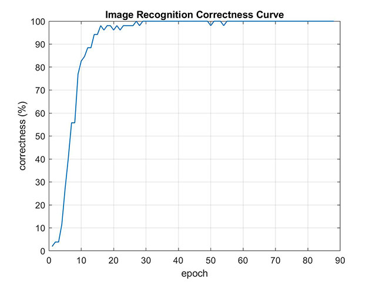

CUDA Character Recognition
======================

**University of Pennsylvania, CIS 565: GPU Programming and Architecture, Project 2**

* Zheyuan Xie
* Tested on: Windows 10 Pro, i7-7700HQ @ 2.80GHz 2.80GHz, 16GB, GTX 1050 2GB (Dell XPS 15 9560)

## Description
In this project, a three-layer perceptron is implemented using CUDA.The implementation is tested on the XOR example and the given character recognition dataset. 

The three-layer perceptron is warpped into a class `MLP3`, which is declared in `mlp.h` and implemented in `mlp.cu`. Related CUDA kernels and cuBLAS helper functions are implemented in `mlp.cu`. The neural network is composed of three layers:
 - A input layer
 - A fully connected hidden layer with Sigmoid activation
 - A fully connected output layer with Sigmoid activation

Currently we do not support changing the number of layers. But the number of neurons (N_input, N_hidden, N_output) in each layer is configurable at consturction. The training data and labels are provided in batch as N_batch x N_input and N_batch x N_ouptut matrix stored in *column-major* arrays. The training undergoes the following steps on every epoch:
 
 1. **Forward pass**: given inputs, compute the outputs of the network using current weights.
 2. **Backward propagation**: back propagate the training error and compute the gradients of each weight.
 3. **Calculate Loss**: compute the total training loss of current batch.
 4. **Update weights**: update the gradient using naive gradient descent.

 All calculations are implemented in parallel using custom CUDA kernels and cuCLABS library.

## Traning Result
### XOR Example
 - input neuron: 2
 - hidden neuron: 2
 - output neuron: 1
 - batch size: 4
 - initial weights: As given in the Excel
 - learning rate: 10^-2 fixed

The graph below shows the change of total error in the first 200 epoches.


Debug Output:
```
--- XOR Example ---
epoch: 0 | cost: 0.00286369
epoch: 10 | cost: 0.00229358
epoch: 20 | cost: 0.00190236
epoch: 30 | cost: 0.00162444
epoch: 40 | cost: 0.00142166
epoch: 50 | cost: 0.00127057
epoch: 60 | cost: 0.0011561
epoch: 70 | cost: 0.00106817
epoch: 80 | cost: 0.000999872
epoch: 90 | cost: 0.000946314
epoch: 100 | cost: 0.000903958
epoch: 110 | cost: 0.000870197
epoch: 120 | cost: 0.000843124
epoch: 130 | cost: 0.000821268
epoch: 140 | cost: 0.000803517
epoch: 150 | cost: 0.000789034
epoch: 160 | cost: 0.000777127
epoch: 170 | cost: 0.000767323
epoch: 180 | cost: 0.000759189
epoch: 190 | cost: 0.000752402
```

### Character Recognition
 - input neuron: 2
 - hidden neuron: 2
 - output neuron: 1
 - batch size: 52
 - initial weights: random
 - learning rate: 10^-4 fixed

 The graph below shows the change of total error in the first 200 epoches.
 

 Another graph shows the evolution of prediction correctness in the training set. The prediction reaches 100% correct at about 80th epoch.
 

Debug Output:
```
--- Character Recognition ---
epoch: 0 | cost: 0.291311 | correct: 82.6923%
epoch: 10 | cost: 0.142109 | correct: 96.1538%
epoch: 20 | cost: 0.0961198 | correct: 100%
epoch: 30 | cost: 0.063884 | correct: 100%
epoch: 40 | cost: 0.0623333 | correct: 98.0769%
epoch: 50 | cost: 0.0497727 | correct: 100%
epoch: 60 | cost: 0.0461378 | correct: 100%
epoch: 70 | cost: 0.0356991 | correct: 100%
epoch: 80 | cost: 0.0315837 | correct: 100%
epoch: 90 | cost: 0.0304885 | correct: 100%
epoch: 100 | cost: 0.026108 | correct: 100%
epoch: 110 | cost: 0.0254792 | correct: 100%
epoch: 120 | cost: 0.0291465 | correct: 100%
epoch: 130 | cost: 0.0230684 | correct: 100%
epoch: 140 | cost: 0.0249249 | correct: 100%
epoch: 150 | cost: 0.0206818 | correct: 100%
epoch: 160 | cost: 0.0191929 | correct: 100%
epoch: 170 | cost: 0.0171115 | correct: 100%
epoch: 180 | cost: 0.0167711 | correct: 100%
epoch: 190 | cost: 0.0161567 | correct: 100%
---
Target Label:1, Predicted Label:1
Target Label:2, Predicted Label:2
Target Label:3, Predicted Label:3
Target Label:4, Predicted Label:4
Target Label:5, Predicted Label:5
Target Label:6, Predicted Label:6
Target Label:7, Predicted Label:7
Target Label:8, Predicted Label:8
Target Label:9, Predicted Label:9
Target Label:10, Predicted Label:10
Target Label:11, Predicted Label:11
Target Label:12, Predicted Label:12
Target Label:13, Predicted Label:13
Target Label:14, Predicted Label:14
Target Label:15, Predicted Label:15
Target Label:16, Predicted Label:16
Target Label:17, Predicted Label:17
Target Label:18, Predicted Label:18
Target Label:19, Predicted Label:19
Target Label:20, Predicted Label:20
Target Label:21, Predicted Label:21
Target Label:22, Predicted Label:22
Target Label:23, Predicted Label:23
Target Label:24, Predicted Label:24
Target Label:25, Predicted Label:25
Target Label:26, Predicted Label:26
Target Label:27, Predicted Label:27
Target Label:28, Predicted Label:28
Target Label:29, Predicted Label:29
Target Label:30, Predicted Label:30
Target Label:31, Predicted Label:31
Target Label:32, Predicted Label:32
Target Label:33, Predicted Label:33
Target Label:34, Predicted Label:34
Target Label:35, Predicted Label:35
Target Label:36, Predicted Label:36
Target Label:37, Predicted Label:37
Target Label:38, Predicted Label:38
Target Label:39, Predicted Label:39
Target Label:40, Predicted Label:40
Target Label:41, Predicted Label:41
Target Label:42, Predicted Label:42
Target Label:43, Predicted Label:43
Target Label:44, Predicted Label:44
Target Label:45, Predicted Label:45
Target Label:46, Predicted Label:46
Target Label:47, Predicted Label:47
Target Label:48, Predicted Label:48
Target Label:49, Predicted Label:49
Target Label:50, Predicted Label:50
Target Label:51, Predicted Label:51
Target Label:52, Predicted Label:52
```

## Performance Analysis
