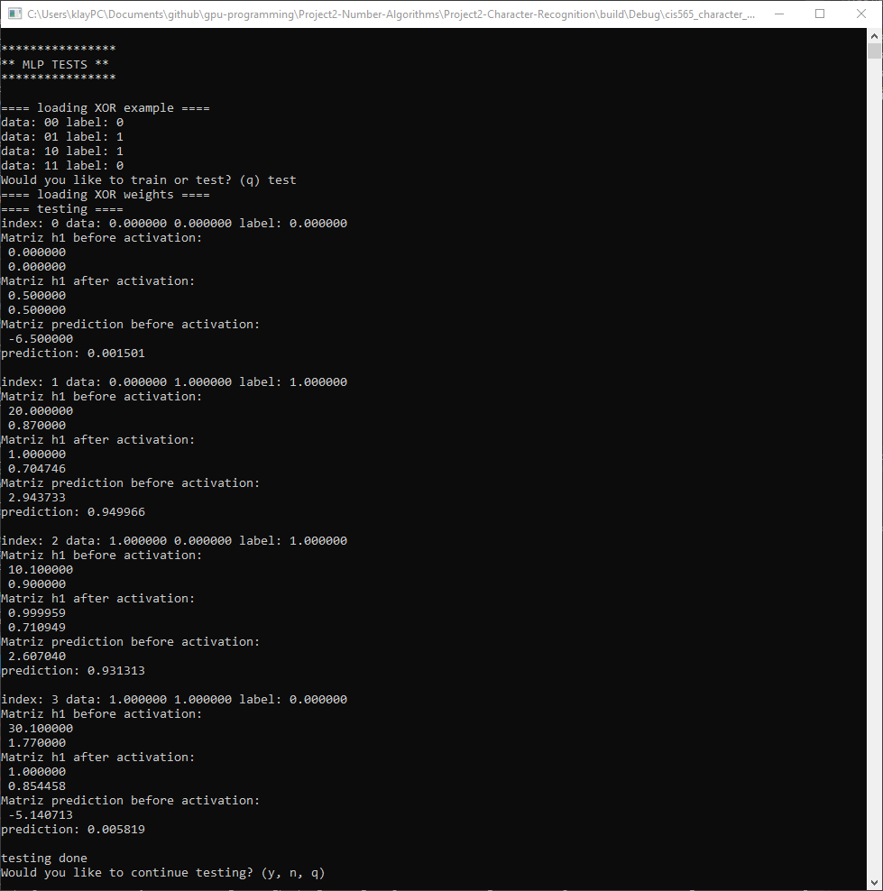

CUDA Character Recognition
======================

**University of Pennsylvania, CIS 565: GPU Programming and Architecture, Project 2**

* Klayton Wittler
	* [LinkedIn](https://www.linkedin.com/in/klayton-wittler/)
* Tested on: Windows 10 Pro, i7-7700K @ 4.20GHz 16.0GB, GTX 1070 8.192GB (my PC)

## Sections

* [Introduction](#introduction)
* [Impelmentation](#implementation)
* [Additions](#additions)

# Introduction
This project is an attempt at developing a multi-layer perceptron from scratch that utilizes some of the parallelization offered by the GPU. 


The architecture for the network is:

* Input Layer: Number of nodes in this layer is equal to the number of features. Two for XOR and 10201 for the images in the dataset

* Hidden Layer: This layer is a linear transformation with some weighted matrix activated by some non-linear function (sigmoid)

* Output Layer: The number of nodes in this layer is equat to the number of labels. One for XOR and 52 for the images in the dataset

The loss function for the network is currently the sum of squared error, but other losses for the image classification would be better (for example cross entropy).

# Implementation
My implemenation contains a flag ```XOR``` which switches from the XOR test to the image dataset. I currently have the ability to load the images, store them into an arary and give it to training or testing functions, however the backprogation for training does not work. Below is an example of forward propagation wiht loss calculation on the XOR dataset.


Inside ```mlp.cu``` the main functions are ```train``` and ```test```. Each of these call ```forward``` to run the network utilizing cublas matrix multiplication in ```matrixMultiply``` for the weights and calls ```kernSigmoid``` to run the activations in parallel. This is repeated twice for the two layers in which the prediction is then returned. The loss is then calculated in ```MSE``` which is also set up to be done in parallel but for the XOR example is trivial. The loss could then be fed into backpropagation to adjust the weights in order perform gradient descent on the loss function. In ```main.cpp``` have given an option to specify the number of desired iterations and learning rate to the user as well as the number of hidden nodes.

# Additions
## Matrix multiplication
```CMakeLists.txt``` has been edited to include ```link_directories(${CUDA_TOOLKIT_ROOT_DIR}/lib/x64)``` as well as ```cublas``` in ```target_link_libraries```.

Each layer of the network is handle with a matrix multiplication through cublas in the ```matrixMultiply``` function then feed through the sigmoid activation in parallel with ```kernSigmoid```. Below is the outputs of each layer in the XOR example. There is a flag for testing matrix multiply ```MULT``` which will trigger a console prompt of what size matrix to test, fill in each element with its index and return the result for verification.



