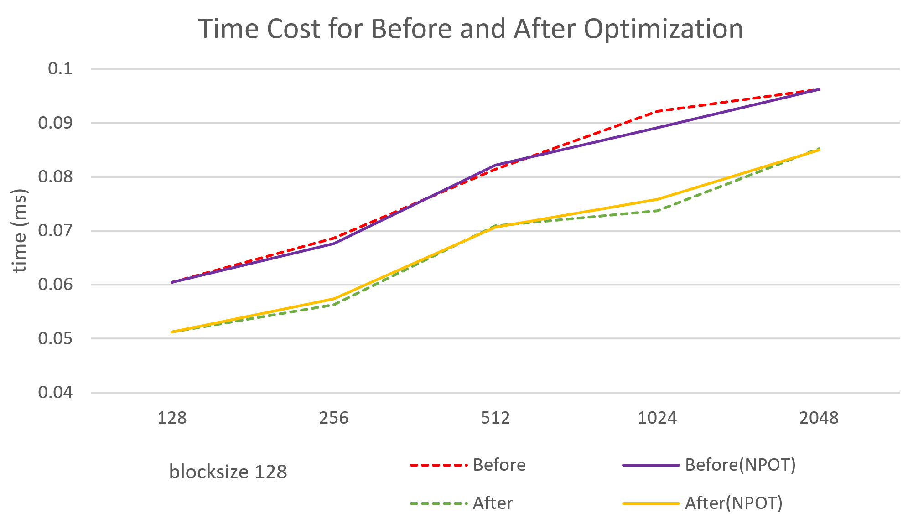

CUDA Stream Compaction
======================

**University of Pennsylvania, CIS 565: GPU Programming and Architecture, Project 2**

* Yan Dong
  - [LinkedIn](https://www.linkedin.com/in/yan-dong-572b1113b/)
  - [personal website](coffeier.com)
  - [github](https://github.com/coffeiersama)
* Tested on: Windows 10, i7-8750 @ 2.22GHz  (12CPUs)  16GB, GTX 1060 14202MB (OMEN 15-dc0xxx)


[Result](#features) - [Runtime Analysis](#analysis) - [Extra](#extra)


## Features

##### CPU: 

-Scan

-Stream Compaction

##### GPU: 

-Naive Scan 

-Work-Efficient Scan

-Work-Efficient Stream Compaction

-Thrust Scan

###### Extra:

-Why is CPU faster than Work-efficient?

-Radix Sort algorithm


```
****************
** SCAN TESTS **
****************
    [  25  15  21  13  27  28  36  12  46  44  46  45  42 ...  17   0 ]
SIZE: 128, NPOT:125
==== cpu scan, power-of-two ====
   elapsed time: 0.0016ms    (std::chrono Measured)
==== cpu scan, non-power-of-two ====
   elapsed time: 0.0009ms    (std::chrono Measured)
    passed
==== naive scan, power-of-two ====
   elapsed time: 0.106496ms    (CUDA Measured)
    passed
==== naive scan, non-power-of-two ====
   elapsed time: 0.11264ms    (CUDA Measured)
    passed
==== work-efficient scan, power-of-two ====
   elapsed time: 0.077824ms    (CUDA Measured)
    passed
==== work-efficient scan, non-power-of-two ====
   elapsed time: 0.095232ms    (CUDA Measured)
    passed
==== thrust scan, power-of-two ====
   elapsed time: 11.607ms    (CUDA Measured)
    passed
==== thrust scan, non-power-of-two ====
   elapsed time: 1.11616ms    (CUDA Measured)
    passed

*****************************
** STREAM COMPACTION TESTS **
*****************************
    [   0   0   1   3   2   1   2   1   3   0   0   1   1 ...   3   0 ]
==== cpu compact without scan, power-of-two ====
   elapsed time: 0.0012ms    (std::chrono Measured)
    passed
==== cpu compact without scan, non-power-of-two ====
   elapsed time: 0.001ms    (std::chrono Measured)
    passed
==== cpu compact with scan ====
   elapsed time: 0.0075ms    (std::chrono Measured)
    passed
==== work-efficient compact, power-of-two ====
   elapsed time: 0.18944ms    (CUDA Measured)
    passed
==== work-efficient compact, non-power-of-two ====
   elapsed time: 0.287744ms    (CUDA Measured)
    passed
==== radix sort ====
    [  20  60  29  31  26  25  58  45  63  56  44  37  45 ...  40  10 ]
    [  10  12  20  25  26  29  31  36  37  40  44  45  45 ...  62  63 ]
```


## Analysis


As we increase the block size, there is no obvious change in the time cost. So I think just change change the block size cannot improve the performance. Some other time consuming things a lot of time(such as read and write global memory).


As we increase the array size, most of the line increase as well.  As for CPU, the 2 lines are so near, and pot and npot do not affect so clearly. And in the Graph, the CPU is the fastest method.

For GPU,  first is the thrust. As you can see the thrust lines are most written lines. I have tried the same parameters for running several times, and find different thrust output. This really makes me confused. Anyway their time consuming are unstable.

For Naive, the npot line is always lower than the pot one. Although it is not so obvious difference. I think this is because we deal with less number in the npot case. Finally, for the work efficient method. I the npot line sometimes higher than the pot one. I think this is cased by the operation and more memory access in dealing with npot to pot when we meet the npot array. 




Here is a graph I show the effect of making the extra1. After remove the lazy thread, we have a stable time saving result!

## Questions

##### Guess at what might be happening inside the Thrust implementation 

The thrust result always vibrate between numbers, but as in my testing, the speed of it is between Naive and Work Efficient method. I think maybe they allocate less memory and use shared memory to save same latency.

##### Can you find the performance bottlenecks? Is it memory I/O? Computation? Is it different for each implementation?

I think is yes.

For the CPU, I think the computation is the main bottlenecks, since you need to do a for loop. And that is the improvement for GPU.

For GPU Naive Scan, in the slides, we know that although the numbers of add is o(nlog2(n)), the whole complexity is o(log2(n)), which is smaller than the o(n). But in my test... the CPU is always faster than the GPU. So I think is the problem of memory I/O.  And in this homework, I do not use the shared memory, so there will be some latency in interact with global memory. There can be other time consuming things, such as bank conflict and SM resource problem, happens, Work Efficient also suffer from these and take more memory operations than Naive, I think that's why it is time costing than Naive.

As for thrust, I am not sure...maybe memory I/O?

## Extra

##### Why is My GPU Approach So Slow?

this is because when I first implement the work efficient approach, not every thread is used.

Here is the up sweep method in the algorithm, 

when d=0, we need to deal with the whole array,

when d=1, we just need to deal with the half data of the array.

So, to solve this, change the index of data to be worked by GPU, make it jump. 


Here is a comparison for before and after changing:

###### Before


###### after


##### Radix sort

just follow the slides from the course.

How to call:

```
genArray(Sort_Size, ra, 64);
zeroArray(Sort_Size, raout);
StreamCompaction::Radix::radix_sort(Sort_Size, 6, raout, ra);
printDesc("radix sort");
printArray(Sort_Size, ra, true);
printArray(Sort_Size, raout, true);
```

Result:

