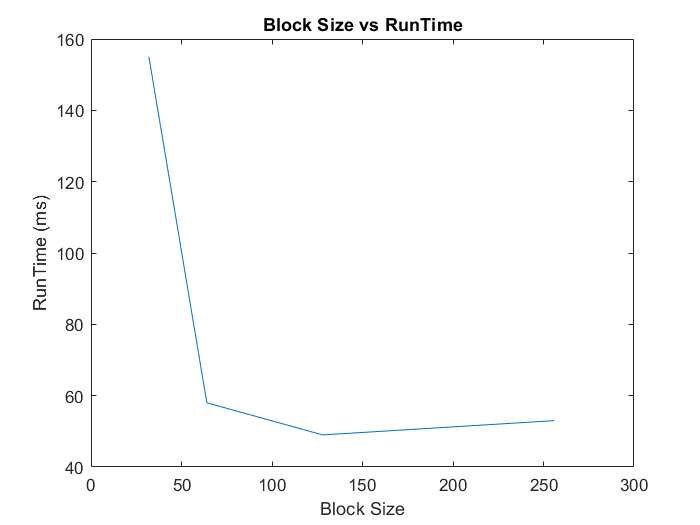
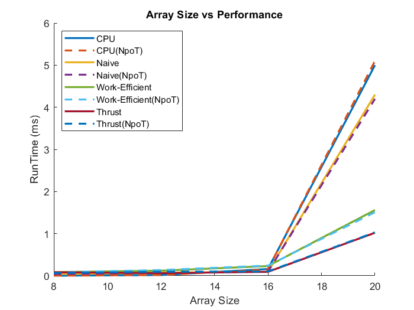

# Project 2-1 GPU Stream Compaction
======================

**University of Pennsylvania, CIS 565: GPU Programming and Architecture, Project 2**

* Weiqi Chen
  * [LinkedIn](https://www.linkedin.com/in/weiqi-ricky-chen-2b04b2ab/)
* Tested on: Windows 10, i7-8750H @ 2.20GHz 2.21GHz, 16GB, GTX 1050 2GB

## Project Goal
In this project, we will implement CUDA stream compaction and use it to remove 0s (or any other elements you don't want) from arrays. 3 versions of exclusive scan are implemented for computing scatter indices:

* CPU Scan
* Naive GPU Scan
* Work-Efficient GPU Scan

We will compare the performances of the three methods along with the implementation provided by Thrust library.

## Performance Analysis
### Block Size Optimization
The bar plot below shows the performance vs block size. The best is 128 and we will use this for all subsequent tasks.



### GPU Scan Implementations vs CPU Scan Implementations
Below is a plot of performance vs array size for all four methods. For each method, an array size of power of two and one of non power of two are used.



* When the array size is below 2<sup>13</sup>, CPU scan has the best performance. This could be due to the overheads of invoking kernels when computation time is not the bottleneck.
* As array size gets larger, GPU implementations start to perform much better than CPU method.
* Thrust's scan is the fastest of all when array size is large. This could be due to the use of shared memory instead of reading from global memory.

### Extra Credit

I didn't encounter the problem of GPU approach running slower than expected. I think this is because during the implementation of UpSweep and DownSweep for work-efficient scan, I change the grid size and allocate necessary threads in different stages of the sweeping process. It makes sense that if we use as many threads as the array size throughout the computation, inactive threads will be present and slow down the performance.


Console Output with a block size of 128 and an array size of 2<sup>16</sup>.
```
****************
** SCAN TESTS **
****************
    [  17  25  12  21  22   4  37  44  40   8  40  46  43 ...   5   0 ]
==== cpu scan, power-of-two ====
   elapsed time: 0.2863ms    (std::chrono Measured)
    [   0  17  42  54  75  97 101 138 182 222 230 270 316 ... 3209400 3209405 ]
==== cpu scan, non-power-of-two ====
   elapsed time: 0.2797ms    (std::chrono Measured)
    [   0  17  42  54  75  97 101 138 182 222 230 270 316 ... 3209316 3209325 ]
    passed
==== naive scan, power-of-two ====
   elapsed time: 0.726016ms    (CUDA Measured)
    passed
==== naive scan, non-power-of-two ====
   elapsed time: 0.727008ms    (CUDA Measured)
    passed
==== work-efficient scan, power-of-two ====
   elapsed time: 0.393216ms    (CUDA Measured)
    passed
==== work-efficient scan, non-power-of-two ====
   elapsed time: 0.39216ms    (CUDA Measured)
    passed
==== thrust scan, power-of-two ====
   elapsed time: 17.0906ms    (CUDA Measured)
    passed
==== thrust scan, non-power-of-two ====
   elapsed time: 11.7248ms    (CUDA Measured)
    passed

*****************************
** STREAM COMPACTION TESTS **
*****************************
    [   2   0   3   2   2   0   0   1   1   2   0   0   2 ...   2   0 ]
==== cpu compact without scan, power-of-two ====
   elapsed time: 0.5571ms    (std::chrono Measured)
    [   2   3   2   2   1   1   2   2   1   1   1   3   1 ...   2   2 ]
    passed
==== cpu compact without scan, non-power-of-two ====
   elapsed time: 0.5431ms    (std::chrono Measured)
    [   2   3   2   2   1   1   2   2   1   1   1   3   1 ...   2   1 ]
    passed
==== cpu compact with scan ====
   elapsed time: 0.2748ms    (std::chrono Measured)
    [   2   3   2   2   1   1   2   2   1   1   1   3   1 ...   2   2 ]
    passed
==== work-efficient compact, power-of-two ====
   elapsed time: 0.490592ms    (CUDA Measured)
    passed
==== work-efficient compact, non-power-of-two ====
   elapsed time: 0.49152ms    (CUDA Measured)
    passed
```
