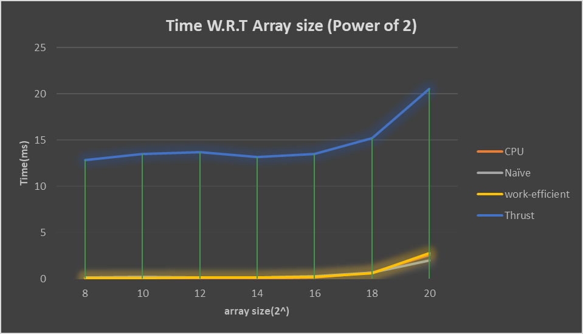
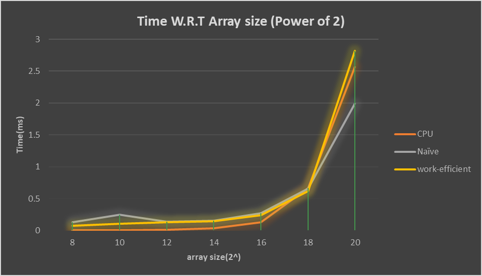
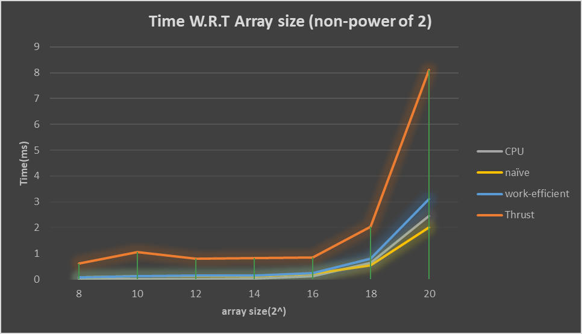
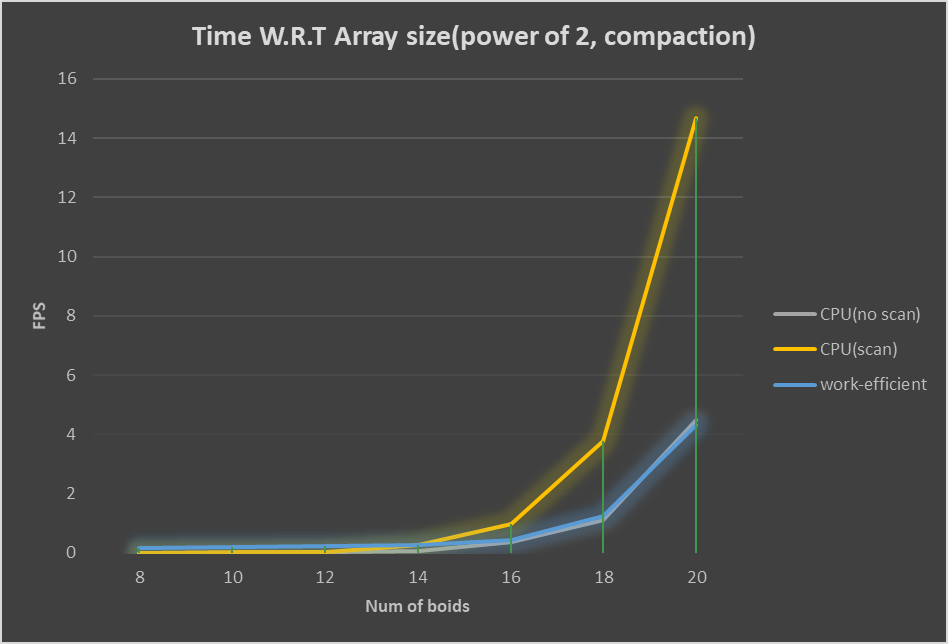
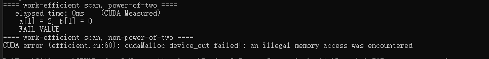

CUDA Stream Compaction
======================

**University of Pennsylvania, CIS 565: GPU Programming and Architecture, Project 2**

* #### Author information
  
  - Tianming Xu (Mark)
    - www.linkedin.com/in/tianming-xu-8bb81816a (LinkedIn)
  - Tested on: Windows 10, i7-8700 @ 3.20GHz 16GB, GTX 2080 8192MB (my personal desktop)

### Output Screenshots(2^14 elements)

### Features

The first thing I did in this project is to implement the exclusive scan in CPU sequential approach, naive GPU approach and work-effiecient approach using upsweep and downsweep algorithm from GPU Gem. Besides, I explored the exclusive scan method in Thrust library. 

The other thing I did in my project is to implement the stream compaction method, which exclude certain elements in the array which satisfy some conditions(in my project, the condition is equal to 0). I use three approaches: sequential without scan, sequential with scan, and parallel with work-efficient scan.

### Performance Analysis

##### The comparison among CPU, Naive, work-efficient and Thrust in scan algorithm

The performance of thrust is very weird. It runs significantly slower than all the other three. However, we can see later in the non power of two part, its speed becomes much more reasonable. I am not quite sure why. I guess there might be some very heavy pre-process step in the thrust library. In order to see more detailed comparison among the rest, I have another chart without thrust

In this chart, surprisingly, the work-efficient one is never the best in both low number of element and high number of element. What I guess the problem might be, just like what instruction mentioned, the index of thread. As we have a 2^d stride of each iteration, when the value of d becomes larger and larger, the gap between the elements we need to compute the result is larger. Hence, as we need to access the data from global memory, we need to spend a lot of time reading the corresponding value we need. 

In the non power of two cases, the situation is similar. Though the thrust library has a much more reasonable efficiency, it still is the slowest among the three. Another interesting find is that, the non power of two cases have a better performance than the power of two cases, which is unexpected. I am not quite sure why that happens.

##### The comparison among CPU(no scan), CPU(with scan) work-efficient stream compaction

The performance of compaction algorithm is more expected than the scan algorithm. The CPU scan one takes longer when the number of element is larger, as it will take multiple rounds of adding and swapping, which is unnecessary in sequential algorithm. But the work-efficient algorithm is not recognizably faster than the sequential one, even when the number of element is huge. I think it might be the same problem in the scan algorithm.

### Debug Database

- The corner case guard is very important. I used incorrect corner case guard (index > n) in my first project, and copy and paste to my project 2. It causes a  very weird problem that the last element in the output data is always incorrect. Make sure to use (index >= n), as the nth element is out of range.
- The cuda initialization error might not be caused by the cuda initialization part. It might be other kernel function mess up something in cuda memory and cause the memory allocation to fail. 
  - 
  - This error is actually because I use "cudaMemcpyDeviceToDevice" when I try to copy my temp_out intermediate array to odata array. 

