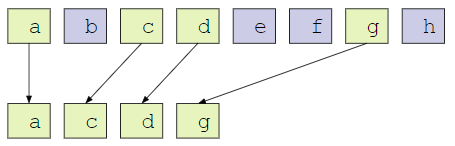
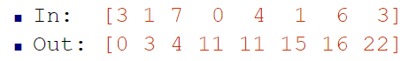
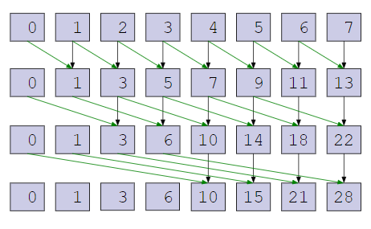
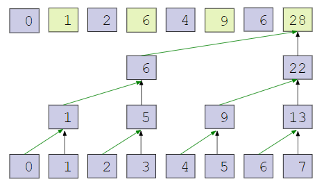
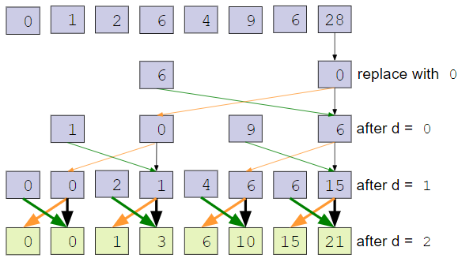
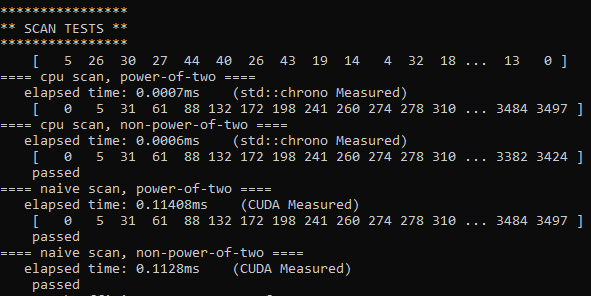
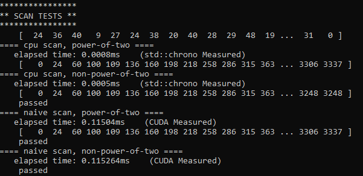
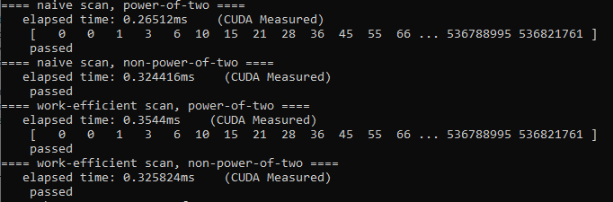
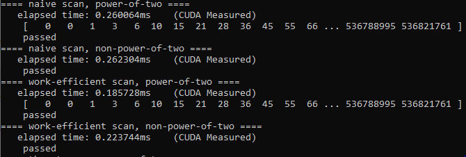

CUDA Stream Compaction
======================

**University of Pennsylvania, CIS 565: GPU Programming and Architecture, Project 2**

* Grace Gilbert
  * gracelgilbert.com
* Tested on: Windows 10, i9-9900K @ 3.60GHz 64GB, GeForce RTX 2080 40860MB


## Overview
In this project, I implemented the stream compaction algorithm on the GPU in CUDA.  Stream compaction is an algorithm that, given an array of values marked to remove or keep, removes the values and returns a new, shorter array with the values removed. Below is a diagram representing the stream compaction algorithm:

 

This algorithm has many practical applications, including path tracing, as it lets us mark certain elements as unwanted and remove them.  While there is a simple way to perform this algorithm using loops on the CPU, it can also be parallelized to be more efficiently performed on the GPU.  

An important step in the stream compaction algorithm is the scan algorithm.  This algorithm goes through an array and accumulates additively all of the elements in the array.  An exclusive scan excludes the current index in the accumulated sum, whereas inclusive scan includes the current index.  Steam compaction uses an exclusive scan.  Below is a diagram representing the scan algorithm:



I implemented 4 versions of the above algorithms, scan and stream compaction on the CPU, a naive version of scan on the GPU, a work efficient version of both on the GPU, and then using the thrust implementation of scan.

## CPU
#### Scan
The scan algorithm on the cpu is a simple loop over the data.  For an exclusive scan, we set the first value of the output to 0, as no sum has been accumulated.  Then from index 1 through arrayLength - 1, we set the output at that index to the sum of the output at the previous index and the input array at the previous index:

```
outputData[0] = 0;
for (int k = 1; k < n; ++k) {
    outputData[k] = outoutData[k - 1] + inputData[k - 1];
}
```

#### Stream Compaction without Scan
The basic stream compaction algorithm tracks a counter of how many elements to include that we have seen. If we see an element to include, it sets the output at the index of the counter to the element value, then increments the counter.
```
int counter = 0;
for (int k = 0; k < n; ++k) {
    int currentValue = inputData[k];
    if (currentValue != 0) {
        outputData[counter] = currentValue;
        counter++;
    }
}
```

#### Stream Compaction with Scan and Scatter
In this version, I start by creating a temporary array that contains a 1 wherever the input array had a nonzero value, and 0 where the input array had a zero value:
```
int *tempArray = new int[n];
for (int k = 0; k < n; ++k) {
    tempArray[k] = (int) inputData[k] != 0;
}
```
I then call scan on that 0/1 array using the CPU implementation from above. I then iterate through all the indices in the input array, and if the value should be included, I get the scan result value at that index and put the input value at that scan result index in the output array.
```
int *scanResult = new int[n];
scan(n, scanResult, tempArray);
for (int k = 0; k < n; ++k) {
    if (tempArray[k]) {
        int index = scanResult[k];
        odata[index] = idata[k];
    }
}
```

## GPU
In order to parallelize scan to run on the GPU, we add pairs of elements in the array in parallel.  We do this in multiple steps, eventually filling out the entire scanned array.  The way in which we group the pairs of elements to sum together in each step affects the efficiency.

These groupings involve splitting the array by 2.  They work only when the array is a power of 2.  Therefore, we pad the input array with 0's, which do not affect scan, filling it until it is as large as the next power of 2. 

### Naive
#### Scan
The first implementation of a GPU scan is the naive one.  This implementation starts by adding all adjacent pairs of indices.  Then in the next step, it adds indices one farther apart from each other.  The distance between the indices added together in parallel doubles at each step, until eventuall the first half of indices is added to the second half of indices.  The following diagram outlines the naive implementation:



This process has O(logn) steps, and O(n) adds run in parallel per step, making the total number of additions O(nlogn).

In this version, the output was an inclusive scan, so I had to shift all of the values right and insert a 0 in the first index.  I performed this shift operation in a kernel, where I checked if the index was 0, in which case I filled the shifted array with 0, and otherwise shifted everything right.

### Work Efficient
#### Scan
In a more efficient GPU implementation, we utilize a binary tree structure in order to further optimize the scan algorithm.  In this version, there are two stages, the up-sweep and the down-sweep.  

In the up-sweep, we first sum adjacent pairs, creating n/2 sums.  We then sum adjacent pairs of the n/2 sums, creating n/4.  We continue this until there is one final sum, as picutred below:



Next comes the down-sweep.  Because we can treat the array as a tree, I will refer to the left and right children of indices.  The root of the tree is the final index, initially holding the final value from the up-sweep.  We start by replacing this value with 0.  Then we store its left child.  In the left child's spot, we copy the current value, which is initially the root.  Then we sum the current value and its left child and store that in the right child.  We the continue this at every level of the tree, running all the values at a level in parallel until we've filled out n leaves.  This algorithm is pictured below:



The up-sweep process has O(n) adds.  The down-sweep process has O(n) adds and O(n) swaps.  This makes the total runtime O(n), exponentially more efficient than the naive scan.  

### Thrust
#### Scan
For this implementation, I simply cast the input and output array buffers to thrust device pointers and then run thrust's exclusive scane on the buffers.  
```
thrust::exclusive_scan(dev_thrust_inputArray, dev_thrust_inputArray + bufferLength, dev_thrust_outputArray);
```

## Performance Analysis and Questions
For each of the algorithms, I ran them with a block size of 128.  In order for the block size to be optimal, it must be a power of two.  Most of the thread counts that we are sending are multiples or powers of two, so having a block size that is a power of two helps ensure that the blocks are filled to their capacity, making it most efficient.

### Optimizations (extra credit)
#### Naive thread count
In the naive algorithm, within the parallel portion of the algorithm, there is a check to see if the index is at least a certain value:

# INSERT IMAGE OF PSEUDOCODE

I realized that for all threads where the index was too small, the thread was simply returning without doing any work. To optimize this, I calculated exactly how many threads would actually end up doing work:
```
for (int d = 1; d <= ilog2ceil(n); ++d) {
    int numThreads = bufferLength - pow(2, d - 1);
}
```
I only launched this many threads.  However, the indices were now incorrect, as I was starting at 0, but the desired threads were the larger portion.  To fix this, I offset all of the thread indices by the cutoff value, enabling proper indexing without launching any redundent threads.

This optimization improved the runtime of the scan, as shown in the data below:

Prior to thread count optimization:



With thread count optimization:



Note that this data shows a relative improvement, not the absolute performance of the algorithm as shown in the charts above.  I had not yet started documenting performance properly, so this was not run in release mode and the timers included the final memory operations.  However, they are both run under the same conditions, scanning an array of size 2^7 and 2^7 - 3.

#### Work Efficient Implementation Optimizations
When I implemented the efficient implementation, it was slower than the naive implementation at first, so I made some changes to optimize it.  Like in the naive implementation, I made sure to only launch exactly as many threads as needed, and this number gets cut in half each iteration for both the up and down sweeps:
```
for (int d = 0; d < ilog2ceil(n); ++d) {
    int power = pow(2, d);
    int numThreads = bufferLength / (2 * power);
}
```
To then ensure proper indexing within the kernel, I multiplied the index by 2 * power.

I also realized that the thread operations were using 2^d frequently.  At first, I was calculating pow(2, d) within the kernel, but realized this to be inefficient, as this is not a trivial operation.  Instead, I calculated the exponent before launching the threads and passed in the value.  For the cased where we used 2^(d + 1) instead, I simply multiplied the power value by 2.  

The final optimization I made is in the part of the algorithm where we have to set the hypothetical root of the tree to 0 before beginning the down-sweep.  Initially, I copied the device buffer data to the CPU, indexed into the root position and changed it to 0, then copied it back into the decide buffer. I realized that this copying between the host and device was inefficient.  Instead, in order to keep all the data on the GPU, I launched a kernel with a single thread and an offset value.  This kernel indexed into the offset value, as the only index is 0, so I used index 0 + offset. For the offset, I made it the index of the root, and then set the value to 0 in the kernel.  This saved two copies of the data between host and device.

Overall, these changes fairly dramatically improved the runtime of the scan operation.  The improvement can be seen in the following two images, the first showing the runtime prior to the optimizations, the second showing the runtime afterwards.  As mentioned above, these are relative improvements, as I did not perform these tests in release mode, and the timers include final data copying. Both of these are run on arrays length 2^7 and 2^7 - 3:





