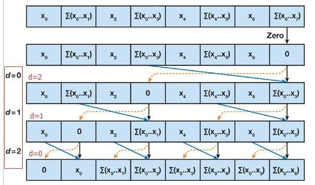
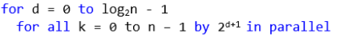
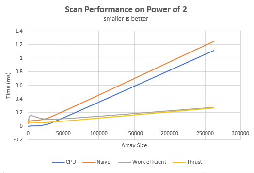
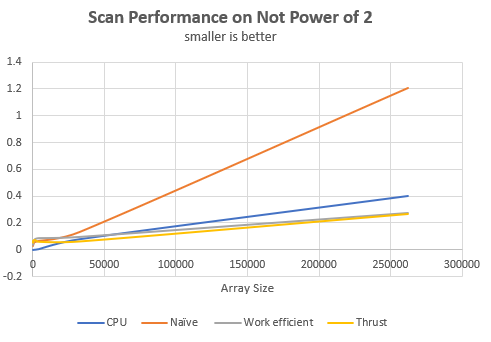
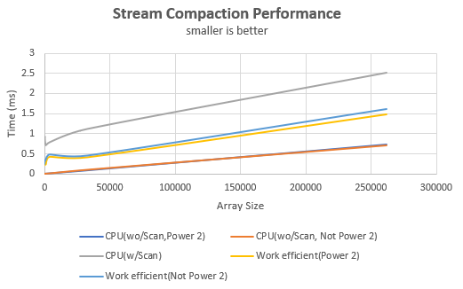

CUDA Stream Compaction
======================

**University of Pennsylvania, CIS 565: GPU Programming and Architecture, Project 2**

Peyman Norouzi
* [LinkedIn](https://www.linkedin.com/in/peymannorouzi)
* Tested on: Windows 10, i7-6700 @ 3.40GHz 16GB, Quadro P1000 4096MB (Moore 100B Lab)

## Scan and Stream Compaction:

Enclusive scan, or simply scan of a sequence of numbers x0, x1, x2, ... is a second sequence of numbers y0, y1, y2, ..., the sums of prefixes (running totals) of the input sequence:

y0 = 0

y1 = x0

y2 = x0 + x1

...

Compaction, on the other hand, is a parallel computing primitive that produces output results consisting of only valid elements from an input array (invalid and valid elements).


## The implementations:

The following implementations were implemted and their performance analyzed:

* CPU scan and stream compaction
* GPU Naive scan
* GPU work efficient scan and stream compaction
* Scan using Thrust package


### 1. CPU scan and stream compaction:

In the scan we compute an exclusive prefix sum using a simple For loop to calculate the sum for each index in the array using the following: array[index] = array[index-1] + array[index].

In the stream compaction, we sequentially alter the index values in the array that are 0 to 0 and >0 to 1. Then using that we complete steam compaction.

### 2. GPU Naive scan:
In this method, instead of going sequentially through all the indices in the array, we go through all of the indices of the array in parallel log(n) times just as following: 


This method would give an inclusive scan, after we move the whole array one to the right thus making the scan exclusive.

### 3. GPU work efficient scan and stream compaction:

Sum: In this method, instead of double counting sums as we did in the naive approach, we only sum each respective indices once. This approach can be done in a place which means it doesn't suffer from the race conditions of the naive method since there won't be a case where one thread writes to and another thread reads from the same location in the array (it is more memory efficient). The scan uses a balanced binary tree in concept to perform the scan in two phases below: 

* Parallel Reduction (Up-Sweep)
* Down-Sweep

The apporch can be seen using the following figure:



Since this approach uses a binary tree structure, it only works with arrays with power-of-two length. If the array does not hold that condition, I round the array memory allocation to the nearest power of two.

In compaction, I used the implemented work efficient scan to the array and compact the input array out of zeros (This would have not been possible without the scan since the GPU does not work sequentially).

### 4. Scan using Thrust package:

I have also implemented the exclsuive scan using the thurst package as a base line to see how the approaches earlier would stack up against each other.


## Why is My GPU Approach So Slow? (Extra Credit) (+5)

I first implemented the work efficient method by launching n threads where n represents the number of elements in the array. This is very inefficient because in a lot of the times most of the used threads won't be doing any work. This is because of the efficient scan uses the following loops for both up sweep and down sweep: 



In the inner loop, we are working in parallel on the GPU. The step size for this loop is not 1 and changes based on the outer loop (d). Thus as d increases, the step size in the inner loop increases. Increased step size would then take use less and less of the launched threads if we have them as n (fixed). To improve this, we would need to launch less and fewer threads as we progress in the other loop. You can have a look at my code in the efficient.cu to see how I am changing the number of laughed thread thus improving the GPU performance significantly. This is the approach I used for my work efficient method.


## Performance:

1. The performance of each of the implemented algorithm changes based on how many blocks were used in launching their respective kernals. I ran multiple kernal values for each GPU implementation and 256 worked the best for the efficient approach and 512 worked the best for the naive approach.

2. The followings are the performanace of the implemneted approaches for both scanning and compation:





3. 

CPU performs the best when the array size is small which makes sense. This is because we are doing fewer mathematical operations in the CPU approach. But as the size of the array increases the performance of the CPU also decreases significantly. This is because we are operating each summation sequentially thus making the process a lot less efficient. The GPU work efficient approach shines as the number of elements in the array increases. this makes sense because we are doing not only less mathematical operations (compare to GPU naive) but we are also doing more and more of the operations in parallel on the warp on the GPU. The performance of the efficient approach is very similar to the thrust performance as the array size increases which kind of speak to the fact that the thrust package might be using the same (close approach) to the work efficient. Though I expect the thrust to perform better as the number of array size increases because the package probably does a better job with memory management. In compaction part, the CPU performs when we are not using scan when compacting which makes sense. But then GPU work efficient also performs reasonably considering many kernels that had to be run for the same easy implementation of compaction.

## Tests output:

```
****************
** SCAN TESTS **
****************
    [  21  15  25  19  28  10   5  34   4  33  35  23  44 ...  39   0 ]
==== cpu scan, power-of-two ====
   elapsed time: 0.0019ms    (std::chrono Measured)
    [   0  21  36  61  80 108 118 123 157 161 194 229 252 ... 24539 24578 ]
==== cpu scan, non-power-of-two ====
   elapsed time: 0.0016ms    (std::chrono Measured)
    [   0  21  36  61  80 108 118 123 157 161 194 229 252 ... 24424 24464 ]
    passed
==== naive scan, power-of-two ====
   elapsed time: 0.067008ms    (CUDA Measured)
    passed
==== naive scan, non-power-of-two ====
   elapsed time: 0.063488ms    (CUDA Measured)
    passed
==== work-efficient scan, power-of-two ====
   elapsed time: 0.088416ms    (CUDA Measured)
    passed
==== work-efficient scan, non-power-of-two ====
   elapsed time: 0.089088ms    (CUDA Measured)
    passed
==== thrust scan, power-of-two ====
   elapsed time: 0.050432ms    (CUDA Measured)
    passed
==== thrust scan, non-power-of-two ====
   elapsed time: 0.05008ms    (CUDA Measured)
    passed

*****************************
** STREAM COMPACTION TESTS **
*****************************
    [   3   1   1   1   0   0   1   2   2   3   1   1   2 ...   1   0 ]
==== cpu compact without scan, power-of-two ====
   elapsed time: 0.0027ms    (std::chrono Measured)
    [   3   1   1   1   1   2   2   3   1   1   2   3   1 ...   1   1 ]
    passed
==== cpu compact without scan, non-power-of-two ====
   elapsed time: 0.0028ms    (std::chrono Measured)
    [   3   1   1   1   1   2   2   3   1   1   2   3   1 ...   2   1 ]
    passed
==== cpu compact with scan ====
   elapsed time: 1.6032ms    (std::chrono Measured)
    [   3   1   1   1   1   2   2   3   1   1   2   3   1 ...   1   1 ]
    passed
==== work-efficient compact, power-of-two ====
   elapsed time: 0.283808ms    (CUDA Measured)
    [   3   1   1   1   1   2   2   3   1   1   2   3   1 ...   1   1 ]
    passed
==== work-efficient compact, non-power-of-two ====
   elapsed time: 0.285792ms    (CUDA Measured)
    [   3   1   1   1   1   2   2   3   1   1   2   3   1 ...   2   1 ]
    passed
```


