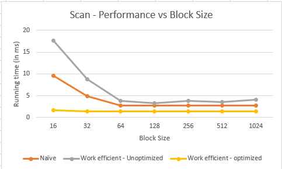
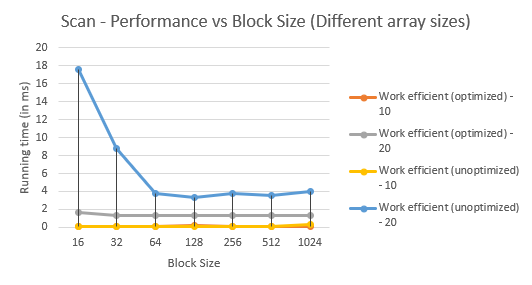
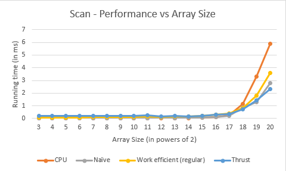
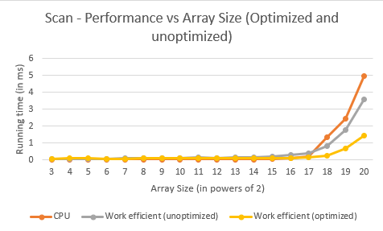
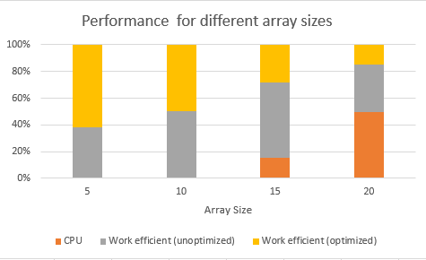
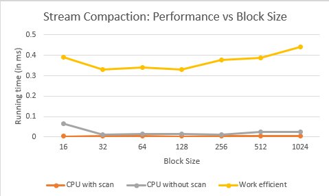
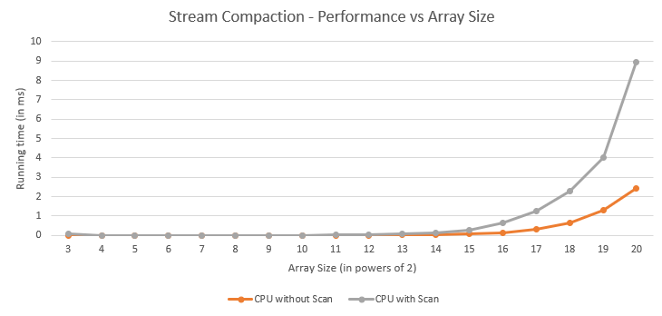
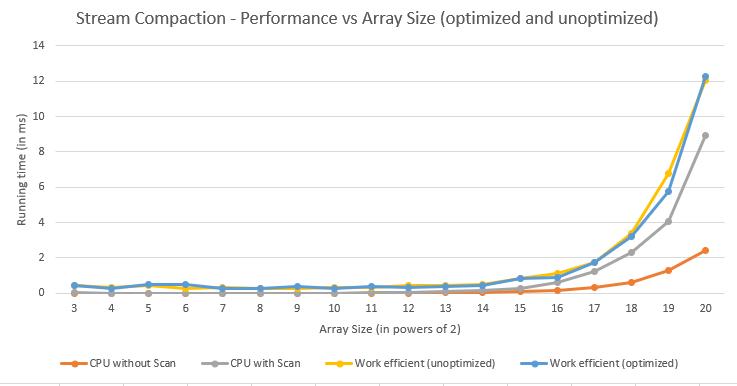
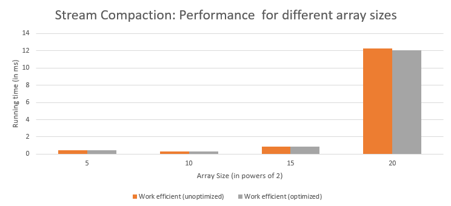

CUDA Stream Compaction
======================

**University of Pennsylvania, CIS 565: GPU Programming and Architecture, Project 2**

* Saket Karve
  * [LinkedIn](https://www.linkedin.com/in/saket-karve-43930511b/), [twitter](), etc.
* Tested on:  Windows 10 Education, Intel(R) Core(TM) i7-6700 CPU @ 3.40GHz 16GB, NVIDIA Quadro P1000 @ 4GB (Moore 100B Lab)

### Description

The scan algorithm is implemented using different approaches starting from a CPU version, then paralellizing it using a Naive parallel implementation and then optimizing it on the GPU. A performance analysis is included here showing a comparison between the different approaches. The thrust version of scan is also included in the comparisons.

The scan algorithm is further used to implement stream compaction. The CPU version and the optimize GPU version is compared for performance.

**\[EXTRA CREDIT\] Radix sort algorithm is also implemented in this repository using the Work efficient scan algorithm.**

### Scan Algorithm - Performance Analysis

Scan algorithm is used for finding the prefix-sum of an array of numbers. Each element of the output is the sum of all the previous elements with (or without) the elemnt at that position in the inclusive (or exclusive) scan. For stream compaction, exclusive scan is needed. Hence all comparisons are made for algorithms computing the exclusive scan of the input array.

Performance is measured in terms of the time (in milliseconds) required to execute the algorithm.

There are two main parameters used for comparison namely,
- Block Size
- Size of the input array

The performance is compared for the following approaches of the scan algorithm with respect to the above parameters.
- CPU implementation
- Naive Parallel implementation
- Work-efficient parallel implementation
- Optimized Work-efficient parallel implementation \[EXTRA CREDIT\]
- Thrust's implementation

#### Performance against Block Size

The block size matters only for the Naive parallel implementation and the Work-efficient implementations. 

The following graph shows how the performance varies with increasing block size on the three parallel implementations.



It can be seen that the performance more or less remains constant with block size for block size more than 32. The performance can be seen to be worse from smaller blocksizes (16 and 32) For all the implementations, block size of 128 is optimal.

I also tested the performance for the work-efficient implementation (optimized and unoptimized) for array sizes set to 2^10 and 2^20. The plots were as follows,



A significant drop can be seen in the runtime when the array size is reduced. But, no specific trend is observed between array size and block size. This is probably because we are not using the shared memory.
The optimized algorithm seems to show constant performance with block size while the unoptimized is affected for smaller blocks.

Hence, for testing against array size, block size is set to 128 wherever applicable.

#### Performance against Array Size

Performance of the CPU implementation with all the GPU implementations can be found in the following figure.



As expected, the performance decreases with increasing array size. The naive GPU and work efficient GPU impelemntation can be found to perform worse than the CPU implementation for smaller array sizes. This is primarily because of the extra overhead in managing the threads on the GPU which overpowers the effect of parallelization.

However for larger arrays, the GPU implementations are better. Thrust performs the best for array sizes greater the 2^18. Naive and work-efficient seem to show similar trends.

The following graph shows a comparison between the optimized work efficient implementation with the regular implementation.



We can see that the CPU implementation is better than the GPU implementation for smaller array sizes. However, as the size of the array increases, CPU implementation takes more time and the optimized work efficient implementation performs the best. This can be seen from the following graph.



**\[EXTRA CREDIT\]Optimized Work-efficient implementation**

The optimized version of the work-efficient scan implementation is done by taking into account the number of idle (or extra) threads launched during each subsequent implementation of the algorithm. The way the algorithm is implemented, the number of active threads is halved every iteration. So to optimize the regular implementation, I launched only as many threads as needed for that iteration. The indices were then updated as per the stride which makes the overhead in managing the threads much simpler. This accounts for the performance improvement.

The work efficient implementation is applicable only when the size of the array is a power of two. So if the given array has a size which is not a power of two, then the input array is padded with zeros to make the size a power of two. The performance does not matter with respect to this parameter since eventually it is always expanded to a power of two and will give a perfomance equivalent to that with the next power of two.

### Stream Compaction Algorithm - Performance Analysis

Stream compaction is used to eliminate elements from an array based on some condition. The exclusive scan of the input array is used to do stream compaction. 

Performance is measured in terms of the time (in milliseconds) required to execute the algorithm.

There are two main parameters used for comparison namely,
- Block Size
- Size of the input array

The performance is compared for the following approaches of the scan algorithm with respect to the above parameters.
- CPU implementation (with and without scan)
- Work-efficient parallel implementation
- Optimized Work-efficient parallel implementation \[EXTRA CREDIT\]

#### Performance against Block Size

The block size matters only for the Naive parallel implementation and the Work-efficient implementations. 

The following graph shows how the performance varies with increasing block size on the two parallel implementations.



It can be seen that the performance more or less remains constant with block size. For all the implementations, block size of 128 is optimal.

Hence, for testing against array size, block size is set to 128 wherever applicable.

#### Performance against Array Size

There are two CPU implementations compared in this section. One uses the scan to do stream compaction and the other simply loops over the input array and stores the required elements in a separate buffer.

A comparison between the two CPU implementations can be found in the following figure.



Performance of the CPU implementation with all the GPU implementations can be found in the following figure.



As expected, the performance decreases with increasing array size. The naive GPU and work efficient GPU impelemntation can be found to perform worse than the CPU implementation for smaller array sizes. This is primarily because of the extra overhead in managing the threads on the GPU which overpowers the effect of parallelization.

The following graph shows a comparison between the optimized work efficient implementation with the regular implementation.



There is a significant improvement in performance with the optimized version of the work efficient scan for stream compaction. The regular implementation is most of the times worse than the CPU implementation.

### RADIX SORT

The radix sort algorithm is implementd in a separate file named ```radix.cu```.

To call this implementation perform the following steps,

- Include the ```radix.h``` header file in the main function (or wherever you want to call it from)
- Call the ```sort(int n, int* odata, int*idata)``` function. Here, ```n``` is the size of the array, ```odata``` is the array where the sorted array will be stored and  ```idata``` is the array which has to be sorted.
- The function can be called like this ```StreamCompaction::Radix::sort(SIZE, output, input);```.

The test function for Radix sort in ```testing_helpers.hpp```. This function simply compares the result of the sort with the output of ```std::sort()``` from ```algorithms.h```.

The test function can be called as follows,

```printRadixSortTest(SIZE, sorted_by_radix, input_array);```. Here, ```SIZE``` is the size of the array, ```sorted_by_radix``` is the result returned by the ```sort()``` method and ```input_array``` is the input array.

The implementation of radix sort uses the work-efficient scan implementation.

Sample output of Radix sort for array of size 8,
```
*****************************
** RADIX SORT TESTS **
*****************************
    [  33  37  44  34  45  44  12  17 ]
==== Radix Sort ====   elapsed time: 1.7872ms    (CUDA Measured)
    [  12  17  33  34  37  44  44  45 ]
    passed
    
```

#### Sample Output

The sample output:
```
****************
** SCAN TESTS **
****************
    [  44  23  25  24  22   6  15  32  13  21  14   5  32 ...   1   0 ]
==== cpu scan, power-of-two ====   elapsed time: 0.0027ms    (std::chrono Measured)
    [   0  44  67  92 116 138 144 159 191 204 225 239 244 ... 25465 25466 ]
==== cpu scan, non-power-of-two ====   elapsed time: 0.0025ms    (std::chrono Measured)
    passed
==== naive scan, power-of-two ====   elapsed time: 0.043008ms    (CUDA Measured)
    passed
==== naive scan, non-power-of-two ====   elapsed time: 0.039936ms    (CUDA Measured)
    passed
==== work-efficient scan, power-of-two ====   elapsed time: 0.115712ms    (CUDA Measured)
    passed
==== work-efficient scan, non-power-of-two ====   elapsed time: 0.122208ms    (CUDA Measured)
    passed
==== thrust scan, power-of-two ====   elapsed time: 6.24429ms    (CUDA Measured)
    passed
==== thrust scan, non-power-of-two ====   elapsed time: 1.72032ms    (CUDA Measured)
    passed


*****************************
** STREAM COMPACTION TESTS **
*****************************
    [   0   3   1   0   0   2   1   0   3   3   2   3   2 ...   1   0 ]
==== cpu compact without scan, power-of-two ====   elapsed time: 0.0049ms    (std::chrono Measured)
    passed
==== cpu compact without scan, non-power-of-two ====   elapsed time: 0.0051ms    (std::chrono Measured)
    passed
==== cpu compact with scan ====   elapsed time: 0.098ms    (std::chrono Measured)
    passed
==== work-efficient compact, power-of-two ====   elapsed time: 0.412672ms    (CUDA Measured)
    passed
==== work-efficient compact, non-power-of-two ====   elapsed time: 0.384ms    (CUDA Measured)
    passed


*****************************
** RADIX SORT TESTS **
*****************************
    [  44  23  25  24  22   6  15  32  13  21  14   5  32 ...   1   5 ]
==== Radix Sort ====   elapsed time: 1.8688ms    (CUDA Measured)
    [   0   0   0   0   0   0   0   0   0   0   0   0   0 ...  49  49 ]
    passed
```
