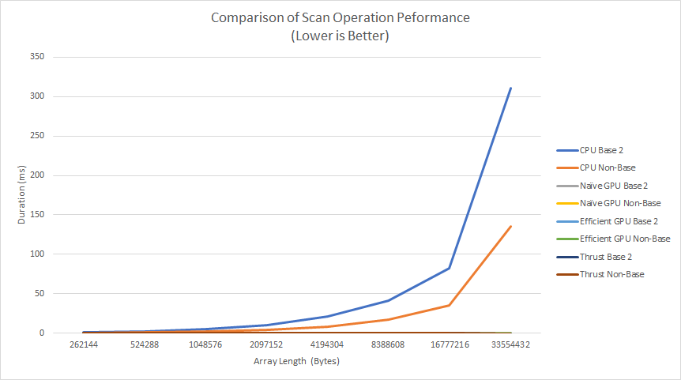
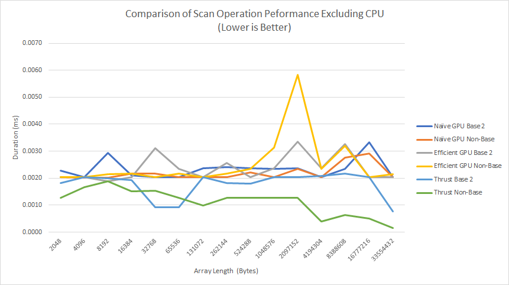
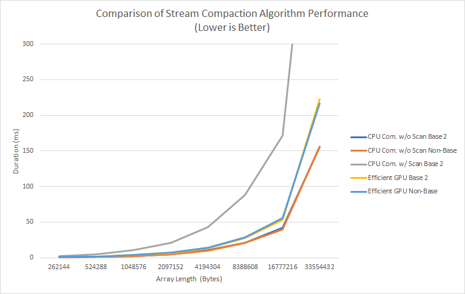

CUDA Number Algorithms
======================

**University of Pennsylvania, CIS 565: GPU Programming and Architecture, Project 2**

* John Marcao
  * [LinkedIn](https://www.linkedin.com/in/jmarcao/)
  * [Personal Website](https://jmarcao.github.io)
* Tested on: Windows 10, i5-4690K @ 3.50GHz, 8GB DDR3, RTX 2080 TI 3071MB (Personal)

# Goals

The goal of this project was to study and analyze different common algorithms in GPU programming. We specifically look at two common operations: stream compatcion and exclusive scan. The two functions are common in GPU programming and Hraphics design, with applications in raytracing and performance focued improvements. The two algorithms can be combined to form powerful tools. The algorithms work when serialized, but the parallel capabilities of GPUs allow them to be (hopefully) sped up.

Scanning is a simple function: Starting at the begining of an array, step through the array adding the previous cell's value to the current cell. Stream Compation is the processor of removing unwanted values from an array while preserving the order between wanted values. One example of this is removing all zero elements from an array.

For this project I implemented four versions of the above algorithms.
* CPU Implementaion - To measure the performance of the algotrithms in serial execution.
* Naive GPU - A simple GPU implementation with little thought to advanced algorithms or memory.
* Efficient GPU - A more focused implementation that takes advantage of the GPU's parallelism.
* Thrust - A library implementation of the algorithms, for comparison.

To see how each implementation comapres, I ran each with varying block sizes to see the reponse. The results are below.

# Performance Data

I first present some charts showing the performance differences between the implementations.





    

Looking at the first chart, we can see that for values below 1MB, there is very little difference in the performance between the 8 scenarios. However, as we approach 4MB, it becomes clear that the CPU is underperforming comapred to the GPUs. In fact, as can be seen in figure 2, the GPU implementations have improved rates with larger data sets. This comes down to a fundamental rule on GPUs: overhead is high when working with small ammounts of data. Why go through the process of offloading a scan operation with only 256 elements? An optimized CPU implementation will take advantage of pipelining, cacheing, and other utilities to greatly speed up the operation. When approaching large data sets that can be worked with independently, we can see a huge benefit to the GPU.

Looking at the performance of just the GPU implementations of Scan, there isn;t much difference between the Naive and Efficient implementations. The two are roughly the same and variation is likely due to noise in the test environment (other processes using the GPU, latencies in CPU scheduling during observation). It is obvious from the data set, however, that the Thrust Non-Base 2 implementation is the most efficient. 

Lastly, looking at figure 3, we can see the performance comparisson for the Stream Compartion algorithm. The slowest implementaton here is the CPU compaction with Scan. This makes sense, since the scan operation is still serialized and takes up a lot of CPU time. This goes to show that some improvements to an algorithm will only benefit systems that can take advantage of parallelism. We see that the Efficient GPU implementation, both Power of Two and Non Power of Two, perform slightly worse than the CPU implementation without Scan.

# Example Run

```
****************
** SCAN TESTS **
****************
    [  42  16  18   8  38  28  13   0  26   5  30   4  48 ...  39   0 ]
==== cpu scan, power-of-two ====
   elapsed time: 0.0021ms    (std::chrono Measured)
==== cpu scan, non-power-of-two ====
   elapsed time: 0.002ms    (std::chrono Measured)
    passed
==== naive scan, power-of-two ====
   elapsed time: 0.04096ms    (CUDA Measured)
    passed
==== naive scan, non-power-of-two ====
   elapsed time: 0.038976ms    (CUDA Measured)
    passed
==== work-efficient scan, power-of-two ====
   elapsed time: 0.089536ms    (CUDA Measured)
    passed
==== work-efficient scan, non-power-of-two ====
   elapsed time: 0.086976ms    (CUDA Measured)
    passed
==== thrust scan, power-of-two ====
   elapsed time: 0.001696ms    (CUDA Measured)
    passed
==== thrust scan, non-power-of-two ====
   elapsed time: 0.000608ms    (CUDA Measured)
    passed

*****************************
** STREAM COMPACTION TESTS **
*****************************
    [   2   0   2   0   0   0   3   0   0   3   0   2   2 ...   1   0 ]
==== cpu compact without scan, power-of-two ====
   elapsed time: 0.0025ms    (std::chrono Measured)
    [   2   2   3   3   2   2   1   3   2   2   1   3   3 ...   2   1 ]
    passed
==== cpu compact without scan, non-power-of-two ====
   elapsed time: 0.0025ms    (std::chrono Measured)
    [   2   2   3   3   2   2   1   3   2   2   1   3   3 ...   1   2 ]
    passed
==== cpu compact with scan ====
   elapsed time: 0.0055ms    (std::chrono Measured)
    [   2   2   3   3   2   2   1   3   2   2   1   3   3 ...   2   1 ]
    passed
==== work-efficient compact, power-of-two ====
   elapsed time: 0.317888ms    (CUDA Measured)
    passed
==== work-efficient compact, non-power-of-two ====
   elapsed time: 0.545888ms    (CUDA Measured)
    passed
Press any key to continue . . .
```