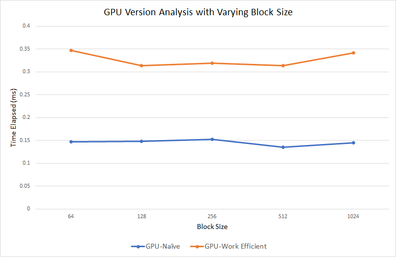

CUDA Stream Compaction
======================

In the subproject part 2A, we will be comparing different version of GPU scan versions (namely, Naive, Work-Efficent and Thrust) with the serialized CPU version. The metrics for comparison would be the time elapsed for the above algorithms for diferent array sizes.

## 1. CPU Scan

This implementation is the simple serialized scan version of CPU in which we are writing the simple for loop to go all the elements and calculating the exclusive sum of the elements.

Later on, we are using the above scan function to perform the stream compaction where we are removing all the elements with 0 in the array. We also implemented the stream compaction without the scan in implementations.

## 2. GPU Versions

For GPU versions, we implemented three different versions which are mentioned above. The implementation details for each of them is below:

### 2 a) Naive Implementation 

Here, we are doing naive implementation where we are finding the exclusive scan result by iteration over the ceil(log(n)) levels and adding on the elements with stride equal to power of 2 for these levels. Here, we get the final result same as the exclusive scan but we make some paralleilization which reduces the time complexity, but we are performaing more number of additions as compared to the naive CPU scan.

### 2 b) Work-efficient Implementation and Stream Compaction Using Work Efficient Scan

In this implementation, we are further trying to optimize by reducing the number of additions to O(n). For performing this, we are assuming the array is the balanced binary tree representation and performing the upsweep and downsweep algorithms for calculating the exclusive scan. Note all the calculations taking place here is in place as we don't have to worry about  the possible race conditions in this scenario.

In the upsweep part, we are adding th elements by taking the stride of power of 2 when we are going up the levels, which are ceil(log(n)), where log is in the base of 2. 

In the downsweep part, we are putting the last element as zero and then updating the array assuming it as the balanced binary tree again. So, we are creating the left node and right node childs in the stride of power of 2 coming from high to low. So, we are putting the value in left child as the current value and updating the right child node as the sum of left node and right node child. We conitnue doing these for ceil(log(n)) levels. The resulting array would be the exclusive scan on the input array.

In stream compaction part, we are using the above work-efficient scan implementation. Before using the fucntion, we are doing boolean mapping to ensure that all the non-zero values are 1 so that they can de easily differentialted with 0. After performing the scan along with the boolean data to create the unique indices for the compaction output, we are performing scatter in which we are taking the indices value whose boolean mapped array value is 1 and putting that value which is in original array into the new output array with the unique indices value from the scanned output.  

### 2 c) Thrust implementtion

For comparing our alogirhtms with the exclusive scna implementation thrust library uses, we are using the exclusive scan implementation of the thrust. We created a wrapper function in which we are initializing the device pointers to the input data and using these pinters to create the exlcusinve scan and copying the output to the pointer located in the host memory.

## 3. Performance Analysis

In the performance analysis, we are first checking the best blockSize value for Naive and Work-Efficient algorithms. The plot for the analysis of the time elapsed vs Block size for both these implementations are given below:

