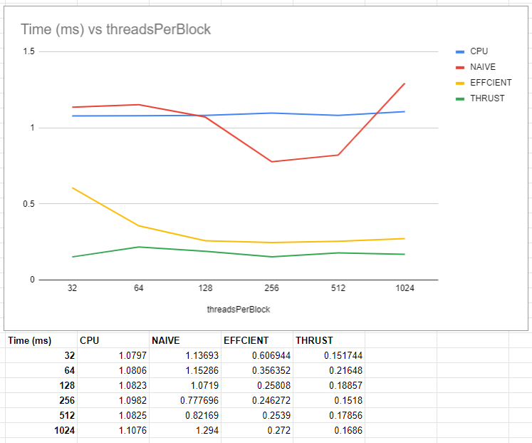
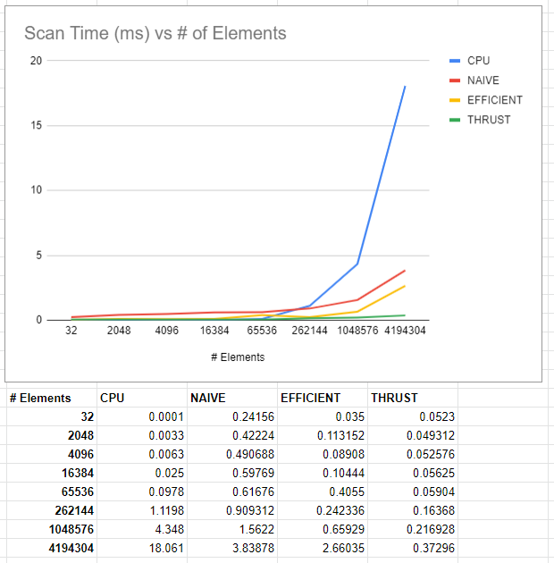

CUDA Stream Compaction
======================

**University of Pennsylvania, CIS 565: GPU Programming and Architecture, Project 2**

* Gangzheng Tong
  * www.gtong.me
* Tested on: Windows 10, i7-8th Gen @ 2.2GHz 16GB, RTX 2070 8GB (Personal Laptop)






### Features Implemented
In this project I implemented all features required. Tested with up to `2^26` elements and all passed.
The project will run different scan and stream compaction algorithms and report the timing.
To make it easy to dump the testing, I added some automation code so it can be run with a batch file.

### Questions
1. By trying different block size, I concluded that it performs the best when each block contains 256 threads. While theoretically my GPU can run up to 1024 threads concurrently, the number of threads is limited by other factors such as the number of registers. For this particular algorithm, it's possbile that the GPU cannot schudule all 1024 threads to run at once.
2. For the detailed compairson see the chart above. It's obvious to see that with effcient scan outperforms naive as the array size gets larger. The thrust implementation is the fastest when the array size is huge.
3. The memeory latency is clearly the bottleneck when the array size is small, which explains why even the trust implementation failed to compete with CPU one when the number of elements is smaller than `2^16`. 
4. As array size grows, the memory bandwidth becomes the bottleneck, especially for Naive implementation, which suffers greatly from the data incoherency. Thrust is probalbly utilizes the shared memeory and cahce to overcome the limitation.

Raw Output
```
****************
** SCAN TESTS **
****************
    [  17  29  47  28  31   5  24  33   0  16  12  15  20 ...  33   0 ]
==== cpu scan, power-of-two ====
   elapsed time: 4.6704ms    (std::chrono Measured)
    [   0  17  46  93 121 152 157 181 214 214 230 242 257 ... 25687915 25687948 ]
==== cpu scan, non-power-of-two ====
   elapsed time: 1.6061ms    (std::chrono Measured)
    [   0  17  46  93 121 152 157 181 214 214 230 242 257 ... 25687815 25687841 ]
    passed
==== naive scan, power-of-two ====
   elapsed time: 1.48669ms    (CUDA Measured)
    passed
==== naive scan, non-power-of-two ====
   elapsed time: 1.37837ms    (CUDA Measured)
    passed
==== work-efficient scan, power-of-two ====
   elapsed time: 0.649216ms    (CUDA Measured)
    passed
==== work-efficient scan, non-power-of-two ====
   elapsed time: 0.658624ms    (CUDA Measured)
    passed
==== thrust scan, power-of-two ====
   elapsed time: 0.182272ms    (CUDA Measured)
    passed
==== thrust scan, non-power-of-two ====
   elapsed time: 0.218432ms    (CUDA Measured)
    passed

*****************************
** STREAM COMPACTION TESTS **
*****************************
    [   1   1   3   2   3   1   2   1   0   2   2   3   0 ...   1   0 ]
==== cpu compact without scan, power-of-two ====
   elapsed time: 2.5317ms    (std::chrono Measured)
    [   1   1   3   2   3   1   2   1   2   2   3   3   2 ...   2   1 ]
    passed
==== cpu compact without scan, non-power-of-two ====
   elapsed time: 2.4355ms    (std::chrono Measured)
    [   1   1   3   2   3   1   2   1   2   2   3   3   2 ...   2   2 ]
    passed
==== cpu compact with scan ====
   elapsed time: 6.1908ms    (std::chrono Measured)
    [   1   1   3   2   3   1   2   1   2   2   3   3   2 ...   2   1 ]
    passed
==== work-efficient compact, power-of-two ====
   elapsed time: 1.02813ms    (CUDA Measured)
    passed
==== work-efficient compact, non-power-of-two ====
   elapsed time: 1.06282ms    (CUDA Measured)
    passed
```
