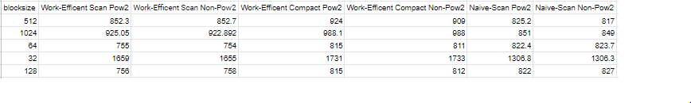
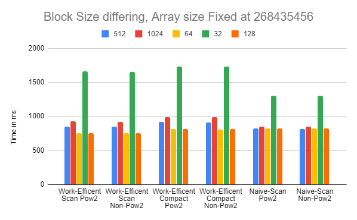
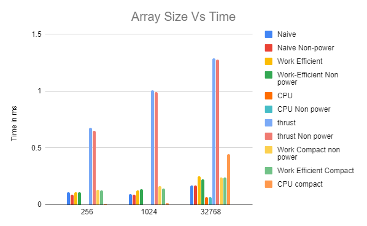
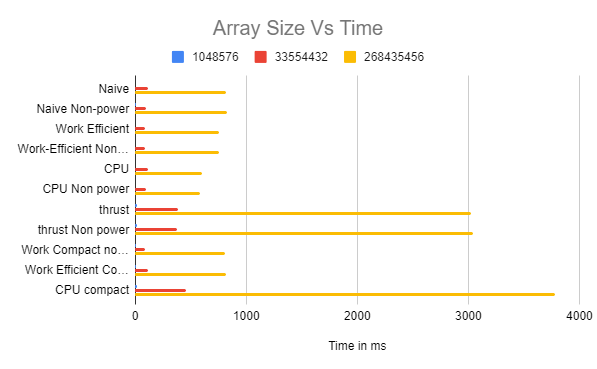
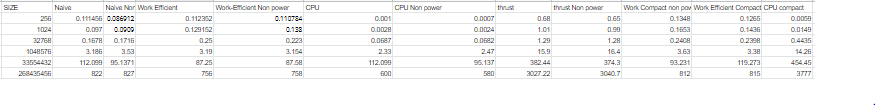
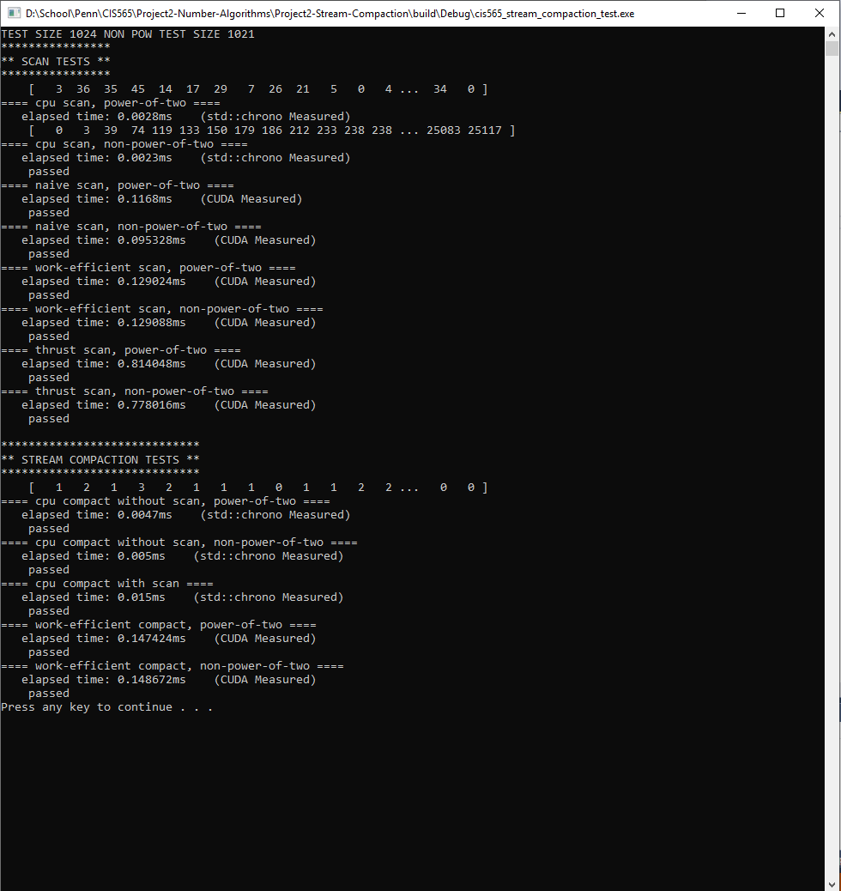
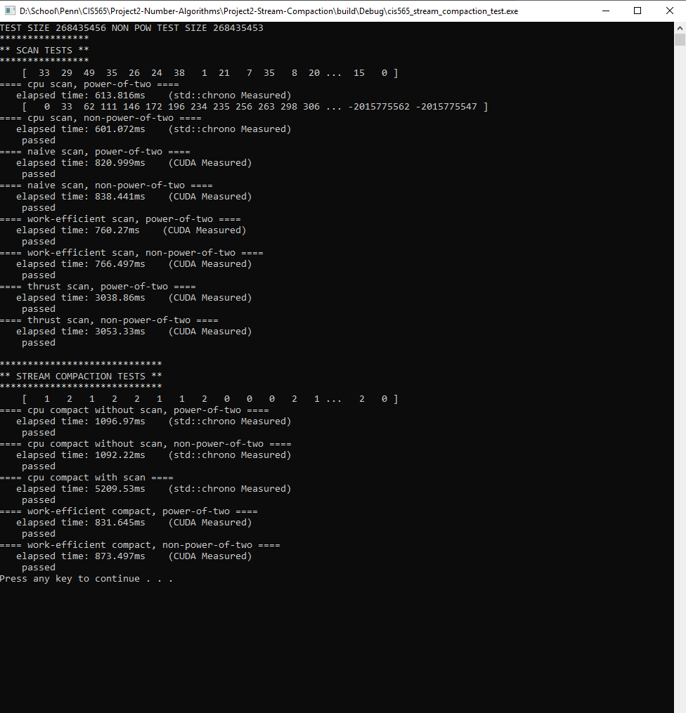

CUDA Stream Compaction
======================

**University of Pennsylvania, CIS 565: GPU Programming and Architecture, Project 2**

* Eric Micallef
  * https://www.linkedin.com/in/eric-micallef-99291714b/
  
* Tested on: Windows 10, i7-6700 @ 3.4GHz 16GB, Nvidia Quadro P1000 (Moore 100B Lab)

## Overview

The illustration above gives us a naive approach to performing the scan algorithm. In this algorithm the gpu does alot of repetitive memory reads and writes but gets to a solution. 

The illustration above gives us the work efficient algorithm used. In this manner the gpu performs an upsweep and then a downsweep. 
Although this algorithm does less computation than the naive implementation we will see later on that because the threads are not sequentially indexing we run into memory bottlenecks and the algorithm is not as efficient as it could be.

## Blocksize Analysis

From the data gathered we can see that the ideal block size is 128 for both Naive and Work Efficient Scans and compact algorithms.
a block size of 32 drastically increased the run time of the algorithms where as more blocks made the algorithms slower. My guess is that because so many threads that are not active at a given time 128 and 64 seem to be a happy balance for hiding some memory latency that occurs.

## Performance Analysis

When comparing the performances of the naive, work efficient and cpu implementations we can see that CPU scans are very quick. once we get to about 32k the compact algorithm on the CPU slows down quite a bit but performing scans on the CPU is significanlty faster than on a GPU. This could be because for the CPU scan we are getting nice sequential read access where as in the work efficient algorithm we are getting random access memory patterns which causes some bottlenecks. 

In the graph with the larger arrays we see a similar pattern forming where the cpu compact is terribly slow in comparison to the GPU version. during these higher array sizes the GPU implementation starts to become slightly better than the CPU.

In all implementations thrust performed poorly. My initial guess is that perhaps thrust always copies the data before it performs its computations so we are seeing a false time for the actual algorithm.

Although the naive implementation has more work to do we see that the times are not significantly higher than that of the work efficient algorithm. This could be because in the work efficient algorithm we have manyy warps with just a few thread active and the memory patterns are random causing for less latency hiding. It could also be because is a bit more divergence when comparing the naive version to the work efficient version.

### Test Results

