CUDA Stream Compaction
======================
**University of Pennsylvania, CIS 565: GPU Programming and Architecture, Project 2**

* Dewang Sultania
  * [LinkedIn](https://www.linkedin.com/in/dewang-sultania/)
* Tested on: Windows 10, Intel Xeon E-2176M @ 2.70GHz 16GB, Quadro P2000 4GB (Personal Computer)

### Table of Contents
1. [Overview](#overview)
2. [CPU Scan and Stream Compaction](#cpu)
3. [Naive GPU Scan](#naive)
4. [Work-Efficient GPU Scan and Stream Compaction](#work)
5. [Thrust Implementation](#thrust)
6. [Results](#results)
7. [Performance Analysis](#performance)
8. [Future Work](#future)

<a name = "overview"/>

## Overview

In this project, I implemented Stream Compaction from scratch on CUDA, It has applications like ray tracing and collision detection. The stream compaction method implemented here removes 0's from an array of S.

<a name = "cpu"/>

## CPU Scan and Stream Compaction

The CPU scan algorithm is implemented in two ways: 

- Without scanning: The without scan is simple, it takes in an input array, maintains an output array index, iterates linearly through the input, checks if it's 0 or not, puts it in the output array and updates the index.

- With scanning: The with scanning function emulates the GPU version of the algorithm on the cpu by calculating the exclusive scan of a mask array which tells if you want to keep the element or not. The scan gives us the index of the location at which the element has to be stored in the compressed array. The algorithm is illustrated as follows:

<a name = "naive"/>

## Naïve GPU Scan

The naïve scan algorithm takes elements based on an offset and adds them up based on the level depth. The following figures show the algorithm and the pictorial representation of the same:

Naïve Scan             |  Algorithm
:-------------------------:|:-------------------------:
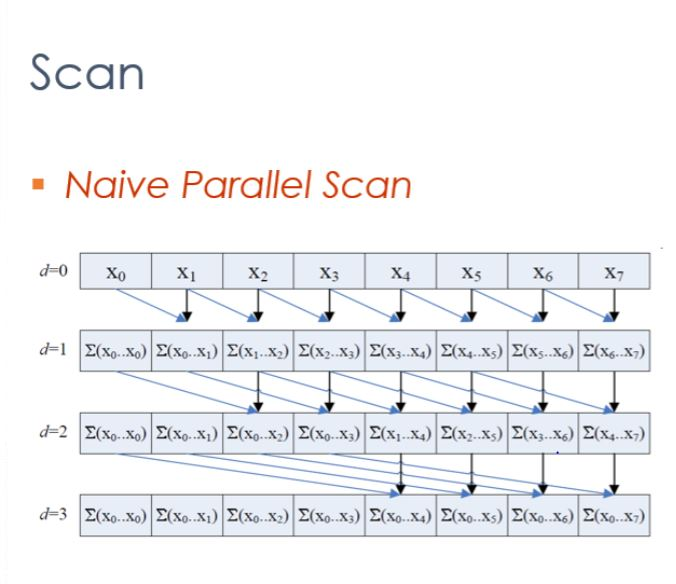 | 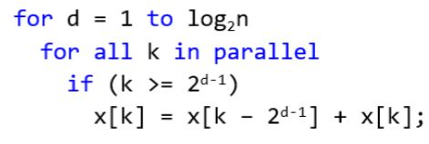

<a name = "work"/>

## Work Efficient GPU Scan and stream compaction

In Work Efficient scan we use a balanced binary tree (in concept) to perform scan in two phases:
- Up-Sweep (Parallel Reduction)
- Down-Sweep

These up sweep algorithm is illustrated in the pictures below:

Up Sweep             |  Algorithm
:-------------------------:|:-------------------------:
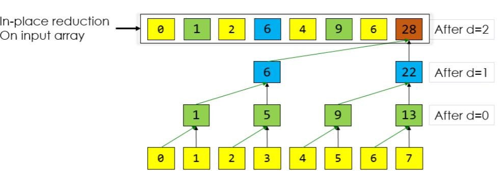 | 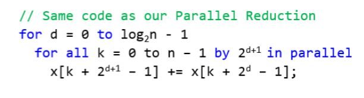

In Down sweep we traverse back down the tree using partial sums to build the scan in place. The following steps are performed:
- Set root to zero
- At each pass, a node passes its value to its left child and sets the right child to the sum of the previous left child's value and its value.

Down Sweep             |  Algorithm
:-------------------------:|:-------------------------:
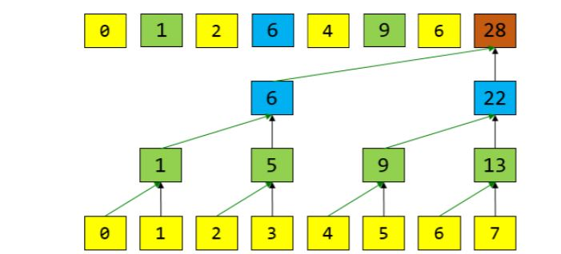 | 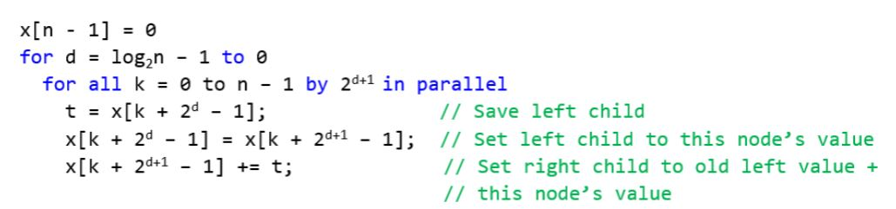

This computes an exclusive scan, which we can use to do stream compaction in a similar way, we use work efficient sweep to compute exclusive scan of the mask array and then that gives us the index of the elements in the output array.

<a name = "thrust"/>

## Thrust Implementation

The thrust implementation uses thrust::exclusive_scan to compute the exclusive scan of the array. This has been implemented as a benchmark against our own implementation.

<a name = "results"/>

## Results
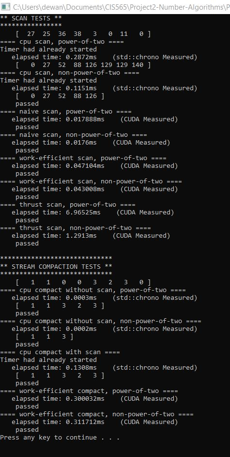
## Performance Analysis

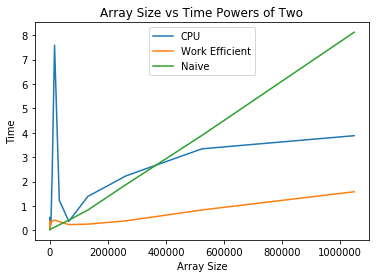

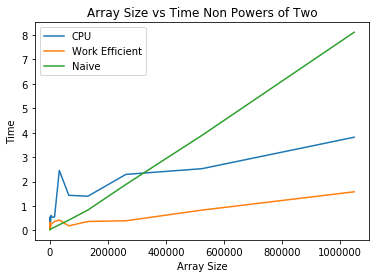

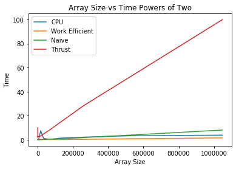

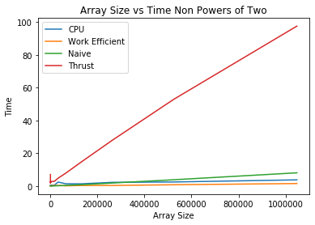

The CPU implementation was better than work efficient for smaller array sizes, but worked slowly compared to Work efficient for larger size arrays. I think the parallelism really kicks in when array sizes are really large. Thrust was super slow for me, I might have to dig into this deeper but my initial hunch is that memory allocation on thrust pointers takes significant amount of time.