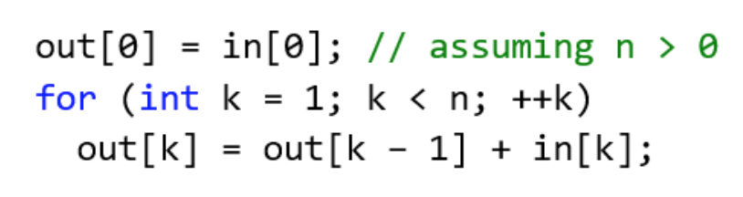

# Project 2a: CUDA Stream Compaction
**University of Pennsylvania, CIS 565: GPU Programming and Architecture,
Project 2 - Stream Compaction**

Caroline Lachanski: [LinkedIn](https://www.linkedin.com/in/caroline-lachanski/), [personal website](http://carolinelachanski.com/)

Tested on: Windows 10, i5-6500 @ 3.20GHz 16GB, GTX 1660 (personal computer)

## Project Description

This goal of this project was to gain to familiarity with writing parallel algorithms, specifically Scan and Stream Compaction (used to remove values of zero from an array), from scratch in CUDA. The implementations in this project were mainly based on [these slides](https://onedrive.live.com/view.aspx?resid=A6B78147D66DD722!93669&ithint=file%2cpptx&authkey=!AOZdbr6KT8OQ9fs). 

### Scan

The Scan algorithm (also known as prefix sum) takes in an input array and returns an array where each element j in the output array is a sum of the previous elements from the input array. The Scan algorithm can be inclusive or exclusive. In an exclusive Scan, element j of the result does not include element j of the input. In an inclusive Scan, element j of the result includes all elements before and up to element j of the input;


### Stream Compact
The goal of Stream Compaction is, given an input array of elements, create a new array with elements from the input array that meet a certain critera (e.g. being non-zero or non-null), while preserving the order of elements from the input array.


Stream Compaction can be accomplished in a few steps. Let In be out input array.
1. Map the input array to a new array of bools B where B[i] = 1 if In[i] meets the specififed criteria, and B[i] = 0 if In[i] does not. (B is the yellow array in the below picture.)
2. Run an exclusive Scan on B to get C, the Scan result. C will contain the indices into our output array. (C is the first blue array in the below picture.)
3. Run Scatter on C, the result of Scan. Write the element In[i] to output array Out[C[i]] if B[i] = 1.


This project contains several implementations of the above algorithms: a CPU version, a naive GPU version, a work-efficient GPU version, and one using the Thrust library functions.

## Implementation Details

### CPU

The CPU implementations were done simply to allow me to become more familiar with the algorithms. These are straightforward and simple to implement, and include implementations of Scan, Scatter, Stream Compaction without using Scan, and Stream Compaction using Scan and Scatter. For example, here is pseudo-code for single-thread Scan:




### Naive

The first GPU implementation of Scan is a naive one, and results in an inclusive Scan that must be modified (using a shift right kernel) to an exclusive Scan. 


### Work-Efficient

Next we have work-efficient GPU versions of Scan, Scatter, and Stream Compaction. The work-efficient version of Scan involves two phases, an upsweep:


...and a downsweep:


Because of work-efficient Scan's underlying conceptual structure as a balanced binary tree, the input array must be buffered with zeros until its size is a power of 2.

We can then use Scan in a GPU implementation of Stream Compaction, which also uses Scatter and MapToBoolean kernels.

### Thrust

Lastly, we perform Stream Compaction with the Thrust library's thrust::exclusive_scan.

## Analysis

We can look at the performance of the various implementations. Here's a graph of the performance of Scan vs. block size:


A faster implementation will take less time, so lower implementations on the graph perform better than the higher up implementations. It may seem like "Thrust (power of 2)" is missing, but it is right beneath the "Thrust" line, since their performances were so similar.

Oddly enough, Work-Efficient performs the worst, Naive the second worst, and CPU better than both of those. This is not necessarily unexpected. The current implementation of Work-Efficient actually has very poor warp occupancy; the number of threads doing useful work decreases by half each time, but they are not able to be terminated due to their organization. Some re-indexing and changing of the organization of threads should fix this issue. Additionally, the upsweep and downsweep outer for-loops are run on the CPU, which will not help runtime at all. But, we can obviously see from the Thrust examples that a GPU implementation of Scan can be way faster than a CPU implementation... as long as you do it right. As to why Thrust performs so much better, possible reasons include optimizing warp occupancy with better indexing and avoiding so much memory latency.

One thing to notice: for CPU and Naive, the power of 2 examples (which are running on an array whose size is a power of 2), take slightly longer than their non-power of 2 counterparts (which are running on an array whose size is very slightly smaller than the aforementioned power of 2). This can likely be attributed to the fact that for these more basic, less parallelized applications, a larger input simply takes larger to process (note that CPU, which is the most serialized implementation, sees the biggest difference between its performances). For the Work-Efficient examples, there is very little difference between power of 2 and non-power of 2, since the non-power of 2 input is padded with zeros until it reaches a size that is a power of 2. The thrust implementation is similarly not effected by a size that is power of 2 or not, likely because it is very well parallelized or also pads to a power of 2 size.

A second thing to notice: changing block size does not seem to have a significant effect on any of the implementations, although block sizes of 64 and 1024 seem to cause slightly worse performance in my GPU implementations.

Here's a graph of the performance of Compact vs. block size:


Again, a better implementation will take less time, so lower implementations on the graph perform better than the higher up implementations. Also, it may seem like "CPU (no scan, power of 2)" is missing, but it is right beneath the "CPU (no scan)" line, since their performances were so similar.

We see similar performance patterns to what we saw for Scan. The Work-Efficient Compact performs worse than the CPU version, and the CPU version using a CPU Scan performs worse than the CPU versions that do not use Scan. This perhaps indicates that Scan will only provide a better performance Compact if it is parallelized. In regards to the Work-Efficient examples, first, Work-Efficient Compact uses Work-Efficient Scan which already performs poorly as discussed above. Additionally, the Work-Efficient Scan includes several memory copies within the recorded time, which can decrease performance.

Again, block size seems to have relatively little effect on performance.

## Output

Here is the output of the test cases for 33,554,432 elements, with a block size of 1024.
```

****************
** SCAN TESTS **
****************
    [  30  46  22   3  29  47  40  19   4  43   5  18  39 ...  24   0 ]
==== cpu scan, power-of-two ====
   elapsed time: 179.922ms    (std::chrono Measured)
    [   0  30  76  98 101 130 177 217 236 240 283 288 306 ... 821999768 821999792 ]
==== cpu scan, non-power-of-two ====
   elapsed time: 64.8479ms    (std::chrono Measured)
    [   0  30  76  98 101 130 177 217 236 240 283 288 306 ... 821999720 821999754 ]
    passed
==== naive scan, power-of-two ====
   elapsed time: 1067.39ms    (CUDA Measured)
    passed
==== naive scan, non-power-of-two ====
   elapsed time: 1046.83ms    (CUDA Measured)
    passed
==== work-efficient scan, power-of-two ====
   elapsed time: 2464.74ms    (CUDA Measured)
    passed
==== work-efficient scan, non-power-of-two ====
   elapsed time: 2473.12ms    (CUDA Measured)
    passed
==== thrust scan, power-of-two ====
   elapsed time: 2.0384ms    (CUDA Measured)
    passed
==== thrust scan, non-power-of-two ====
   elapsed time: 2.14227ms    (CUDA Measured)
    passed

*****************************
** STREAM COMPACTION TESTS **
*****************************
    [   1   1   0   1   0   1   0   2   2   3   2   3   3 ...   3   0 ]
==== cpu compact without scan, power-of-two ====
   elapsed time: 98.5023ms    (std::chrono Measured)
    [   1   1   1   1   2   2   3   2   3   3   1   2   1 ...   3   3 ]
    passed
==== cpu compact without scan, non-power-of-two ====
   elapsed time: 100.227ms    (std::chrono Measured)
    [   1   1   1   1   2   2   3   2   3   3   1   2   1 ...   2   3 ]
    passed
==== cpu compact with scan ====
   elapsed time: 445.056ms    (std::chrono Measured)
    [   1   1   1   1   2   2   3   2   3   3   1   2   1 ...   3   3 ]
    passed
==== work-efficient compact, power-of-two ====
   elapsed time: 2690.43ms    (CUDA Measured)
    [   1   1   1   1   2   2   3   2   3   3   1   2   1 ...   3   3 ]
    passed
==== work-efficient compact, non-power-of-two ====
   elapsed time: 2689.84ms    (CUDA Measured)
    [   1   1   1   1   2   2   3   2   3   3   1   2   1 ...   2   3 ]
    passed
Press any key to continue . . .
```


