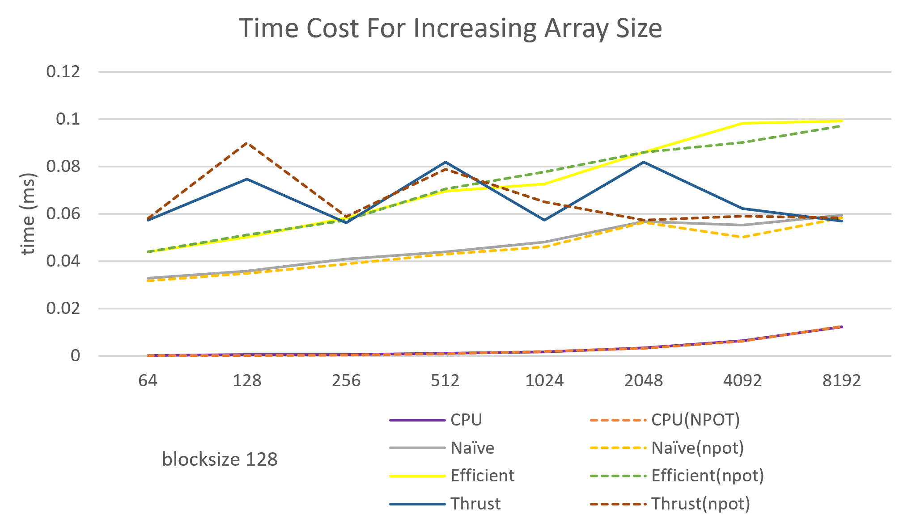

CUDA Stream Compaction
======================

**University of Pennsylvania, CIS 565: GPU Programming and Architecture, Project 2**

* Yan Dong
  - [LinkedIn](https://www.linkedin.com/in/yan-dong-572b1113b/)
  - [personal website](coffeier.com)
  - [github](https://github.com/coffeiersama)
* Tested on: Windows 10, i7-8750 @ 2.22GHz  (12CPUs)  16GB, GTX 1060 14202MB (OMEN 15-dc0xxx)


[Result](#features) - [Rules](#rules) - [Runtime Analysis](#analysis) - [Extra](#extra)


## Features

##### CPU: 

-Scan

-Stream Compaction

##### GPU: 

-Naive Scan 

-Work-Efficient Scan

-Work-Efficient Stream Compaction

-Thrust Scan

###### Extra:

-Why is CPU faster than Work-efficient?

-Radix Sort algorithm


```
****************
** SCAN TESTS **
****************
    [  25  15  21  13  27  28  36  12  46  44  46  45  42 ...  17   0 ]
SIZE: 128, NPOT:125
==== cpu scan, power-of-two ====
   elapsed time: 0.0016ms    (std::chrono Measured)
==== cpu scan, non-power-of-two ====
   elapsed time: 0.0009ms    (std::chrono Measured)
    passed
==== naive scan, power-of-two ====
   elapsed time: 0.106496ms    (CUDA Measured)
    passed
==== naive scan, non-power-of-two ====
   elapsed time: 0.11264ms    (CUDA Measured)
    passed
==== work-efficient scan, power-of-two ====
   elapsed time: 0.077824ms    (CUDA Measured)
    passed
==== work-efficient scan, non-power-of-two ====
   elapsed time: 0.095232ms    (CUDA Measured)
    passed
==== thrust scan, power-of-two ====
   elapsed time: 11.607ms    (CUDA Measured)
    passed
==== thrust scan, non-power-of-two ====
   elapsed time: 1.11616ms    (CUDA Measured)
    passed

*****************************
** STREAM COMPACTION TESTS **
*****************************
    [   0   0   1   3   2   1   2   1   3   0   0   1   1 ...   3   0 ]
==== cpu compact without scan, power-of-two ====
   elapsed time: 0.0012ms    (std::chrono Measured)
    passed
==== cpu compact without scan, non-power-of-two ====
   elapsed time: 0.001ms    (std::chrono Measured)
    passed
==== cpu compact with scan ====
   elapsed time: 0.0075ms    (std::chrono Measured)
    passed
==== work-efficient compact, power-of-two ====
   elapsed time: 0.18944ms    (CUDA Measured)
    passed
==== work-efficient compact, non-power-of-two ====
   elapsed time: 0.287744ms    (CUDA Measured)
    passed
==== radix sort ====
    [  20  60  29  31  26  25  58  45  63  56  44  37  45 ...  40  10 ]
    [  10  12  20  25  26  29  31  36  37  40  44  45  45 ...  62  63 ]
```


## Rules

Scan: sum the variable together

Stream Compaction: reduce the operation count

## Analysis




## Questions

##### Can you find the performance bottlenecks? Is it memory I/O? Computation? Is it different for each implementation?


## Extra

##### Why is My GPU Approach So Slow?

this is because when I first implement the work efficient approach, not every thread is used.

Here is the up sweep method in the algorithm, 

when d=0, we need to deal with the whole array,

when d=1, we just need to deal with the half data of the array.

So, to solve this, change the index of data to be worked by GPU, make it jump. 


Here is a comparison for before and after changing:

###### Before


###### after


##### Radix sort

just follow the slides from the course.

