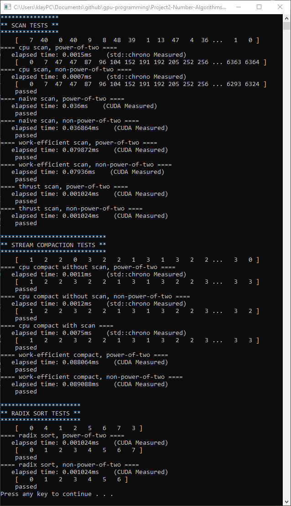

CUDA Stream Compaction
======================

**University of Pennsylvania, CIS 565: GPU Programming and Architecture, Project 2**

* Klayton Wittler
	* [LinkedIn](https://www.linkedin.com/in/klayton-wittler/)
* Tested on: Windows 10 Pro, i7-7700K @ 4.20GHz 16.0GB, GTX 1070 8.192GB (my PC)

## Sections

* [Introduction](#introduction)
	* [Scanning](#scanning)
	* [Stream Compaction](#stream-compaction)
* [Performance Analaysis](#performance-analysis)
	* [Optimize Block Size](#optimize-block-size)
	* [Compare Implementations](#compare-implementations)
	* [Explanation](#explanation)
* [Additions](#additionals)
	* [Radix Sort](#radix-sort)

# Introduction
This project implements parallel algorithms in reduction, scanning, and stream compaction in CUDA on the GPU. There is both a naive and work efficient scanning algorithm, however the work efficient still requires memory optimizations to see its real benefits. Stream compaction is used to compress data by removing unnecessary elements.

## Scanning
Scanning an array is getting the accumulated sum of the elements. This can be both inclusive of the last element or exclusive of the last element. For the purposes of this project we will focus on the exclusive version, knowing that we can convert between the two with a shift.

### Naive 
The naive approach to scanning in parallel would be to make multiple passes in the array, each pass moving the summing elements down the array in an exponenial fasion as seen in the figure below.


To implement this in parallel, we have the psuedocode below that in practice requires two arrays to buffer read and writes.
```
for d = 1 to log_2(n)
	for all k in parallel
		if k >= 2^(d-1)
			output[k] = input[k - 2^d+1] + input[k]
		else
			output[k] = input[k]
		end
	end
	swap(input,output)
end
```
This will return an inclusive scan so to convert we shift all elements to the right and add in an identity in the first element, which addition is zero.


### Work Efficient
The work efficient approach perform two sweeps (referred to as up and down sweep) of these exponential passes but allows for inplace operation. The upsweep performs a parallel reduction and the downsweep cleverly utilizes the array as a binary tree to return the exclusive scan.

The upsweep, parallel reduction, uses a divide and conquer approach to achieve the total sum of the array in the last element in this example.


```
for d = 0 to log_2(n-1)
	for all k to n by 2^(d+1) in parallel
		input[k + 2^(d+1) - 1] += input[k + 2^d]
	end
end
```

The downsweep treats the array as a binary tree that only saves the left child as seen below and traverses down it following 3 rules as it goes.


<b>Rules</b>

1. Set the root of the entire tree to 0

2. Add the parent value and left child value to the right child

3. Copy the parent value to the left child

The implementation of this is seen below in the figure where the black arrow represents rule 1, green arrows as rule 2, and orange arrows as rule 3. The psuedocode also shows how this would be done algorithmically in parallel.


```
input[n - 1] = 0
for d = log_2(n-1) to 0
	for all k = 0 to n-1 by 2^(d+1) in parallel
		temp = input[k + 2^d]
		input[k + 2^d - 1] = input[k + 2^(d+1) - 1]
		input[k + 2^(d+1) - 1] += temp
	end
end
```

## Stream Compaction
Stream compaction in parallel has three parts: condition mapping, scanning, and scatter.


We create an array that indicates whether the element should be included. Then scan the map array to determine the elements index in the return array. Then scatter the results into the new array by checking the condition map array, looking up the index, and placing the element in that index.

# Performance Analysis
To do a performance analysis, the run time of each algorithm is clocked in milliseconds. The faster the algorithm the lower the run time and the better the approach. The scan comparisons are separate from the compact comparison, but are denoted on the graphs as the same name since compact utilizes the scan. 

## Optimize Block Size
In order to perform an accurate comparison between implementations, the implemented methods of naive and work efficient need to have the block sizes optimized.

Below we see the outcome of run time at two different array sizes (1 << 16 and 1 << 10 respectively) accross block sizes that are multiples of warp size.


The optimal block size for each approach was chosen and based on the run time analaysis this is generally 128 threads per block.

## Compare Implementations

In the run time graphs below we see that the 'efficient' approach does not perform well even compared to the CPU version. We only see the CPU start to become comparable in compactions with a scan and this is because everything is being done serially. On the other hand the naive implementation is somewhat comparable to the CPU versions but still generally performs worse. We can also see the thrust implementation at the very bottom remains relatively constant through array sizes.


### Explanation

* <b>Write a brief explanation of the phenomena you see here. Can you find the performance bottlenecks? Is it memory I/O? Computation? Is it different for each implementation?</b>

The primary reasons for these performance gaps in the 'efficient' approach despite the parallel capabilities of the GPU is the thread management. In the figure below, what has been implemented is on the left and whats left to optimize is on the right. We can see thread divergence in each pass with a red circle and warp retirement can be seen in greyed out threads. In the implemented version we can see each level has thread divergence which means that threads are sitting waiting for other threads in the warp to finish a set of instructions. The optimized version does not have a thread divergence until the very last pass in which it is returning the answer anyway. We can also see that the optimized version frees up warps much faster as it goes allowing more work to be done overall.


The performance gaps in the naive approach and secondarily in the 'efficient' approach is memory optimizations. We can further resturture the way we access memory to use shared memory within blocks, change access patterns to avoid bank conflicts and utilize the full band width on the bus.

We can see from the graphs that the thrust implementation is the quickest and does not suffer from the performance issues since they have done these optimizations inside their functions. In running the NSight performance analysis it can also been seen that they are pulling alot of device information to optimize for my specific hardware.

## Output
This output is for 1 << 8 array size and includes a test of radix sort algorithm. There are two flags ```RUN_RADIX``` and ```RADIX_CLASS_EXAMPLE```  at the top of ```main.cpp```. Radix tests can be disabled by setting ```RUN_RADIX 0``` and to run radix sort on the full test array set ```RADIX_CLASS_EXAMPLE 0``` but is currently displaying the class example as to quickly verify its working.



# Additions

## Radix Sort

This is implemented in ```radix.cu``` with ```radix.h``` and the ```stream_compaction/CMakeLists.txt``` has been changed to include these in build. My work efficient scan was utilized in implementing radix sort.

Radix sort can be done in parallel by breaking the array into tiles and sorting each tile in parallel then merging. Further more sorting within it tile can be parallelized by utilizing scanning approaches developed previously. It should also be noted that radix sort operates on bits and requires k-bit passes to sort where k is the number of bits in each cell. It starts at the least significant bit (LSB) and moves to the most significant bit (MSB), partitioning the array and rearranging the array as it goes as seen below.


Where within each pass we do parallel scans and scatters as seen below. We mantain a true and false condition array (in practice we can use one and just take the opposite when we need the other), scan the false array and then scan the true array starting where the false left off (in practice we can skip the true array and compute real time based on the false array). Finally, we can use the full array of indices and scatter the results.


