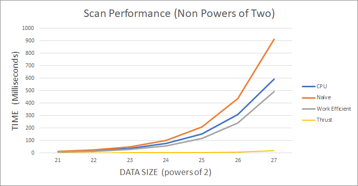

## Project 2 Part 1 - CUDA Character Recognition
**University of Pennsylvania
CIS 565: GPU Programming and Architecture**

* Author: Chhavi Sharma ([LinkedIn](https://www.linkedin.com/in/chhavi275/))
* Tested on: Windows 10, Intel Core(R) Core(TM) i7-6700 CPU @ 3.40GHz 16GB, 
             NVIDIA Quadro P1000 4GB (MOORE100B-06)

### Index

- [Introduction]( )
- [Algorithm]()

### Introduciton

In this project, we implement GPU based Stream Compaction in CUDA. To aid stream compaction, we also implement various versions of the *Scan* (*Prefix Sum*) algorithm, such as CPU, GPU Naive and GPU Work Efficient versions.
algorithm

Stream compaction, also known as stream filtering or selection, usually produces a smaller output array which contains only the wanted elements from the input array based on some criteria for further processing, while preserving order. For our implementation, We will attemp to remove '0's from an array of ints.

### Algorithms

####  1: CPU Scan & Stream Compaction
 
 We implement stream compaction in two ways:
 
 - CPU based stream compaction without using scan: 
   - Loop over the input data array
      - Copy non-zero elements to output array
      - count copies to track size
   ```
   compactWithoutScan(N, Odata, Idata)
     if n > 0
       int size=0;
       for i in Idata
           if (idata[i] != 0) 
              Odata[counter] = Idata[i]
              size+=1
       return size
   ```
 - CPU based stream compaction with CPU based scan: 
   - Compute *Indicator Array* of the input data size that is 1 for non zero elements, an 0 otherwise.
   - Compute *Scan* over indicator Array to get another array. This gives us write indices for the valid elements in the output array. It also gives us the total valid elelemts.
   - *Scatter* data, read from the input array where Indiacator Array is 1, write to the outut array at index given by the scan array.

    ```
     compactWithScan(n, odata, idata) 
        Compute indicator array
        Compute scan
        Scatter
    ```
####  2: Naive GPU Scan Algorithm

####  3: Work-Efficient GPU Scan & Stream Compaction

##### 3.1: Work-Efficient Scan

##### 3.2: Work-Efficient Stream Compaction

####  4: Using Thrust's Implementation

### Questions and Performance Analysis

* **BlockSize Optimization for each Implementation**
  We compare the rumtime of GPU Naive scan and and the work efficient naive scan with the number of threads per block to pick  the most optimal configuration for furhter tests.
  
 *Block Size v/s Runtime*


* **Compare all of these GPU Scan implementations (Naive, Work-Efficient, and
  Thrust) to the serial CPU version of Scan. Plot a graph of the comparison
  (with array size on the independent axis).**
  
   Description.
  
   SCAN with increasing data size
   
      
  
      
  
   SCAN with increasing data size and nonPowersOf2
   
      
  
     
  
  * To guess at what might be happening inside the Thrust implementation (e.g.
    allocation, memory copy), take a look at the Nsight timeline for its
    execution. Your analysis here doesn't have to be detailed, since you aren't
    even looking at the code for the implementation.

* **Write a brief explanation of the phenomena you see here.**

* **Can you find the performance bottlenecks? Is it memory I/O? Computation? Is
    it different for each implementation?**

*  **Paste the output of the test program into a triple-backtick block in your
   README.**
  

