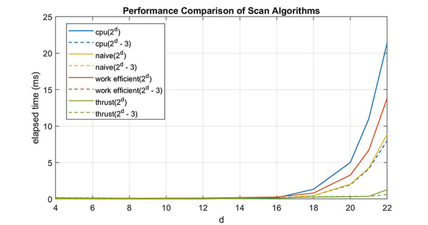

CUDA Stream Compaction
======================

**University of Pennsylvania, CIS 565: GPU Programming and Architecture, Project 2**

* Zheyuan Xie
* Tested on: Windows 10 Pro, i7-7700HQ @ 2.80GHz 2.80GHz, 16GB, GTX 1050 2GB (Dell XPS 15 9560)

## Description
Stream compaction is a common parallel primitive used to remove unwanted elements in sparse data. In this project, we want to removes zeros from a integer array. An exclusive scan that is used to compute scatter indices is the core algorithm in stream compaction. 

The following scan method is implemented:
 - CPU Scan
 - Naive GPU Scan
 - Work-Efficient GPU Scan

We also compared the above implementations to that provided in thrust library: `thrust::exclusive_scan`.

## Performance Analysis
### Blocksize Optimization
The graph below shows work efficient compact runtime with power of two elements (2^24) versus block size. The minimum runtime is achieved with a block size of 128. Therefore we pick 128 as the default block size in all the implementations.


### Runtime Comparison
The graphs below compare the runtime of different scan implementations.


 - When the array size is small, CPU scan has the best performance. This is probably due to the CUDA kernel overhead. Executing a kernel on the GPU is a relatively expensive operation.


 - The advantage of using GPU begins to dominate when the array size is large (> 2^15).
 - Thrust performed significently better. The reason is probably it utilizes shared memory instead of the much slower global memory.
 - Work efficient scan performs worse than naive scan, which is unexpected. This will be discussed later. 
 - Another unexplained phenomenon is CPU scan with non-power-of-two array size has significantly better performance (even better than GPU) than power-of-two array size. It could be a bug in the test program.

### Extra Credit 5: Why is My GPU Approach So Slow
The reason why work efficient scan is slower than expected is although the number of arithmetic operation is reduced, the kernel call is launching too much unnecessary threads. This effect has more influence on runtime when the array size is large.

To resolve this, both the kernel code and calling code is altered so that only necessary number of threads are launched. The thread index is converted to the array index by multiplying stride length.

Before optimization:
 - number of threads = 2^dmax
 - In kernel:
```
if (k < n && k % (1 << (d+1)) == 0) {
    array_idx = k;
    ...
}
```

After optimization:
 - number of threads = 2^(dmax - 1 - d)
 - In kernel:
```
if (k < n) {
    array_idx = k * (1 << (d+1));
    ...
}
```

After optimization, work efficient is significantly improved, outperforming naive scan and cpu scan.


### Test Output
 - In `common.h`, BLOCKSIZE = 128.
 - In `main.cpp`, SIZE = 2 << 15 (2^15).

```
****************
** SCAN TESTS **
****************
    [   4   1  35  47  28  20  17  24  37  49  31  26  43 ...  33   0 ]
==== cpu scan, power-of-two ====
   elapsed time: 0.058ms    (std::chrono Measured)
    [   0   4   5  40  87 115 135 152 176 213 262 293 319 ... 802776 802809 ]
==== cpu scan, non-power-of-two ====
   elapsed time: 0.0582ms    (std::chrono Measured)
    passed
==== naive scan, power-of-two ====
   elapsed time: 0.059136ms    (CUDA Measured)
    passed
==== naive scan, non-power-of-two ====
   elapsed time: 0.057184ms    (CUDA Measured)
    passed
==== work-efficient scan, power-of-two ====
   elapsed time: 0.156736ms    (CUDA Measured)
    passed
==== work-efficient scan, non-power-of-two ====
   elapsed time: 0.151712ms    (CUDA Measured)
    passed
==== thrust scan, power-of-two ====
   elapsed time: 0.06144ms    (CUDA Measured)
    passed
==== thrust scan, non-power-of-two ====
   elapsed time: 0.05952ms    (CUDA Measured)
    passed

*****************************
** STREAM COMPACTION TESTS **
*****************************
    [   2   3   1   1   2   0   1   0   1   1   1   2   1 ...   1   0 ]
==== cpu compact without scan, power-of-two ====
   elapsed time: 0.1095ms    (std::chrono Measured)
    [   2   3   1   1   2   1   1   1   1   2   1   1   2 ...   2   1 ]
    passed
==== cpu compact without scan, non-power-of-two ====
   elapsed time: 0.1079ms    (std::chrono Measured)
    [   2   3   1   1   2   1   1   1   1   2   1   1   2 ...   1   1 ]
    passed
==== cpu compact with scan ====
   elapsed time: 0.2213ms    (std::chrono Measured)
    [   2   3   1   1   2   1   1   1   1   2   1   1   2 ...   2   1 ]
    passed
==== work-efficient compact, power-of-two ====
   elapsed time: 0.213024ms    (CUDA Measured)
    passed
==== work-efficient compact, non-power-of-two ====
   elapsed time: 0.175968ms    (CUDA Measured)
    passed
```
