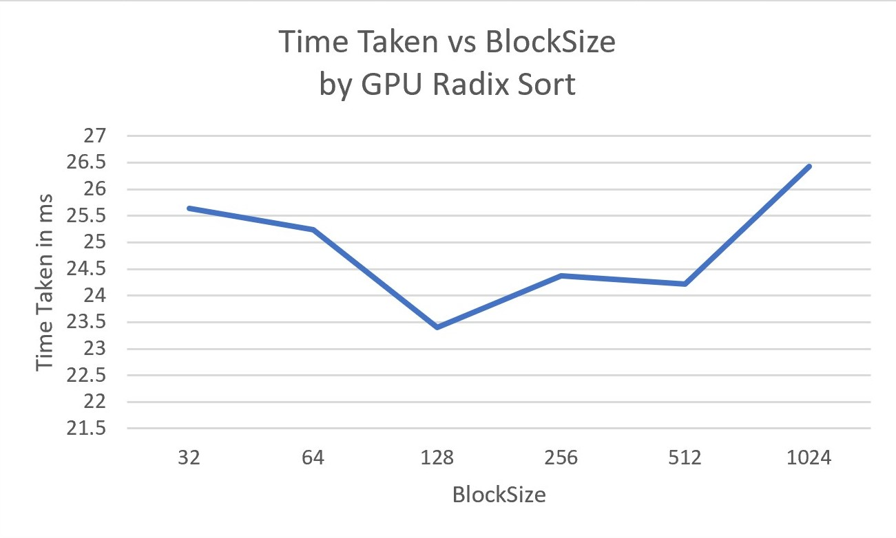

CUDA Stream Compaction
======================

**University of Pennsylvania, CIS 565: GPU Programming and Architecture, Project 2**

* Author : Kushagra
  - [LinkedIn](https://www.linkedin.com/in/kushagragoel/)
* Tested on:  Windows 10 Education, Intel(R) Core(TM) i7-6700 CPU @ 3.40GHz 16GB, NVIDIA Quadro P1000 @ 4GB (Moore 100B Lab)

____________________________________________________________________________________


### Table of Contents
1. [Introduction](#Introduction)  
2. [Scan Algorithm](#algo)  
2.1. [CPU Scan](#cpuscan)  
2.2. [Naive GPU Scan](#naive)  
2.3. [Work-Efficient GPU Scan](#work)  
2.4. [Thrust Implementation](#thrust)  
3. [Stream Compaction Algorithm](#streamcompaction)  
3.1. [CPU Compaction](#cpucompaction)  
3.2. [GPU Compaction](#gpucompaction)  
4. [Radix Sort](#radix)
5. [Performance Analysis](#performance) 
6. [Outputs](#outputs)   

<a name = "Introduction"/>  

## Introduction

We have implemented Stream Compaction in CUDA from scratch in this project. Stream compaction is widely used in graphics pipelines like pathtracers. 
In particular we use stream compaction to simply remove `0`s from an array of integers which is similar to removing terminated paths from an array of rays for a pathtracing pipeline.

<a name = "algo">  
  
## Scan Algorithm
Scan algorithm is basically a reduction from an array to a new array such that the new array contains the prefix sum for each index in the given array. There are different ways to perform this reduction and we explore a few of them here.

<a name = "cpuscan"/>  

### CPU Scan
We simply iterate over the array in a single pass while book-keeping the sum so far. We keep storing it into a new array as we go.

<a name = "naive"/>  

### Naïve Parallel Scan

In a naive attempt to parallelize, we observe that we can optimize by calculating sums in pairs and then adding them in a new level. We can go even beyond by computing the sums for the layers in pairs as well. For demonstration, let's look at an example : 


<a name = "work"/>

### Work Efficient GPU Scan

The aim is to go even further beyond, and we achieve that by clever indexing, 2 stage calculation and a balanced binary trees (didn't expect that did you?). For stage one, we perform the upsweep operation which propagates the partial sums upwards, as we can see in the image : 

  


For stage 2, we can trickle down the partial sums back to the array elements to get the total prefix sum. Think of this like propagating partial information globaly such that each array element can combine the global knowledge with what it knows locally to form the complete picture:

  

#### Extra Credits  

Interestingly, it was observed that following the above algorithm exactly produced poorer results than the CPU. This is attributed to the fact that most threads at lower levels are not doing anything. We improvise on this by even cleverer indexing which allowed us to effectively compact the threads and also allow more blocks to be run when at lower levels.

<a name = "thrust"/>

### Thrust Implementation

We can also use the thrust library's thrust::exclusive_scan to calculate the exclusive scan for the array.

<a name = "(#streamcompaction) "/>


## Stream Compaction Algorithm  

Here we discuss the compaction algorithms we have used to see the difference between the might of the CPU and the GPU.

<a name = "cpucompaction"/>

### CPU Compaction

We have tried 2 different versions of compaction, one which is a traditional cpu style code and another which follows similar logic (scan) as our GPU for benchmarking

#### Without scanning

We simply iterate over the array in a single pass while book-keeping the new index for the compacted array by ignoring the `0`s we see.


#### With scanning  

Here we use a simple scan (single pass over the array) to calculate the indices the elements need to be scattered to. The algorithm is illustrated as follows:


<a name = "gpucompaction"/>  

### GPU Compaction

Here we follow similar to CPU compaction with scanning, but we perform the scan using our work-efficient GPU scan.

<a name = "radix"/>  

## Radix Sort  

As a part of extra credit, we also implement Radix Sort on the GPU and analyse it. GPU Radix Sort is essentially the vanilla radix sort, but we use work-efficient scan to calculate the new indices for the boolean array based on a given bit value.   

### Effect of Number of Elements  


### Effect of BlockSize  




<a name = "performance"/>  

## Performance Analysis   

### Effect of Number of Elements  

We perform this by choosing the optimal blockSize for each implementation.  

#### When Number of Elements are a Power of 2  

##### Scan Time  

  

##### Compaction Time  


#### When Number of Elements are not a Power of 2  

##### Scan Time  

  

##### Compaction Time  


  
### Effect of BlockSize  

Since the performance of CPU implementations and Thrust do not depend on these changes of blockSizes, we report average time taken for them.  

##### Scan Time  


By comparison, average scan time for when number of elements is a power of 2:
* CPU : 4.71 ms
* Thrust : 3.49 ms 
Average scan time for when number of elements is not a power of 2 :
* CPU : 1.76 ms (!!! suprising)
* Thrust : 3.22 ms   

##### Compaction Time  


By comparison, average compaction time for when number of elements is a power of 2:
* CPU :
  * with Scan : 10.19077 ms
  * without Scan : 3.38006
Average scan time for when number of elements is not a power of 2 :
* CPU without Scan: 2.96 ms

We observe that Naive implementations are way slower than the CPU and Work Efficient implementations. 
Surprisingly CPU implementation without scan is always the fastest and by a lot of margin. We suspect this might be due to latency induced in inefficient memory accesses in the GPU code which we plan to look into in the future. 
As we expected Work Efficient scan is significantly faster than the CPU implementation with scan and this difference is even more evident when we have large number of elements.
Thrust is usually comparable to work efficient scan but falls behind when we are scannning arrays that do not have power of 2 elements. We suspect this might be due to work efficient scan compacting the array and launching more blocks as per our improvisation.
Another huge suprise for us that CPU implementation is unexpectedly fast for inputs whose size is not a multiple of 2. 

Finally we believe memory I/O cause significant bottlenecks in our GPU implementation as we tried to time cuda memory commands and saw their timings were of the order of our executions. For Naive implementation inefficient computation also contributes a lot to terrible running times.


<a name = "outputs"/>    

## Output  

```

****************
** SCAN TESTS **
****************
    [  35  23  10   8  40  33  46  28  22  20  39   2  16 ...  42   0 ]
==== cpu scan, power-of-two ====
   elapsed time: 2.4435ms    (std::chrono Measured)
    [   0  35  58  68  76 116 149 195 223 245 265 304 306 ... 25700115 25700157 ]
==== cpu scan, non-power-of-two ====
   elapsed time: 2.5796ms    (std::chrono Measured)
    [   0  35  58  68  76 116 149 195 223 245 265 304 306 ... 25700035 25700067 ]
    passed
==== naive scan, power-of-two ====
   elapsed time: 14.5613ms    (CUDA Measured)
    passed
==== naive scan, non-power-of-two ====
   elapsed time: 13.8198ms    (CUDA Measured)
    passed
==== work-efficient scan, power-of-two ====
   elapsed time: 3.8544ms    (CUDA Measured)
    passed
==== work-efficient scan, non-power-of-two ====
   elapsed time: 4.12861ms    (CUDA Measured)
    passed
==== thrust scan, power-of-two ====
   elapsed time: 110.257ms    (CUDA Measured)
    passed
==== thrust scan, non-power-of-two ====
   elapsed time: 96.7069ms    (CUDA Measured)
    passed

*****************************
** STREAM COMPACTION TESTS **
*****************************
    [   3   3   0   2   2   3   0   0   2   2   3   2   2 ...   2   0 ]
==== cpu compact without scan, power-of-two ====
   elapsed time: 4.8346ms    (std::chrono Measured)
    [   3   3   2   2   3   2   2   3   2   2   2   2   2 ...   2   2 ]
    passed
==== cpu compact without scan, non-power-of-two ====
   elapsed time: 4.6603ms    (std::chrono Measured)
    [   3   3   2   2   3   2   2   3   2   2   2   2   2 ...   2   2 ]
    passed
==== cpu compact with scan ====
   elapsed time: 18.4084ms    (std::chrono Measured)
    [   3   3   2   2   3   2   2   3   2   2   2   2   2 ...   2   2 ]
    passed
==== work-efficient compact, power-of-two ====
   elapsed time: 5.47408ms    (CUDA Measured)
    passed
==== work-efficient compact, non-power-of-two ====
   elapsed time: 5.89123ms    (CUDA Measured)
    passed

****************
** RADIX TESTS **
****************
==== radix sort ====
   elapsed time: 23.54ms    (CUDA Measured)
    [  35  23  10   8  40  33  46  28  22  20  39   2  16 ...  42   0 ]
    passed
Press any key to continue . . .
```
