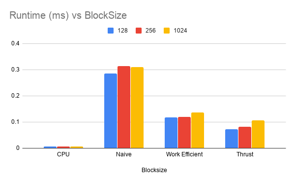

Project 2 - STREAM COMPACTION
====================
**University of Pennsylvania, CIS 565: GPU Programming and Architecture**
Dhruv Karthik: [LinkedIn](https://www.linkedin.com/in/dhruv_karthik/)

Tested on: Windows 10 Home, Intel(R) Core(TM) i7-8700 CPU @ 3.20GHz, 16GM, GTX 2070 - Compute Capability 7.5
____________________________________________________________________________________
   
____________________________________________________________________________________
## Performance Analysis
### Runtime vs Blocksize (ARRAY SIZE = 4096, 1<<12)
   

## Questions
**Can you find the performance bottlenecks? Is it memory I/O? Computation? Is it different for each implementation?**

Main Learning: I actually removed 2 calls to ```cudaMemcpy``` and saw the execution time get halved across all the GPU Implementations. 

Copying back and forth (Device to Device & Device to Host) can seriously increase the execution time of the program. 
* The CPU Implementation takes wins likely because of no need for copying memory. It can just pass the pointer arround This takes *O(n)
* The Naive Implementation does *O(nlogn)* computations (many of them needless in the event of an non-power-of-2 array) and runs slow than the CPU 
The Work Efficient scan is the faster of the GPU scans, but still requires that we copy. While is it *O(n)*, many of the threads in a warp don't exit early when they should. Even worse is that unlike CPU, this still has 2 cudaMemcpy's.

## Extra Credit Features
**Why is my GPU implementation slower than my CPU implementation?**

Apart from the calls to ```cudaMemcpy```, some threads to unneccesarry work because they don't get terminated early as they will not be required for the next level of computation for the work-efficient scan. I optimized this by sending an offset value into the call to the kernel, so any threads that weren't neccesarry in the future could get terminated early. This was also useful because it saves one call to cudaMemcpy. Despite this, my CPU implementation was still much faster. 

This picture illustrates an early termination strategy on the upsweep. 
   
 
## Output
```bash
****************
** SCAN TESTS **
****************
    [  40  42  40  23  36  45  21   8  44  38   1   3  25 ...  15   0 ]
==== cpu scan, power-of-two ====
   elapsed time: 0.000642ms    (std::chrono Measured)
    [   0  40  82 122 145 181 226 247 255 299 337 338 341 ... 6248 6263 ]
==== cpu scan, non-power-of-two ====
   elapsed time: 0.000321ms    (std::chrono Measured)
    [   0  40  82 122 145 181 226 247 255 299 337 338 341 ... 6141 6177 ]
    passed
==== naive scan, power-of-two ====
   elapsed time: 0.315392ms    (CUDA Measured)
    [   0  40  82 122 145 181 226 247 255 299 337 338 341 ... 6248 6263 ]
    passed
==== naive scan, non-power-of-two ====
   elapsed time: 0.2752ms    (CUDA Measured)
    [   0  40  82 122 145 181 226 247 255 299 337 338 341 ... 6141 6177 ]
    passed
==== work-efficient scan, power-of-two ====
   elapsed time: 0.08576ms    (CUDA Measured)
    [   0  40  82 122 145 181 226 247 255 299 337 338 341 ... 6248 6263 ]
    passed
==== work-efficient scan, non-power-of-two ====
   elapsed time: 0.08608ms    (CUDA Measured)
    [   0  40  82 122 145 181 226 247 255 299 337 338 341 ... 6141 6177 ]
    passed
==== thrust scan, power-of-two ====
   elapsed time: 0.105824ms    (CUDA Measured)
    passed
==== thrust scan, non-power-of-two ====
   elapsed time: 0.107616ms    (CUDA Measured)
    passed

*****************************
** STREAM COMPACTION TESTS **
*****************************
    [   2   1   0   0   3   0   0   1   3   2   3   3   0 ...   0   0 ]
==== cpu compact without scan, power-of-two ====
   elapsed time: 0.000641ms    (std::chrono Measured)
    [   2   1   3   1   3   2   3   3   1   1   2   3   2 ...   2   2 ]
    passed
==== cpu compact without scan, non-power-of-two ====
   elapsed time: 0.000963ms    (std::chrono Measured)
    [   2   1   3   1   3   2   3   3   1   1   2   3   2 ...   1   2 ]
    passed
==== cpu compact with scan ====
   elapsed time: 0.002246ms    (std::chrono Measured)
    [   2   1   3   1   3   2   3   3   1   1   2   3   2 ...   2   2 ]
    passed
==== work-efficient compact, power-of-two ====
   elapsed time: 0.19456ms    (CUDA Measured)
    [   2   1   3   1   3   2   3   3   1   1   2   3   2 ...   2   2 ]
    passed
==== work-efficient compact, non-power-of-two ====
   elapsed time: 0.196608ms    (CUDA Measured)
    [   2   1   3   1   3   2   3   3   1   1   2   3   2 ...   1   2 ]
    passed
```
