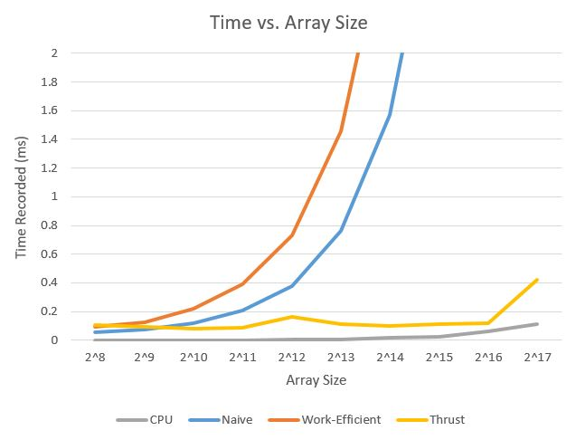

CUDA Stream Compaction
======================

**University of Pennsylvania, CIS 565: GPU Programming and Architecture, Project 2**

* Tabatha Hickman
  * LinkedIn:https://www.linkedin.com/in/tabatha-hickman-335987140/
* Tested on: Windows 10 Pro, i7-5600U CPU @ 2.60GHz 16GB, GeForce 840M (personal computer)

## Stream Compaction

### Approaches

Stream compaction is the process of removing null or otherwise useless values from an array. Naively, you could just traverse each element one by one, removing it if necessary, but there are other methods that can be used to reduce computation. One of them involves using a prefix-sum scan. If we create a mirror array to the original which has boolean values (0 or 1) representing if the value is null or not, then perform a scan on that, we will find that for each value which should be in the output of stream compaction, the mirrored value in the scan output is its index in the output array. 

So now we should think about how best we can perform the prefix-sum scan. There are several approaches I implemented that accomplish this:

* CPU Naive approach: A simple for loop which keeps track of a sum, goes through each element in the array and adds its value to the sum.
* GPU Naive approach: We reduce the number of computations to n times log base 2 of n by looping through each power of 2 from 1 to the first that is greater than or equal to the size of the array and summing pairs of numbers with that power of 2 distance from one another. As this adds up we get finally get the final sum adding the sum at the halfway index to the sum at the last index.
* GPU Work-Efficient approach: This approach further optimizes the scan by imagining the array as a binary tree and summing pairs of two iteratively until we get to the top of the tree with a final sum. This is considered the upsweep phase. It works, but it only sets the final index with the correct sum and neglects the others. So there is next a downsweep phase where from the top of the tree to the leaves, we take two nodes and swap their values with the lower index one adding its value to the current sum of the right one. By the time we get to the bottom of the tree, where we have each index in the original array, they all have the correct output for the prefix sum. 
* GPU Thrust approach: Simply invokes the scan function of the Thrust library.

### Performance Analysis

Optimal block sizes for each scan approach: I tested different block sizes to find the optimal one for each GPu implementation and got these results:


* Naive: 128
* Work-Efficient: 128

Comparison of all scan approaches:

Here is a chart of the results for all approaches with differing array sizes.


And here is a zoomed in version of the chart so you can see the comparisons at a more detailed level.



The CPU and Thrust implmentation appears to be pretty stable until we reach a size of 2^16 or 2^17. Though Thrust starts out as one of the worst times at the lowest array size, which leads me to believe a lot of the computation for Thrust involves the overhead of starting it up and using the library, and is unrelated to array size until we reach really large numbers. Since the CPU implementation should have O(n) time, I was surprised to see the slope was so minimal as the array size increased by powers of 2. However, the CPU implementation is really only doing one calculation per element so maybe the simplicity of just using a for loop has so little overhead is what makes this implementation so much faster.

As for the Naive and Work-efficient GPU implementations, both seem to follow the same exponential curve, with the work-efficient consitently about double the time of naive. Both are far worse than the Thrust or CPU implementations, which only grows more clear as array size increases. I think that these two implementations are worse only because the task at hand is so simple. The overhead of invoking multiple kernels, performing multiple loops, and in some cases needing to swap buffers seems to be more trouble than it's worth. As for the difference between the naive and work-efficient, I would guess that the extra kernel is what causes the doubling issue, since almost the same calculations need to be done in the two implementations, but in the work-efficient we split it into upsweep and downsweep which need to be completed in sequence so it all takes twice the time. 

Output of test program: (2^8 array size)

```
****************
** SCAN TESTS **
****************
    [  11  10  31  32  43   9  48  31  19   2  32  39  22 ...  12   0 ]
==== cpu scan, power-of-two ====
   elapsed time: 0.000789ms    (std::chrono Measured)
    [   0  11  21  52  84 127 136 184 215 234 236 268 307 ... 5946 5958 ]
==== cpu scan, non-power-of-two ====
   elapsed time: 0.000395ms    (std::chrono Measured)
    [   0  11  21  52  84 127 136 184 215 234 236 268 307 ... 5870 5891 ]
    passed
==== naive scan, power-of-two ====
   elapsed time: 0.052672ms    (CUDA Measured)
    passed
==== naive scan, non-power-of-two ====
   elapsed time: 0.05264ms    (CUDA Measured)
    passed
==== work-efficient scan, power-of-two ====
   elapsed time: 0.090496ms    (CUDA Measured)
    passed
==== work-efficient scan, non-power-of-two ====
   elapsed time: 0.091072ms    (CUDA Measured)
    passed
==== thrust scan, power-of-two ====
   elapsed time: 0.095808ms    (CUDA Measured)
    passed
==== thrust scan, non-power-of-two ====
   elapsed time: 0.103232ms    (CUDA Measured)
    passed

*****************************
** STREAM COMPACTION TESTS **
*****************************
    [   2   0   1   1   1   2   2   2   3   0   3   3   3 ...   2   0 ]
==== cpu compact without scan, power-of-two ====
   elapsed time: 0.001579ms    (std::chrono Measured)
    [   2   1   1   1   2   2   2   3   3   3   3   1   2 ...   1   2 ]
    passed
==== cpu compact without scan, non-power-of-two ====
   elapsed time: 0.001579ms    (std::chrono Measured)
    [   2   1   1   1   2   2   2   3   3   3   3   1   2 ...   2   2 ]
    passed
==== cpu compact with scan ====
   elapsed time: 5.07698ms    (std::chrono Measured)
    [   2   1   1   1   2   2   2   3   3   3   3   1   2 ...   1   2 ]
    passed
==== work-efficient compact, power-of-two ====
   elapsed time: 0.08976ms    (CUDA Measured)
    passed
==== work-efficient compact, non-power-of-two ====
   elapsed time: 0.089792ms    (CUDA Measured)
    passed
```
