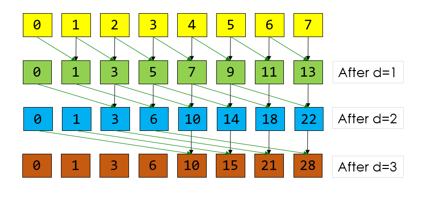

CUDA Stream Compaction
======================

**University of Pennsylvania, CIS 565: GPU Programming and Architecture, Project 2**

* Alexis Ward
  * [LinkedIn](https://www.linkedin.com/in/alexis-ward47/), [personal website](https://www.alexis-ward.tech/)
* Tested on: Windows 10, i7-8750H CPU @ 2.20GHz 16GB, GTX 1050 Ti (Same borrowed computer as last time, for the second half of the assignment.)

# README

In this project, I implemented GPU stream compaction in CUDA, from scratch. This is good practice in advance of the path tracer assignment.

I began by coding a CPU implementation of scan and compact, and then coded different GPU editions (starting with a "Naive" approach, then "Work-Efficient", then by just using Thrust's implementation).

This readme will compare the runtime results of all versions.

## Performance Analysis

### Scan Implementations:

I ran my program on power-of-two array sizes (from 2^8 to 2^20), and recorded and plotted the results. The time cost is the y-axis, and the information listed in the data-table values, while the x-axis represents array size. For all methods, I recorded the time cost on power-of-two-sized arrays (which is the listed array sizes), and non-power-of-two-sized arrays (the listed array size, minus 3). These tests were done using an optimized block size of 128 for all methods.

Opposite to my expectations, the CPU implementations of Scan were the fastest, followed by Naive::Scan and then Work-Efficient::Scan. This is with the exception of Thrust's implementation of Scan, which, on smaller arrays, is slower than CPU::Scan but faster on larger arrays. 

The performance measurements at least present a consistent direct relationship between size and time cost. You can even see that the non-power-of-two-sized arrays are slightly faster than their counterparts. The discrepency between GPU and CPU timing must be how I followed the class slides, and I think it is because I do not terminate any lazy threads and let each run to completion. This is an issue I would like to address before beginning the pathtracer, since I would not like to wait as long as I had in Advanced Rendering to render an image.

I assume thrust works so well because it does pay attention to slower threads, empty indices, and optimized memory usage more accurately than I do. It may use a different type of tree structure as well.

### Stream Compaction Implementations:

I ran my program on power-of-two array sizes (from 2^8 to 2^18), and recorded and plotted the results. The time cost, again is the y-axis, and the x-axis represents array size. Methods with the label "2^n" were recorded at the listed array sizes, and methods with the label "non-2^n" were recorded at the listed array size, minus 3. These tests were done using an optimized block size of 128 for all methods.

Similarly to the Scan analyses above, the CPU implementations are faster than the GPU. As before, the non-power-of-two-sized arrays are slightly faster than their counterparts, and the CPU-with-scan algorithm is the slowest of the three CPU algorithm. This makes sense as we are performing more operations in With-Scan.